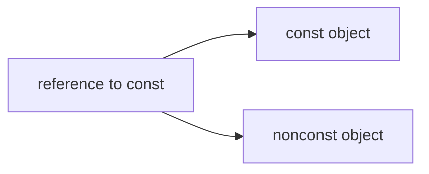
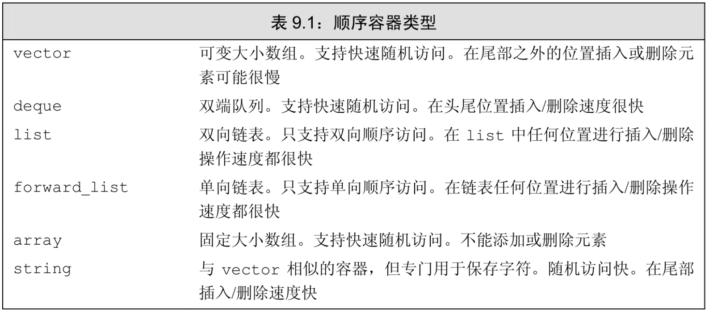

[TOC]

# Materials  

> 未加引用的章节，默认 C++ Primer, Fifth Edition[^C++ Primer, 5th]  


GitHub: [Google Style Guides](https://github.com/google/styleguide)  

- [Google C++ Style Guide](https://google.github.io/styleguide/cppguide.html)  

# Note  
- 打印函数名称，在函数内部直接使用语句 `cout << __func__ << endl;`  
- 函数中的某一变量需要初始化，则该函数不能放在 .h 文件中，否则编译出错。应将其放在 .cpp文件中。  
- **函数模板**和**类模板** **成员函数**的定义通常放在头文件中。
类模板，函数实现直接放在头文件，否则当头文件与main不在同一个文件夹下会报错；

## 与命令行交互  
- 从键盘输入文件结束符：Windows系统中，按`Ctrl+Z`，然后按`Enter`键。
- 遇到回车停止输入
```C++
char c;
c=cin.get();
if (c=='\n') 
    break;
```

## 头文件的防卫式声明  
- 知乎: [头文件的防卫式声明](https://zhuanlan.zhihu.com/p/336622992)  
- 知乎: [在 C++ 中防止头文件被重复包含时为什么同时使用 #ifndef 和 #pragma once？](https://www.zhihu.com/question/40990594)  
- 知乎: [【C++进阶之路】C++防止头文件被重复引入的3种方法！](https://zhuanlan.zhihu.com/p/352837146)  

# Grammar  

## Arrays数组  

CSDN: [c++数组指针和指针数组详解](https://blog.csdn.net/shayne000/article/details/88554004?utm_medium=distribute.pc_aggpage_search_result.none-task-blog-2~all~first_rank_v2~rank_v25-1-88554004.nonecase&utm_term=c++%E6%80%8E%E6%A0%B7%E5%AE%9A%E4%B9%89%E4%B8%80%E4%B8%AA%E6%9C%8910%E4%B8%AA%E6%8C%87%E9%92%88%E7%9A%84%E6%95%B0%E7%BB%84)  

> 3.5数组  

### 定义和初始化内置数组  

> 3.5.1 定义和初始化内置数组[^C++ Primer, 5th]

数组的声明形如`a[d]`  
- `a`是数组的名字
- `d`是数组的维度。  

数组中元素的个数也属于数组类型的一部分。维度必须是**常量表达式**。  
```C++
int arr[10];    // 含有10个整数的数组
int *parr[42];  // 含有42个整型指针的数组
```
默认情况下，数组的元素被默认初始化。  
在函数内部定义了某种内置类型的数组，默认初始化会令数组含有未定义的值。  
定义数组的时候必须指定**数组的类型**，不允许用`auto`关键字由初始值的列表推断类型。  
数组的元素应为对象，不存在引用的数组。  

> >  显式初始化数组元素  

可以对数组的元素进行列表初始化，此时允许忽略数组的维度。  
```C++
int a2[] = {0, 1, 2};  // 维度是3的数组
```

> > 字符数组的特殊性  

可以用字符串字面值对字符数组初始化。  
**字符串字面值**的结尾还有一个空字符，这个空字符也会像字符串的其他字符一样被拷贝到字符数组中去。  

```C++
char a1[] = {'C', '+', '+'};  // 列表初始化，没有空字符
char a2[] = {'C', '+', '+', '\0'};  // 列表初始化，含有显式的空字符
char a3[] = "C++";  // 自动添加表示字符串结束的空字符，a3的维度是4

// 检查函数
template<int M>
void Test(const char (&aa)[M])
{
    int cnt = 0;
    for (auto ii=begin(aa);ii!=end(aa); ii++) {
        cnt ++;
        cout<<setw(5)<<*ii;
    }
    cout<<endl<<"number is: "<<cnt<<endl;
}

// 查看数组中元素存放元素个数
Test(a1);
Test(a2);
Test(a3);
```

> > 不允许拷贝和赋值  

> > 理解复杂的数组声明  
```C++
int *pts[10];  // pts是含有10个整形指针的数组
int &refs[0]=/*?*/;  // 错误，不存在引用的数组
int (*Parray)[10]=&arr;  // Parray指向一个含有10个整数的数组
int (&arrRef)[10]=arr;  // arrRef引用一个含有10个整数的数组
```

默认情况下，类型修饰符从右向左依次绑定。  
要想理解数组声明的含义，最好的办法是从数组的名字开始按照由内向外的顺序阅读。  

-----------------------

### 访问数组元素  
> 3.5.2 访问数组元素  

在使用数组下标的时候，通常将其定义为size_t类型。size_t是一种机器相关的无符号类型。  
在`cstddef`头文件中定义了size_t类型。  

使用范围for语句  
```C++
int a[] = {0, 1, 2, 3, 5, 100};
for (auto ii: a)
    cout << ii << "  ";
cout << endl;
```

-------------------

### 指针和数组  
> 3.5.3 指针和数组  

通常情况下，使用**取地址符（&）**来获取指向某个对象的指针，取地址符可以用于任何对象。  
在很多用到数组名字的地方，编译器都会自动地将其替换为一个**指向数组首元素的指针**。  

使用数组作为一个`auto`变量的初始值时，推断得到的类型是**指针**而非数组。  
```C++
int ia[] = {10, 1, 2, 3, 5, 100};
auto ia2(ia);  // ia2 是一个指针，指向ia的第一个元素
cout << ia2[1] << "  ";
```

使用`decltype`关键字与使用`auto`的结果不同  
```C++
int ia[] = {10, 1, 2, 3, 5, 100};
decltype(ia) ia3;  // ia3是一个数组，其维度与ia相同；此处ia3会默认初始化
ia3[1] = 1000;
cout << ia3[1] << "  ";
```


> > 指针也是迭代器  

尾后指针不指向具体的元素。不能对尾后指针执行解引用或递增的操作。  

> > 标准库函数begin和end  

`begin`函数返回指向ia首元素的指针，`end`函数返回指向ia尾元素下一位置的指针。这两个函数定义在`iterator`头文件中。  

> > 指针运算  

给指针加上一个整数，得到的新指针扔需指向同一数组的其他元素，或者指向同一数组的尾元素的下一位置。  
两个指针相减的结果是它们之间的距离。参与运算的两个指针必须指向同一个数组当中的元素。
两个指针相减的结果类型是一种名为ptrdiff_t的标准库类型，定义在cdtddef头文件中的机器相关的类型。  

> > 解引用和指针运算的交互  

> > 下标和指针  

```C++
int ia[] = {0, 2, 4, 6, 8};
int *p = &ia[2];  // p指向索引为2的元素
int j = p[1];  // p[1]等价于*(p+1)
```

内置的下标运算符所用的索引值不是无符号类型。  

--------------------

### 多维数组  
> 3.6 多维数组[^C++ Primer, 5th]  

严格来说，C++语言中没有多维数组，通常所说的多维数组其实是数组的数组。  

#### 多维数组的初始化  

#### 多维数组的下标引用  
- 如果表达式含有的下标运算符数量和数组的维度一样多，该表达式的结果将是给定类型的元素；反之，如果表达式含有的下标运算符数量比数组的维度小，则表达式的结果将是给定索引处的一个内层数组：  
```C++
int ia[3][4];
int (&row)[4]=ia;  // 指向ia的第一个4元素数组
int (&row)[4]=ia[1];  // 指向ia的第二个4元素数组
```

#### 使用范围for语句处理多维数组  
```C++
int a1[5][10];
int cnt = 0;
for (auto &row:a1) {
	for (auto &col:row) {  // 循环中有赋值操作，此处（最内层循环）必须使用引用
		col = ++cnt;
	}
}
```

- 将外层循环的控制变量声明为引用类型，避免数组被自动转成指针（auto语句）。
- 要使用范围for语句处理多维数组，除了最内层的循环外，其他所有循环的控制变量都应该是引用类型。  

#### 指针和多维数组  
- 多维数组实际上是数组的数组，由多维数组名转换得来的指针实际上是指向第一个内层数组的指针。  

```C++
// my test
int b[2][3] = {6, 5, 4, 3, 2, 1};
int (*a)[3] = b;
cout << **b << endl;
cout << **a<< endl;
cout << *(*a + 1) << endl;
cout << *(*(a + 1)) << endl;

// test for multiply array and pointers
int const M=3, N=5;
int arr[M][N], cnt=0;
for (int ii=0;ii<M;ii++) {
    for (int jj=0;jj<N;jj++) {
        arr[ii][jj] = cnt++;
    }
}

int (*ptr)[N] = arr;
for (int ii=0;ii<M;ii++) {
    for (int jj=0;jj<N;jj++) {
        cout<<setw(5)<<*(*(ptr+ii)+jj);
    }
    cout<<endl;
}
```

#### 类型别名简化多维数组的指针  
```C++
using int_array = int[4];
typedef int int_array[4];
```

-------------------

## const Qualifier  
> 2.4 const限定符[^C++ Primer, 5th]  

`const`对象一旦创建后其值就不能再改变，所以**const对象必须初始化**。  

> > 初始化和const

利用一个对象去初始化另外一个对象，则它们是不是const都无关紧要。  
```C++
int i = 42;
const int ci = i;
int j = ci;
```

> > **默认状态下，const对象仅在文件内有效**  

默认情况下，const对象被设定为仅在文件内有效。当多个文件中出现了同名的const变量时，其实等同于在不同文件中分别定义了独立的变量。  

某些时候有这样一种const变量，它的初始值不是一个常量表达式，但又确实有必要在文件间共享。  
- 解决方法：对于const变量不管是声明还是定义都添加extern关键字。  

如果想在多个文件之间共享const对象，必须在变量的定义之前添加`extern`关键字。  

### References to const  
> 2.4.1 const的引用  

reference to const, which is a reference that refers to a const type. Unlike an ordinary reference, a reference to const cannot be used to change the object to which the reference is bound.  

> > Initialization and References to const  

there are two exceptions to the rule that the type of a reference must match the type of the object to which it refers.  

- The first exception is that we can **initialize a reference to const from any expression that can be converted to the type of the reference**. In particular, we can bind a reference to const to a nonconst object, a literal, or a more general expression.  

```C++
int i = 42;
const int &r1 = i;
const int &r2 = 42;
int &r4 = r1 * 2;  // 错误
```




> > A Reference to const May Refer to an Object That Is Not const  

It is important to realize that **a reference to const restricts only what we can do through that reference. Binding a reference to const to an object says nothing about whether the underlying object itself is const. Because the underlying object might be nonconst, it might be changed by other means.  

### Pointers and const  
> 2.4.2. Pointers and const  

Like a reference to const, a pointer to const may not be used to change the object to which the pointer points.   
We may **store the address of a const object only in a pointer to const**.  

```C++
const double pi = 3.14;
double *ptr = &pi;  // 错误，ptr是一个普通指针
const double *cptr = &pi;
*cptr = 42;  // 错误，不能给*cptr赋值
```


we noted that there are two exceptions to the rule that the types of a pointer and the object to which it points must match. 
- The first exception is that we can use **a pointer to const to point to a nonconst object**.  


> > const Pointers  

a const pointer must be initialized, and once initialized, its value (i.e., the address that it holds) may not be changed.   
We indicate that the pointer is const by putting the const after the `*`. This placement indicates that it is the pointer, not the pointed-to type, that is const.  

```C++
int err_num = 0;
int *const cur_err = &err_num;  // cur_err将一直指向err_num
const double pi = 3.1459;
const double *const pip = &pi;  // pip是一个指向常量对象的常量指针
```

### Top-Level const  
> 2.4.3. Top-Level const  

We use the term **top-level const** to indicate that the **pointer itself is a const**. 
When a pointer can point to a const object, we refer to that const as a **low-level const**.   

More generally, top-level const indicates that an object itself is const.  
Low-level const appears in the base type of compound types such as pointers or references.   

Note that pointer types, unlike most other types, can have both top-level and low-level const independently.
```C++
int i = 0;
int *const p1 = &i;  // 不能改变 p1 的值，这是一个顶层 const
const int ci = 42;  // 不能改变 ci 的值，这是一个顶层 const
const int *p2 = &ci;  // 允许改变 p2 的值，这是一个底层 const
const int *const p3 = p2;  // 靠右的 const 是顶层 const，靠左的是底层 const
const int &r = ci;  // 用于声明引用的 const 都是底层 const
```

The distinction between top-level and low-level matters when we copy an object. When we copy an object, top-level consts are ignored.  
- Copying an object doesn’t change the copied object. As a result, it is immaterial whether the object copied from or copied into is const.  
- low-level const is never ignored. When we copy an object, both objects must have the same low-level const qualification or there must be a conversion between the types of the two objects. In general, we can convert a nonconst to const but not the other way round.  

### constexpr和常量表达式  
> 2.4.4. constexpr and Constant Expressions  

常量表达式（const expression）是指值不会改变并且在编译过程就能得到计算结果的表达式。  
一个对象（或表达式）是不是常量表达式由它的数据类型和初始值共同决定。  
将变量声明为constexpr类型以便由编译器来验证变量的值是否是一个常量表达式。声明为constexpr的变量一定是一个常量，而且必须用常量表达式初始化。  

> > 字面值类型  

一个constexpr指针的初始值必须是nullptr或者0，或者是存储于某个固定地址中的对象。  
定义于所有函数体之外的对象其地址固定不变，能用来初始化constexpr指针。  
同样是在6.1.1节（第185页）中还将提到，允许函数定义一类有效范围超出函数本身的变量，这类变量和定义在函数体之外的变量一样也有固定地址。  

> > 指针和constexpr  

在constexpr声明中如果定义了一个指针，限定符constexpr仅对指针有效，与指针所指的对象无关。  


------------------

## Dynamic Memory动态内存  
> 12 动态内存  

动态分配的对象的生存期与它们在哪里创建是无关的，只有当显式地被释放时，这些对象才会销毁。  
标准库定义了两个智能指针类型来管理动态分配的对象。当一个对象应该被释放时，指向它的智能指针可以确保自动地释放它。  

--------------------

### 动态内存与智能指针  
> 12.1 动态内存与智能指针  

在C++中，动态内存的管理是通过一对运算符来完成的：  

- new，在动态内存中为对象分配空间并返回一个指向该对象的指针，我们可以选择对对象进行初始化；  
- delete，接受一个动态对象的指针，销毁该对象，并释放与之关联的内存。

智能指针（smart pointer）的行为类似常规指针，重要的区别是它负责自动释放所指向的对象。新标准库提供的这两种智能指针的区别在于管理底层指针的方式：  

- shared_ptr允许多个指针指向同一个对象；
- unique_ptr则“独占”所指向的对象。
- 标准库还定义了一个名为weak_ptr的伴随类，它是一种弱引用，指向shared_ptr所管理的对象。  

这三种类型都定义在`memory`头文件中。

--------------------

#### [shared_ptr类](https://en.cppreference.com/w/cpp/memory/shared_ptr)  
> 12.1.1 shared_ptr类  

智能指针也是模板。  
默认初始化的智能指针中保存着一个空指针。  
解引用一个智能指针返回它指向的对象。  
在一个条件判断中使用智能指针，效果就是检测它是否为空。  

> > make_shared函数  

最安全的分配和使用动态内存的方法是调用一个名为make_shared的标准库函数。此函数在动态内存中分配一个对象并初始化它，返回指向此对象的shared_ptr。与智能指针一样，make_shared也定义在**头文件memory**中。  
make_shared用其参数来构造给定类型的对象。  
不传递任何参数，对象就会进行值初始化。  
我们通常用`auto`定义一个对象来保存make_shared的结果。  

> > shared_ptr的拷贝和赋值

引用计数（referencecount）。  
一旦一个shared_ptr的计数器变为0，它就会自动释放自己所管理的对象：  

> > shared_ptr自动销毁所管理的对象……  

当指向一个对象的最后一个shared_ptr被销毁时，shared_ptr类会自动销毁此对象。它是通过另一个特殊的成员函数——析构函数（destructor）完成销毁工作的。  

> > ……shared_ptr还会自动释放相关联的内存  

share_ptr在无用之后仍然保留的一种可能情况是，你将shared_ptr存放在一个容器中，随后重排了容器，从而不再需要某些元素。在这种情况下，你应该确保用erase删除那些不再需要的shared_ptr元素。  


---------------

#### 直接管理内存  
> 12.1.2 直接管理内存  

1. 运算符new分配内存，delete释放new分配的内存。
2. 自己直接管理内存的类与使用智能指针的类不同，它们不能依赖类对象拷贝、赋值和销毁操作的任何默认定义。

> > 使用new动态分配和初始化对象  

1. 在自由空间分配的内存是无名的，因此new无法为其分配的对象命名，而是返回一个指向该对象的指针。  
2. 默认情况下，动态分配的对象是默认初始化的，这意味着内置类型或组合类型的对象的值将是未定义的，而类类型对象将用默认构造函数进行初始化。  
3. 可以使用直接初始化方式来初始化一个动态分配的对象。  
4. 也可以对动态分配的对象进行值初始化，只需在类型名之后跟一对空括号。  
5. 提供一个括号包围的初始化器，就可以使用auto从此初始化器来推断我们想要分配的对象的类型。但是，由于编译器要用初始化器的类型来推断要分配的类型，只有当括号中仅有单一初始化器时才可以使用auto。  

> > 动态分配的const对象  

1. 类似其他任何const对象，一个动态分配的const对象必须进行初始化。  

> > 内存耗尽
1. 定位new（placement new）  
2. 定位new表达式允许我们向new传递额外的参数。在此例中，我们传递给它一个由标准库定义的名为nothrow的对象。如果将nothrow传递给new，我们的意图是告诉它不能抛出异常。如果这种形式的new不能分配所需内存，它会返回一个空指针。bad_alloc和nothrow都定义在头文件new中。  

> > 释放动态内存  

在动态内存使用完毕后，必须将其归还给系统。我们通过delete表达式（delete expression）来将动态内存归还给系统。delete表达式接受一个指针，指向我们想要释放的对象。  

> > 指针值和delete  

1. **传递给delete的指针必须指向动态分配的内存，或者是一个空指针**。释放一块并非new分配的内存，或者将相同的指针值释放多次，其行为是未定义的：  
2. 通常情况下，编译器不能分辨一个指针指向的是静态还是动态分配的对象。类似的，编译器也不能分辨一个指针所指向的内存是否已经被释放了。  
3. 虽然一个const对象的值不能被改变，但它本身是可以被销毁的。如同任何其他动态对象一样，想要释放一个const动态对象，只要delete指向它的指针。  
4. 动态对象的生存期直到被释放时为止。  
5. 由内置指针（而不是智能指针）管理的动态内存在被显式释放前一直都会存在。  

> > delete之后重置指针值……  

1. 在delete之后，指针就变成了人们所说的**空悬指针（dangling pointer）**，即，指向一块曾经保存数据对象但现在已经无效的内存的指针。  
2. 可以避免空悬指针的问题：在指针即将要离开其作用域之前释放掉它所关联的内存。这样，在指针关联的内存被释放掉之后，就没有机会继续使用指针了。如果我们需要保留指针，可以在delete之后将nullptr赋予指针，这样就清楚地指出指针不指向任何对象。  


> > ……这只是提供了有限的保护  

动态内存的一个基本问题是可能有多个指针指向相同的内存。在delete内存之后重置指针的方法只对这个指针有效，对其他任何仍指向（已释放的）内存的指针是没有作用的。  

```C++
int *p(new int (42));
auto q=p;  // p和q指向相同的内存
delete p;
p= nullptr;
```
本例中p和q指向相同的动态分配的对象。我们delete此内存，然后将p置为nullptr，指出它不再指向任何对象。但是，重置p对q没有任何作用，在我们释放p所指向的（同时也是q所指向的！）内存时，q也变为无效了。在实际系统中，查找指向相同内存的所有指针是异常困难的。


#### shared_ptr和new结合使用  
> 12.1.3 shared_ptr和new结合使用  

1. 还可以用new返回的指针来初始化智能指针。  
2. 接受指针参数的智能指针构造函数是explicit的（参见7.5.4节）。因此，我们不能将一个内置指针隐式转换为一个智能指针，必须使用直接初始化形式（参见3.2.1节）来初始化一个智能指针。  
3. 一个返回shared_ptr的函数不能在其返回语句中隐式转换一个普通指针。  
4. 默认情况下，一个用来初始化智能指针的普通指针必须指向动态内存，因为智能指针默认使用delete释放它所关联的对象。  

> > 不要混合使用普通指针和智能指针……

1. 当将一个shared_ptr绑定到一个普通指针时，我们就将内存的管理责任交给了这个shared_ptr。一旦这样做了，我们就不应该再使用内置指针来访问shared_ptr所指向的内存了。  

> > ……也不要使用get初始化另一个智能指针或为智能指针赋值  

1. 智能指针类型定义了一个名为get的函数（参见表12.1），它返回一个内置指针，指向智能指针管理的对象。  
2. 使用get返回的指针的代码不能delete此指针。  

> > 其他shared_ptr操作  

以用reset来将一个新的指针赋予一个shared_ptr。

#### 智能指针和异常  
> 12.1.4 智能指针和异常  

1. 使用智能指针，即使程序块过早结束，智能指针类也能确保在内存不再需要时将其释放。  
2. 当发生异常时，我们直接管理的内存是不会自动释放的。  

> > 智能指针和哑类  

1. 分配了资源，而又没有定义析构函数来释放这些资源的类。

> > 使用我们自己的释放操作  

1. 默认情况下，shared_ptr假定它们指向的是动态内存。因此，当一个shared_ptr被销毁时，它默认地对它管理的指针进行delete操作。

> > 注意：智能指针陷阱  

- 不使用相同的内置指针值初始化（或`reset`）多个智能指针。  
- 不`deleteget()`返回的指针。  
- 不使用`get()`初始化或`reset`另一个智能指针。  
- 如果你使用`get()`返回的指针，记住当最后一个对应的智能指针销毁后，你的指针就变为无效了。  
- 如果你使用智能指针管理的资源不是new分配的内存，记住传递给它一个删除器。

#### unique_ptr  
> 12.1.5 unique_ptr  

1. 某个时刻只能有一个unique_ptr指向一个给定对象。
2. 当unique_ptr被销毁时，它所指向的对象也被销毁。
3. 定义一个unique_ptr时，需要将其绑定到一个new返回的指针上。
4. 初始化unique_ptr必须采用直接初始化形式。
5. unique_ptr不支持普通的拷贝或赋值操作：
6. 不能拷贝或赋值unique_ptr，但可以通过调用release或reset将指针的所有权从一个（非const）unique_ptr转移给另一个unique。
7. release成员返回unique_ptr当前保存的指针并将其置为空。因此，p2被初始化为p1原来保存的指针，而p1被置为空。
8. reset成员接受一个可选的指针参数，令unique_ptr重新指向给定的指针。如果unique_ptr不为空，它原来指向的对象被释放。因此，对p2调用reset释放了用"Stegosaurus"初始化的string所使用的内存，将p3对指针的所有权转移给p2，并将p3置为空。
9. 调用release会切断unique_ptr和它原来管理的对象间的联系。release返回的指针通常被用来初始化另一个智能指针或给另一个智能指针赋值。
10. 如果我们不用另一个智能指针来保存release返回的指针，我们的程序就要负责资源的释放。

> > 传递unique_ptr参数和返回unique_ptr  

1. 不能拷贝unique_ptr的规则有一个例外：我们可以拷贝或赋值一个将要被销毁的unique_ptr。最常见的例子是从函数返回一个unique_ptr。

> > 向unique_ptr传递删除器  

1. unique_ptr默认情况下用delete释放它指向的对象。


#### weak_ptr  
> 12.1.6 weak_ptr

1. weak_ptr（见表12.5）是一种不控制所指向对象生存期的智能指针，它指向由一个shared_ptr管理的对象。将一个weak_ptr绑定到一个shared_ptr不会改变shared_ptr的引用计数。一旦最后一个指向对象的shared_ptr被销毁，对象就会被释放。即使有weak_ptr指向对象，对象也还是会被释放。  
2. 创建一个weak_ptr时，要用一个shared_ptr来初始化它。  
3. 由于对象可能不存在，我们不能使用weak_ptr直接访问对象，而必须调用lock。此函数检查weak_ptr指向的对象是否仍存在。如果存在，lock返回一个指向共享对象的shared_ptr。  


----------------------

### 动态数组  
> 12.2 动态数组  

new和delete运算符一次分配/释放一个对象。  

#### new和数组
> 12.2.1 new和数组  

new分配一个对象数组，在类型名之后跟一对方括号，在其中指明要分配的对象的数目。**方括号中的大小必须是整型，但不必是常量**。  
```C++
int p = 10;
int *pia = new int [p];
```

使用类型别名  
```C++
using arr = int[10];  // typedef int arr[10];
int *pia = new arr;
```

> > 分配一个数组会得到一个元素类型的指针  

不能对动态数组调用begin或end；  
也不能使用范围for语句来处理动态数组中的元素。  

> > 释放动态数组  

delete 在指针前加上一个空方括号对：
```C++
delete [] pa;
```

---------------------------------------------

#### [allocator类](https://en.cppreference.com/w/cpp/memory/allocator)  

> 12.2.2 allocator类  

> > allocator类  

标准库allocator类定义在头文件memory中，它帮助我们将内存分配和对象构造分离开来。它提供一种类型感知的内存分配方法，它分配的内存是原始的、未构造的。  

allocator是一个模板。  

当一个allocator对象分配内存时，它会根据给定的对象类型来确定恰当的内存大小和对齐位置。  

```C++
int n = 10;
allocator<string> alloc;
auto const p = alloc.allocate(n);  // 分配n个未初始化的string

allocator<int> alloc;
int *p = alloc.allocate(10);
p[0] = 1;
p[1] = 2;
cout<<p[0];
```

> > allocator分配未构造的内存  

释放内存通过调用`deallocate`来完成。
```C++
allocator<int> alloc1;
allocator<int>::pointer alloc_ptr;
    
alloc_ptr = alloc1.allocate(10);
int ii;
for (ii = 0; ii < 10; ii++) {
    alloc_ptr[ii] = ii;
}
    
for (ii = 0; ii < 10; ii++) {
    cout << setw(5) << alloc_ptr[ii];
}
    
alloc1.deallocate(alloc_ptr, 10);
```


## Enumerations 枚举类型  
> 19.3 枚举类型  

枚举类型（enumeration）使我们可以将一组整型常量组织在一起。和类一样，每个枚举类型定义了一种新的类型。  
枚举属于字面值常量类型。  

C++包含两种枚举：限定作用域的和不限定作用域的。C++11新标准引入了限定作用域的枚举类型（scoped enumeration）。  
(1) 定义限定作用域的枚举类型的一般形式是：首先是关键字enum class（或者等价地使用enum struct），随后是枚举类型名字以及用花括号括起来的以逗号分隔的枚举成员（enumerator）列表，最后是一个分号。  
(2) 定义不限定作用域的枚举类型（unscoped enumeration）时省略掉关键字class（或struct），枚举类型的名字是可选的。  

如果enum是未命名的，则我们只能在定义该enum时定义它的对象。和类的定义类似，我们需要在enum定义的右侧花括号和最后的分号之间提供逗号分隔的声明列表。


### 枚举成员  

在限定作用域的枚举类型中，枚举成员的名字遵循常规的作用域准则，并且在枚举类型的作用域外是不可访问的。
在不限定作用域的枚举类型中，枚举成员的作用域与枚举类型本身的作用域相同。
默认情况下，枚举值从0开始，依次加1。可以为一个或几个枚举成员指定专门的值。
枚举值不一定唯一。
没有显式地提供初始值，则当前枚举成员的值等于之前枚举成员的值加1。
**枚举成员是const**，因此在初始化枚举成员时提供的初始值必须是常量表达式。

### 和类一样，枚举也定义新的类型  
1. 要想初始化enum对象或者为enum对象赋值，必须使用该类型的一个枚举成员或者该类型的另一个对象：
2. 一个不限定作用域的枚举类型的对象或枚举成员自动地转换成整型。
### 指定enum的大小  
1. 在enum的名字后加上冒号以及在该enum中使用的类型。
2. 指定enum的潜在类型，则默认情况下限定作用域的enum成员类型是int。对于不限定作用域的枚举类型来说，其枚举成员不存在默认类型，
### 枚举类型的前置声明  
1. enum的前置声明（无论隐式地还是显示地）必须指定其成员的大小：
2. 不能在同一个上下文中先声明一个不限定作用域的enum名字，然后再声明一个同名的限定作用域的enum。
### 形参匹配与枚举类型  
1. 初始化一个enum对象，必须使用该enum类型的另一个对象或者它的一个枚举成员。  


## Exception Handling  
> 5.6 TRY语句块和异常处理[^C++ Primer, 5th]  

### throw表达式  
> https://en.cppreference.com/w/cpp/language/throw  

程序的异常检测部分使用throw表达式引发一个异常。throw表达式包含关键字throw和紧随其后的一个表达式，其中表达式的类型就是抛出的异常类型。throw表达式后面通常紧跟一个分号，从而构成一条表达式语句。  

```C++
// throw runtime_error("This is runtime error");
try {
    throw runtime_error("This is runtime error!");
} catch (runtime_error err) {
    cout<<err.what()<<"\ncatch it\n";
}
```

### try语句块  
> https://en.cppreference.com/w/cpp/language/try_catch  

函数在寻找处理代码的过程中退出  
- 没能找到任何匹配的catch子句，程序转到名为terminate的标准库函数。该函数的行为与系统有关，一般情况下，执行该函数将导致程序非正常退出。  
- 程序没有try语句块且发生了异常，系统会调用terminate函数并终止当前程序的执行。  

### 标准异常  

`exception`头文件定义了最通用的异常类exception。它只报告异常的发生，不提供任何额外信息。  
[`Standard library header <exception>`](https://en.cppreference.com/w/cpp/header/exception)  

`stdexcept`头文件定义了几种常用的异常类。  
[`Standard library header <stdexcept>`](https://en.cppreference.com/w/cpp/header/stdexcept)  

|Classes||
|:-|:-|
|[**runtime_error**](https://en.cppreference.com/w/cpp/error/runtime_error)|exception class to indicate conditions only detectable at run time|

- new头文件定义了bad_alloc异常类型  
[`Standard library header <new>`](https://en.cppreference.com/w/cpp/header/new)  

- type_info头文件定义了bad_cast异常类型  
[`Standard library header <typeinfo>`](https://en.cppreference.com/w/cpp/header/typeinfo)  


## Expressions表达式  
### The Conditional Operator  
> 4.7 条件运算符  

- 条件运算符（`? :`）允许我们把简单的if-else逻辑嵌入到单个表达式当中，条件运算符按照如下形式使用:  
```C++
cond?expr1:expr2;
```
&emsp;&emsp;其中cond是判断条件的表达式，而expr1和expr2是两个类型相同或可能转换为某个公共类型的表达式。  

- 条件运算符的执行过程是：首先求cond的值，如果条件为真对expr1求值并返回该值，否则对expr2求值并返回该值。  

## Functions  
> 6 函数

### 函数基础  
> 6.1 函数基础

1. 一个典型的函数（function）定义包括以下部分：返回类型（return type）、函数名字、由0个或多个形参（parameter）组成的列表以及函数体。其中，形参以逗号隔开，形参的列表位于一对圆括号之内。函数执行的操作在语句块（参见5.1节，第155页）中说明，该语句块称为函数体（function body）。
2. 通过调用运算符（call operator）来执行函数。调用运算符的形式是一对圆括号，它作用于一个表达式，该表达式是函数或者指向函数的指针；圆括号之内是一个用逗号隔开的实参（argument）列表，我们用实参初始化函数的形参。调用表达式的类型就是函数的返回类型。
##### 形参和实参
1. 实参是形参的初始值。
2. 尽管实参与形参存在对应关系，但是并没有规定实参的求值顺序（参见4.1.3节，第123页）。编译器能以任意可行的顺序对实参求值。
3. 实参的类型必须与对应的形参类型匹配。

##### 函数的形参列表
函数的形参列表可以为空，但是不能省略。要想定义一个不带形参的函数，最常用的办法是书写一个空的形参列表。不过为了与C语言兼容，也可以使用关键字void表示函数没有形参：
##### 函数返回类型
返回类型是void，它表示函数不返回任何值。  
函数的返回类型不能是数组类型或函数类型，但可以是指向数组或函数的指针。  

### 参数传递  
> 6.2 参数传递  

引用传递（passed by reference）  
值传递（passed by value）

#### 传值参数  
> 6.2.1 传值参数  

> > 指针形参  

当执行指针拷贝操作时，拷贝的是指针的值。拷贝之后，两个指针是不同的指针。  

#### 传引用参数  
> > 6.2.2 传引用参数  

#### const形参和实参  
> > 6.2.3 const形参和实参

当用实参初始化形参时会忽略掉顶层const。  
当形参有顶层const时，传给它常量对象或者非常量对象都是可以的。  


#### 数组形参  
> 6.2.4 数组形参  

数组特殊性质：  
- 不允许拷贝数组；  
- 使用数组时（通常）会将其转换成指针；  

因为不能拷贝数组，所以我们无法以值传递的方式使用数组参数。  
因为数组会被转换成指针，所以当我们为函数传递一个数组时，实际上传递的是指向数组首元素的指针。  

管理指针形参有三种常用的技术  
1. 使用标记指定数组长度  
2. 使用标注库规范  
3. 显示传递一个表示数组大小的形参  

> > 数组引用形参  

数组的大小是构成数组类型的一部分。
```C++
// &arr 两端的括号必不可少
// arr是具有2行3列整型数组的引用
void PrintArray2D(int (&arr)[2][3])
{
    for (auto &row:arr) {
        for (auto &col:row) {
            cout<<"     "<<col;
        }
        cout<<endl;
    }
}

// test
int aa[2][3] = {{1, 2, 3}, {10, 20, 30}};
PrintArray2D(aa);
```

> > 传递多维数组  

当将多维数组传递给函数时，传递的是指向数组首元素的指针。  
处理数组的数组，首元素本身就是一个数组，指针就是一个指向数组的指针。数组第二维（以及后面所有维度）的大小都是数组类型的一部分，不能省略。  

```C++
// example one =========================================
// 指向含有3个整数的数组的指针
void PrintArray2D(int (*arr)[3], int row_size)
{
    // 等价定义 void PrintArray2D(int arr[][3], int row_size)
    for (int ii=0;ii<row_size;ii++) {
        for (int jj=0;jj<3;jj++) {
            cout<<"     "<<arr[ii][jj];
        }
        cout<<endl;
    }
}

// test
int aa[2][3] = {{1, 2, 3}, {10, 20, 30}};
PrintArray2D(aa, 2);

// example two =========================================
void PrintArray2D(int *arr[2], int row_size)
{
    // 经测试，将*arr[2] 改为 *arr[3] 或 **arr 均可
    for (int ii=0;ii<row_size;ii++) {
        for (int jj=0;jj<3;jj++) {
            cout<<"     "<<arr[ii][jj];
        }
        cout<<endl;
    }
}

// test
int aa[2][3] = {{1, 2, 3}, {10, 20, 30}};
int *bb[2];  // 2个指针构成的数组
bb[0] = aa[0];
bb[1] = aa[1];
PrintArray2D(bb, 2);
```

#### main: 处理命令行选项  
> 6.2.5main: 处理命令行选项  

命令行选项通过两个（可选的）形参传递给main函数：
```C++
int main(int argc, char* argv[]) {}
// main函数也可以定义成
int main(int argc, char** argv[]) {}
```

第一个形参argc表示数组中字符串的数量。  
第二个形参argv是一个数组，它的元素是指向C风格字符串的指针。  

当实参传给main函数之后，
- argv的第一个元素指向程序的名字或者一个空字符串，
- 接下来的元素依次传递命令行提供的实参。
- 最后一个指针之后的元素值保证为0。  

### 返回类型和return语句  
> 6.3 返回类型和return语句

return语句终止当前正在执行的函数，将控制权返回到调用该函数的地方。return语句有两种形式：
```C++
return;
return expression;
```

#### 无返回值函数  
> 6.3.1 无返回值函数  

没有返回值的return语句只能用在返回类型是void的函数中。返回void的函数不要求有return语句，因为这类函数的最后一句后面会隐式地执行return。  

#### 有返回值函数  
> 6.3.2 有返回值函数  

return语句返回值的类型必须与函数的返回类型相同，或者能隐式地转换成函数的返回类型。  

> > 不要返回局部对象的引用或指针  

> > 引用返回左值  

调用一个返回引用的函数得到左值，其他返回类型得到右值。  
可以为返回类型是非常量引用的函数的结果赋值。  

> > 列表初始化返回值  


#### 返回数组指针  
> 6.3.3 返回数组指针  

数组不能被拷贝，所以函数不能返回数组。	  
函数可以返回数组的指针或引用。  
其中最直接的方法是使用类型别名。  

> > 声明一个返回数组指针的函数  

定义一个返回数组指针的函数，则数组的维度必须跟在函数名字之后。然而，函数的形参列表也跟在函数名字后面且形参列表应该先于数组的维度。  

返回数组指针的函数形式如下所示：
```C++
Type (*function(parameter_list)) [dimension]
```

- `(*function(parameter_list))`两端的括号必须存在。如果没有这对括号，函数的返回类型将是指针的数组。  

```C++
// my test
int(*(days_in_month()))[12]
{
	// 一年中每个月的天数
	static int tmp_days[12] = { 31, 28, 31, 30, 31, 30, 31, 31, 30, 31, 30, 31 };  
	int(*days)[12] = &tmp_days;
	// cout << endl << year << " " << (*days)[1] << endl << endl;
	return days;
}

// 函数调用
int(*arr)[12] = days_in_month();
for (int ii = 0; ii < 12; ii++) {
	cout << *(*arr + ii) << endl;
}
```

> > 使用尾置返回类型

尾置返回类型（trailing return type）。  

任何函数的定义都能使用尾置返回，但是这种形式对于返回类型比较复杂的函数最有效，比如返回类型是数组的指针或者数组的引用。  

尾置返回类型跟在形参列表后面并以一个 -> 符号开头。  
```C++
// func接受一个int类型的实参，返回一个指针，该指针指向含有10个整数的数组
auto func(int i) -> int(*)[10];
```

> > 使用decltype  

知道函数返回的指针指向哪个数组，就可以使用decltype关键字声明返回类型。
```C++
int odd[] = {1, 3, 5, 7, 9};
int even[] = {0, 2, 4, 6, 8};

decltype(odd) *arr_ptr(int ii)
{
    return (ii%2)?&odd:&even;
}
```
decltype并不负责把数组类型转换成对应的指针，所以decltype的结果是个数组，要想表示arrPtr返回指针还必须在函数声明时加一个＊符号。

### 函数重载  
> 6.4 函数重载

### 默认实参  
> 6.5.1 默认实参  

默认实参后面所有的形参都必须有默认值。

> > 使用默认实参调用函数  

> > 默认实参声明  

在给定的作用域中，一个形参只能被赋予一次默认实参。

应该在函数声明中指定默认实参，并将该声明放在合适的头文件中。

> > 默认实参初始值  

局部变量不能作为默认实参。除此之外，只要表达式的类型能转换成形参所需的类型，该表达式就能作为默认实参。

### 内联函数和constexpr函数
> 6.5.2 内联函数和constexpr函数  

### 调试帮助  
> 6.5.3 调试帮助  

> > assert预处理宏  

`assert`是一种预处理宏（preprocessor marco）。所谓预处理宏其实是一个预处理变量。

assert宏使用一个表达式作为它的条件：
```C++
assert (expr);
```
> 对expr求值，  
- 表达式为假（即0），assert输出信息并终止程序的执行；  
- 表达式为真（即非0），assert不做处理。  

assert宏定义在**`cassert`**头文件中。
预处理名字由预处理器而非编译器管理，可以直接使用预处理名字而无须提供using声明。
和预处理变量一样，宏名字在程序内必须唯一。含有cassert头文件的程序不能再定义名为assert的变量、函数或者其他实体。

> > NDEBUG预处理变量  

asset的行为依赖于NDEBUG预处理变量的状态。  
- 如果定义了NDEBUG，则assert什么也不做。  
- 默认状态下没有定义NDEBUG，此时assert将执行运行时检查。  

|变量名字|作用|定义主体|
|:-|:-|:-|
|`__func__`|存放函数名字|编译器|
|`__FILE__`|存放**文件名**的字符串字面值|预处理器|
|`__LINE__`|存放当前行号的整型字面值|预处理器|
|`__TIME__`|存放文件编译时间的字符串字面值|预处理器|
|`__DATE__`|存放文件编译日期的字符串字面值|预处理器|


### 函数指针  
> 6.7 函数指针  


### Lambda Expressions  
#### Lambda Expressions  
> 10.3.2 lambda表达式[^C++ Primer, 5th]  

lambda表达式表示一个可调用的代码单元。可以将其理解为一个未命名的内联函数。lambda具有一个返回类型、一个参数列表和一个函数体。与函数不同，lambda可以定义在函数内部。  

lambda表达式具有如下形式  
```
[capture list] (parameter list) -> return type {function body}
```
lambda必须使用**尾置**返回来指定返回类型。  

可以忽略**参数列表**和**返回类型**，但必须永远包含捕获列表和函数体。  
```C++
auto f = [] {return 42;};
```

在lambda中忽略括号和参数列表等价于指定一个空参数列表。  
如果忽略返回类型，lambda根据函数体中的代码推断出返回类型。  
如果lambda的函数体包含任何单一return语句之外的内容，且未指定返回类型，则返回void。  

向lambda传递参数
lambda不能有默认参数。  

#### lambda捕获和返回  
> 10.3.3 lambda捕获和返回

```C++
// 角度转为弧度
auto Deg2Rad = [](float deg) -> float { return deg * M_PI / 180.0; };
// 弧度转为角度
auto Rad2Deg = [](float rad) -> float { return rad * 180.0 / M_PI; };
```

## IO  

> 08 IO库  
> 17.5 IO库再探  

### IO类  
cppreference.com [Input/output library](https://en.cppreference.com/w/cpp/io)  

> 8.1 IO类  

IO库类型和头文件  
|头文件|类型|
|:-|:-|
|iostream||
|fstream||
|sstream||

> 8.1.1 IO对象无拷贝或赋值  

不能拷贝或对IO对象赋值。
由于不能拷贝IO对象，不能将形参或返回类型设置为流类型；  
进行IO操作的函数通常以**引用**方式传递和返回流。
读写一个IO对象会改变其状态，因此传递和返回的引用不能是const的。

> 8.1.2 条件状态  

IO库条件状态  
|||
|||
|||

一个流一旦发生错误，其上后续的IO操作都会失败。

> 8.1.3 管理输出缓冲  

每个输出流都管理一个缓冲区，用来保存程序读写的数据。  

刷新输出缓冲区  

- 操纵符`endl`，它完成换行并刷新缓冲区的工作。
- `flush`刷新缓冲区，但不输出任何额外的字符。
- `ends`向缓冲区插入一个空字符，然后刷新缓冲区。


unitbuf操纵符  
如果想在每次输出操作后都刷新缓冲区，我们可以使用`unitbuf`操纵符。它告诉流在接下来的每次写操作之后都进行一次flush操作。  
`nounitbuf`操纵符则重置流，使其恢复使用正常的系统管理的缓冲区刷新机制。  

#### 文件输入输出  
> 8.2 文件输入输出  

头文件fstream定义了三个类型来支持文件IO：  

- ifstream从一个给定文件读取数据  
- ofstream向一个给定文件写入数据  
- fstream可以读写给定文件  

fstream特有的操作  
|||
|:-|:-|
|`fstream fstrm;`|创建一个未绑定的流。`fstream`是头文件fstream中定义的一个类型。|
|`fstream fstrm(s);`|创建一个`fstream`，并打开名为s的文件。s可以是string类型，或者一个指向C风格字符串的指针。|
|`fstream fstrm(s, mode)`||
|`fstrm.open(s)`||
|`fstrm.close()`||
|`fstrm.is_open()`||

> 8.2.2 文件模式  

每一个流都有一个关联的文件模式（file mode），用来指出如何使用文件。  

- in, 以读方式打开
- out, 以写方式打开
- app, 每次写操作前均定位到文件末尾
- ate, 打开文件后立即定位到文件末尾
- trunc, 截断文件  
- binary, 以二进制方式进行IO

每个文件流类型都定义了一个默认的文件模式，当我们未指定文件模式时，就使用此默认模式。  

- ifstream，默认in模式  
- ofstream，默认out模式  
- fstream，默认以in和out模式打开  

```C++
// 默认以out模式打开，文件内容会被丢弃
ofstream out("file1");  
// 保留被ofstream打开的文件中已有数据的唯一方式是显式指定app或in模式
ofstream out3("file2", ofstream::out | ofstream::app);
```

##### Examples  
- CSDN: [C++ 读写TXT文件](https://blog.csdn.net/qq_29406323/article/details/81261926)  

```C++
#include <iostream>
#include <string>
#include <fstream>

using namespace std;

void ReadTxt(string txt_file)
{
    ifstream fin(txt_file, ifstream::in);
    string tmp;
    while (getline(fin,tmp)) {
        cout << tmp;
        cout<<endl;
    }
    fin.close();
    cout << endl;
}
```

- 读取二进制文件
```C++
string src_file;
short unsigned int a;
char b[16];

ifstream file_input(src_file, ios::in | ios::binary);
file_input.read((char*) &a, 1);
file_input.seekg(6);
file_input.read((char*) &b, 16);

cout << "start\n";
cout << a << endl;
cout << b << endl;
cout << "end\n";

file_input.close();
```


> 8.2.3 string流  

sstream头文件定义了三个类型来支持内存IO  

- istringstream, 从string读取数据  
- ostringstream，向string写入数据  
- stringstream，既可从string读取数据也可向string写入数据  
stringstream特有的操作  
|||
|:-|:-|
|`sstream strm;`|sstream是头文件sstream中定义的一个类型<br>strm是一个未绑定的stringstream对象|
|`sstream strm(s);`|strm是一个sstream对象，保存string s的一个拷贝|
|`strm.str()`|返回strm所保存的string的拷贝|
|`strm.str(s)`|将string s拷贝到strm中，返回void|

#### 格式化输入与输出  
> 17.5.1 格式化输入与输出   

操纵符用于两大类输出控制：  
- 控制数值的输出形式  
- 控制补白的数量和位置  

当操纵符改变流的格式状态时，通常改变后的状态对所有后续IO都生效。  

**`iostream`**中的操纵符  

|操纵符|含义|
|:-|:-|
|`boolalpha`|将true和false输出为字符串|
|**`noboolalpha`**|将true和false输出为1,0|
|`showbase`|显示整型值表示进制的前缀<br>0x，表示十六进制<br>0，表示八进制<br>无前导字符串表示十进制|
|**`noshowbase`**||
|`showpoint`|对浮点值总是显示小数点|
|**`noshowpoint`**|只有当浮点值包含小数部分时才显示小数点|
|`showpos`||
|**`noshowpos`**||
|`uppercase`||
|**`nouppercase`**||
|**`dec`**||
|`hex`||
|`oct`||
|`left`||
|`right`||
|`internal`|在符号和值之间添加填充字符|
|`fixed`||
|`scientific`||
|`unitbuf`|每次输出操作后都刷新缓冲区|
|**`nounitbuf`**||
|**`skipws`**|输入运算符跳过空白符|
|`noskipws`|输入运算符不跳过空白符|
|`flush`||
|`ends`||
|`endl`||
*加粗表示默认*  

**`iomanip`**中的操纵符  

|操纵符|含义|
|:-|:-|
|`setfill(ch)`|用ch填充空白|
|`setprecision(n)`|将浮点精度设置为n|
|`setw(w)`|读或写值的宽度为w个字符|
|`setbase(b)`|将整数输出为b进制|

输出补白
1. setw指定下一个数字或字符串值的最小空间。
2. left表示左对齐输出。
3. right表示右对齐输出，右对齐是默认格式。
4. internal控制负数的符号的位置，它左对齐符号，右对齐值，用空格填满所有中间空间。
5. setfill允许指定一个字符代替默认的空格来补白输出。

setw类似endl，不改变输出流的内部状态。它只决定下一个输出的大小。

```C++
float val = -20.0;
cout << left << setw(10) << val << endl;
cout << right << setw(10) << val << endl;
cout << internal << setfill('*') << setw(10) << val << endl;
cout<<setfill(' ');  // 回复正常的补白字符（空格）
```

#### 未格式化的输入/输出操作  
> 17.5.2 未格式化的输入/输出操作

标准库还提供了一组低层操作，支持未格式化IO（unformatted IO）。这些操作允许我们将一个流当作一个无解释的字节序列来处理。  


单字节低层IO操作  
|||
|:-|:-|
|is.get(ch)|从istream is读取下一个字节存入字符ch中。返回is|
|os.put(ch)|将字符ch输出到ostream os。返回os|
|is.get()|将is的下一个字节作为int返回|
|is.putback(ch)|将字符ch放回is。返回is|
|is.unget()|将is向后移动一个字节。返回is|
|is.peek()|将下一个字节作为int返回，但不从流中删除它|

从输入操作返回的int值  
1. 函数peek和无参的get版本都以int类型从输入流返回一个字符。  
2. 这些函数返回一个int的原因是：可以返回文件尾标记。  

头文件`cstdio`定义了一个名为`EOF`的const，我们可以用它来检测从get返回的值是否是文件尾，而不必记忆表示文件尾的实际数值。对我们来说重要的是，用一个int来保存从这些函数返回的值。

多字节低层IO操作  
|||
|:-|:-|
|is.get(sink, size, delim)|从is中读取最多size个字节|
|is.getline(sink, size, delim)||
|is.read(sink, size)||
|is.gcount()||
|os.write(source, size)|将字符数组source中的size个字节写入os。返回os|
|is.ignore(size, delim)|读取并忽略最多size个字符，包括delim。|

#### 流随机访问   
> 17.5.3 流随机访问  

> > seek和tell函数  

|函数|说明|
|:-|:-|
|`tellg()`<br>`tellp()`||
|`seekg()`<br>`seekp()`||
|`seekp(off, from)`<br>`seekg()`||


## Generic Algorithms  
> 10 泛型算法  

### 概述  
1. 大多数算法都定义在头文件algorithm中。标准库还在头文件numeric中定义了一组数值泛型算法。
2. 一般情况下，这些算法并不直接操作容器，而是遍历由两个迭代器指定的一个元素范围。
3. 迭代器令算法不依赖于容器，但算法依赖于元素类型的操作。
4. 泛型算法本身不会执行容器的操作，它们只会运行于迭代器之上，执行迭代器的操作。


## Namespace命名空间  

> 3.1 命名空间的using声明  

- using声明具有如下的形式:  
```C++
using namespace::name;
```

- 每个名字都必须有自己的声明语句，而且每句话都得以分号结束。  
```C++
using std::cin;
using std::cout; using std::endl;
```
or  
```C++
using namespace std;
```

- 头文件不应包含using声明  
头文件的内容会拷贝到所有引用它的文件中去。  

-----------------

## OOP  
Object-Oriented Programming  

> 07 类  

类的基本思想是数据抽象（data abstraction）和封装（encapsulation）。  

> 15 面向对象程序设计  

面向对象程序设计基于三个基本概念：数据抽象、继承和动态绑定。  

> 15.1 OOP：概述  

面向对象程序设计（object-oriented programming）的核心思想是**数据抽象、继承和动态绑定**。
- 通过使用数据抽象，我们可以将类的接口与实现分离（见第7章）；
- 使用继承，可以定义相似的类型并对其相似关系建模；
- 使用动态绑定，可以在一定程度上忽略相似类型的区别，而以统一的方式使用它们的对象。  

> > 继承  

在C++语言中，基类将类型相关的函数与派生类不做改变直接继承的函数区分对待。对于某些函数，基类希望它的派生类各自定义适合自身的版本，此时基类就将这些函数声明成**虚函数（virtual function）**。  
派生类必须通过使用类派生列表（class derivation list）明确指出它是从哪个（哪些）基类继承而来的。类派生列表的形式是：首先是一个冒号，后面紧跟以逗号分隔的基类列表，其中每个基类前面可以有访问说明符。  
派生类必须在其内部对所有重新定义的虚函数进行声明。派生类可以在这样的函数之前加上virtual关键字，但是并不是非得这么做。  

> > 动态绑定  

在C++语言中，当我们使用**基类**的引用（或指针）调用一个**虚函数**时将发生动态绑定。  

--------------------

### 类的定义  
> 7.1 定义抽象数据类型  
> 7.1.2 定义改进的Sales_data类  

成员函数的声明必须放在类的内部，定义则既可以在类的内部也可以在类的外部。  
定义在类内部的函数是隐式的inline函数。  

> > 定义成员函数  

所有成员都必须在类的内部声明，但是成员函数体可以定义在类内也可以定义在类外。  

> > 引入this  

调用成员函数时，实际上是在替某个对象调用它。  
成员函数通过一个名为this的额外的隐式参数来访问调用它的那个对象。当调用一个成员函数时，用请求该函数的对象地址初始化this。  
在成员函数内部，可以直接使用调用该函数的对象的成员，无须通过成员访问运算符来做到这一点，因为this所指的正是这个对象。任何对类成员的直接访问都被看作this的隐式引用。  
this形参是隐式定义的。实际上，任何自定义名为this的参数或变量的行为都是非法的。可以在成员函数体内部使用this。  
this是一个常量指针。不允许改变this中保存的地址。  

> > 引入const成员函数  

默认情况下，this的类型是指向类类型非常量版本的常量指针。  
尽管this是隐式的，但它仍然需要遵循初始化规则，在默认情况下不能把this绑定到一个常量对象上。不能在一个常量对象上调用普通的成员函数。  

将this声明成指向常量的指针：  
- C++语言的做法是允许把const关键字放在成员函数的参数列表之后，紧跟在参数列表后面的const表示this是一个指向常量的指针。像这样使用const的成员函数被称作常量成员函数（const member function）。  

因为this是指向常量的指针，所以常成员函数不能改变调用它的对象的内容。  
常量对象，以及常量对象的引用或指针都只能调用常量成员函数。   

> > 类作用域和成员函数  

编译器分两步处理类：首先编译成员的声明，然后才轮到成员函数体。因此成员函数体可以随意使用类中的其他成员而无需在意这些成员出现的次序。  

> > 在类的外部定义成员函数  

在类的外部定义成员函数时，成员函数的定义必须与它的声明匹配。即返回类型、参数列表和函数名都与类内部的声明保持一致。  

类外部定义的成员函数的名字必须包含它所属的类名：  
```C++
// 如果成员被声明成常量成员函数，那么它的定义也必须在参数列表后面明确指定const属性。
double Sales_data::avg_price() const {}  
```

> > 定义一个返回this对象的函数   

```C++
return *this;  // 返回调用该函数的对象
```
return 语句解引用this指针以获得执行该函数的对象。

> 7.1.3 定义类相关的非成员函数  

一般来说，如果非成员函数是类接口的组成部分，则这些函数的声明应该与类在同一个头文件内。

-----------------------

#### 类成员  
> 7.3.1 类成员再探  

> > 定义一个类型成员  

类可以自定义某种类型在类中的别名。如  
```C++
public:
	typedef std::string::size_type pos;
```
也可以等价地使用类型别名
```C++
public:
	using pos=std::string::size_type;
```
用来定义类型的成员必须先定义后使用。  

> > 令成员作为内联函数  

定义在类内部的成员函数是自动inline的。
可以在类的内部把inline作为声明的一部分显式地声明成员函数，也能在类的外部用inline关键字修饰函数的定义。
`inline`成员函数也应该与相应的类定义在同一个头文件中。  

> > 重载成员函数  

成员函数也可以被重载，只要函数之间在参数的数量和/或类型上有所区别就行。

> > 可变数据成员  

修改类的某个数据成员，即使是在一个const成员函数内。可以通过在变量的声明中加入mutable关键字做到这一点。  
一个可变数据成员（mutable data member）永远不会是const，即使它是const对象的成员。  
一个const成员函数可以改变一个可变成员的值。

> > 类数据成员的初始值  

类内初始值必须使用`=`的初始化形式或者花括号括起来的直接初始化形式。  

---------------------

#### 类类型  

> 7.3.3 类类型  

每个类定义了唯一的类型。对于两个类来说，即使它们的成员完全一样，这两个类也是两个不同的类型。  
把类名作为类型的名字使用，直接指向类类型。  

> > 类的声明

前向声明（forward declaration）。在声明之后定义之前是一个不完全类型（incomplete type）。  

不完全类型只能在非常有限的情景下使用：  
- 定义指向这种类型的指针或引用
- 声明（但是不能定义）以不完全类型作为参数或者返回类型的函数。

-----------------------

### static Members静态成员  
> 7.6 类的静态成员  

> > 声明静态成员  

在成员的**声明**之前加上**关键字`static`**使得其与类关联在一起。和其他成员一样，静态成员可以是public的或private的。静态数据成员的类型可以是常量、引用、指针、类类型等。  
类的静态成员存在于任何对象之外，对象中不包含任何与静态数据成员有关的数据。  
**静态成员函数**也**不与任何对象绑定在一起**，它们**不包含this指针**。作为结果，静态成员函数**不能声明成`const`**的，而且我们也不能在static函数体内使用this指针。这一限制既适用于this的显式使用，也对调用非静态成员的隐式使用有效。  

> > 使用类的静态成员  

使用**作用域运算符**直接访问静态成员。
虽然静态成员不属于类的某个对象，但是我们仍然可以**使用类的对象、引用或者指针**来访问静态成员。
成员函数不用通过作用域运算符就能直接使用静态成员。

> > 定义静态成员  

- 和其他的成员函数一样，我们既可以在**类的内部**也可以在类的外部定义**静态成员函数**。当在**类的外部**定义静态成员时，不能重复**`static`关键字**，该关键字**只出现在类内部的声明语句**。  
- 和类的所有成员一样，当我们**指向类外部的静态成员**时，**必须指明成员所属的类名**。static关键字则只出现在类内部的声明语句中。
- 因为**静态数据成员**不属于类的任何一个对象，所以它们并不是在创建类的对象时被定义的。这意味着它们不是由类的构造函数初始化的。而且一般来说，我们不能在类的内部初始化静态成员。相反的，***必须在类的外部定义和初始化每个静态成员***。和其他对象一样，**一个静态数据成员只能定义一次**。
- 类似于全局变量，静态数据成员定义在任何函数之外。因此一旦它被定义，就将一直存在于程序的整个生命周期中。
- **定义静态数据成员**的方式和在类的外部定义成员函数差不多。我们需要指定对象的类型名，然后是类名、作用域运算符以及成员自己的名字：

> > 静态成员的类内初始化  

- 可以为静态成员提供const整数类型的类内初始值，不过要求静态成员必须是字面值常量类型的constexpr。
- 即使一个常量静态数据成员在类内部被初始化了，通常情况下也应该在类的外部定义一下该成员。

> > 静态成员能用于某些场景，而普通成员不能  

- 静态数据成员的类型可以就是它所属的类类型。而非静态数据成员则受到限制，只能声明成它所属类的指针或引用。
- 可以使用静态成员作为默认实参
- 非静态数据成员不能作为默认实参。

-----------------------------

### Constructor构造函数  
> 7.1.4 构造函数  
> 7.1.5 拷贝、赋值和析构
> 7.5 构造函数再探  
> 13.1.1 拷贝构造函数  


> 7.1.4 构造函数  

- 每个类都分别定义了它的对象被初始化的方式。
- **构造函数（constructor）的任务是初始化类对象的数据成员**。无论何时，只要类的对象被创建，就会执行构造函数。
- 构造函数的名字和类名相同，
- 构造函数没有返回类型。
- 类可以包含多个构造函数，不同的构造函数之间必须在参数数量或参数类型上有区别。
- 构造函数不能被声明称const的。
- 当我们创建类的一个const对象时，直到构造函数完成初始化过程，对象才能真正取得其“常量”属性。因此，**构造函数在const对象的构造过程中可以向其写值**。  

> > 合成的默认构造函数  

- 类通过一个特殊的构造函数来控制默认初始化过程。默认构造函数（default constructor）无须任何实参。  

如果类没有显式地定义构造函数，编译器就会为我们隐式地定义一个默认构造函数。编译器创建的构造函数又被称为合成的默认构造函数（synthesized default constructor）。  
- 如果存在类内的初始值，用它来初始化成员。
- 否则，默认初始化该成员。
	

> > 某些类不能依赖于合成的默认构造函数  

合成的默认构造函数只适合非常简单的类。  

对于一个普通的类来说，必须定义它自己的默认构造函数。
- 只有类没有声明任何构造函数时，编译器才会自动地生成默认构造函数。
- 如果类包含有内置类型或者复合类型（如数组和指针）的成员，则只有当这些成员全都被赋予了类内的初始值时，这个类适合于使用合成的默认构造函数。
- 如果定义在块中的内置类型或复合类型（如数组和指针）的对象被默认初始化，则它们的值将是未定义的。  
	

> > `=default`的含义  

- 在C++11新标准中，如果需要默认的行为，可以通过在参数列表后面写上`=default`来要求编译器生成构造函数。
- `=default`既可以和声明一起出现在类的内部，也可以作为定义出现在类的外部。
- 如果`=default`在类的内部，则默认构造函数是内联的。
- 如果编译器不支持类内初始值，默认构造函数就应该使用构造函数初始值列表来初始化类的每个成员。

> > 构造函数初始值列表  

```C++
Sales_data(const std::string &s, unsigned n): bookNo(s), units_sole(n) {}
// 冒号以及冒号和花括号之间的代码，称为构造函数初始值列表（constructor initialize list）。
// 花括号定义了函数体。
```

- 构造函数初始值是成员名字的一个列表，每个名字后面紧跟括号后面括起来的（或者在花括号内的）成员初始值。不同成员的初始化通过逗号分隔开来。
- 当某个数据成员被构造函数初始值列表忽略时，它将以与合成默认构造函数相同的方式隐式初始化。在此例中，这样的成员使用类内初始值初始化。
- 如果你的编译器不支持类内初始值，则所有构造函数都应该显式地初始化每个内置类型的成员。
- 构造函数不应该轻易覆盖掉类内的初始值，除非新赋的值与原值不同。如果你不能使用类内初始值，则所有构造函数都应该显式地初始化每个内置类型的成员。

> > 在类的外部定义构造函数  

- 在类的外部定义构造函数时，必须指明该构造函数是哪个类的成员。

--------------------------

#### 拷贝、赋值和析构  
> 7.1.5 拷贝、赋值和析构  

- 除了定义类的对象如何初始化之外，类还需要控制拷贝、赋值和销毁对象时发生的行为。
- 如果我们不主动定义这些操作，则编译器将替我们合成它们。一般来说，编译器生成的版本将对对象的每个成员执行拷贝、赋值和销毁操作。

> > 某些类不能依赖于合成的版本  

- 管理动态内存的类通常不能依赖于上述操作的合成版本。
- 很多需要动态内存的类，能使用vector对象或者string对象管理必要的存储空间。使用vector或者string对象的类能避免分配和释放内存带来的复杂性。

-----------------------

#### 构造函数初始值列表  
> 7.5.1 构造函数初始值列表

- 如果没有在**构造函数的初始值列表**中显式地初始化成员，则该成员将在构造函数体之前执行默认初始化。  

> > 构造函数的初始值有时必不可少  

- 如果成员是`const`或者是引用的话，必须将其初始化。
- 当成员属于某种类类型且该**类没有定义默认构造函数**时，也必须将这个成员初始化。
- 随着构造函数体一开始执行，初始化就完成了。我们初始化const或者引用类型的数据成员的唯一机会就是通过构造函数初始值。
- 如果成员是const、引用，或者属于某种未提供默认构造函数的类类型，我们必须通过构造函数初始值列表为这些成员提供初值。

> > 成员初始化的顺序  

- 构造函数初始值列表只说明用于初始化成员的值，不限定初始化的具体执行顺序。
- 成员的**初始化顺序与它们在类定义中的出现顺序一致**。
- 构造函数初始值列表中初始值的前后位置关系不会影响实际的初始化顺序。
- 最好令构造函数初始值的顺序与成员声明的顺序保持一致。而且如果可能的话，尽量避免使用某些成员初始化其他成员。

> > 默认实参和构造函数  

- 如果一个构造函数为所有参数都提供了默认实参，则它实际上也定义了默认构造函数。

-----------------------------------

#### 委托构造函数  
> 7.5.2 委托构造函数  

- 委托构造函数（delegating constructor），使用它所属类的其他构造函数执行它自己的初始化过程，或者说它把它自己的一些（或者全部）职责委托给了其他构造函数。

#### 默认构造函数的作用  
> 7.5.3 默认构造函数的作用  

当对象被默认初始化或值初始化时自动执行默认构造函数。  

默认初始化在以下情况下发生：  
- 当我们在块作用域内不使用任何初始值定义一个非静态变量或者数组时。  
- 当一个类本身含有类类型的成员且使用合成的默认构造函数时。  
- 当类类型的成员没有在构造函数初始值列表中显式地初始化时。  

值初始化在以下情况下发生：  
- 在数组初始化的过程中如果我们提供的初始值数量少于数组的大小时。  
- 当我们不使用初始值定义一个局部静态变量时。  
- 当我们通过书写形如T（）的表达式显式地请求值初始化时，其中T是类型名（vector的一个构造函数只接受一个实参用于说明vector大小，它就是使用一个这种形式的实参来对它的元素初始化器进行值初始化）。  

类必须包含一个默认构造函数以便在上述情况下使用。  
类的某些数据成员缺少默认构造函数  

> > 使用默认构造函数  

想定义一个使用默认构造函数进行初始化的对象，正确的方法是去掉对象名之后的空的括号对

#### 隐式的类类型转换  
> 7.5.4 隐式的类类型转换  

如果构造函数只接受一个实参，则它实际上定义了转换为此类类型的隐式转换机制，有时我们把这种构造函数称作转换构造函数（converting constructor）。  

能通过一个实参调用的构造函数定义了一条从构造函数的参数类型向类类型隐式转换的规则。  

> > 只允许一步类类型转换  

> > 类类型转换不是总有效  

> > 抑制构造函数定义的隐式转换  

在要求隐式转换的程序上下文中，我们可以通过将构造函数声明为explicit加以阻止。  

关键字explicit只对一个实参的构造函数有效。需要多个实参的构造函数不能用于执行隐式转换，所以无须将这些构造函数指定为explicit的。只能在类内声明构造函数时使用explicit关键字，在类外部定义时不应重复。  

> > explicit构造函数只能用于直接初始化  

当我们用explicit关键字声明构造函数时，它将只能以直接初始化的形式使用。而且，编译器将不会在自动转换过程中使用该构造函数。  

> > 为转换显式地使用构造函数  

编译器不会将explicit的构造函数用于隐式转换过程，但是我们可以使用这样的构造函数显式地强制进行转换。  

> > 标准库中含有显式构造函数的类  

#### 聚合类  
> 7.5.5 聚合类  

聚合类（aggregate class）使得用户可以直接访问其成员，并且具有特殊的初始化语法形式。

- 所有成员都是public的。
- 没有定义任何构造函数。
- 没有类内初始值。
- 没有基类，也没有virtual函数。

提供一个花括号括起来的成员初始值列表，并用它初始化聚合类的数据成员。

**初始值的顺序必须与声明的顺序一致。**  

如果初始值列表中的元素个数少于类的成员数量，则靠后的成员被值初始化。初始值列表的元素个数绝对不能超过类的成员数量。

#### 字面值常量类  
> 7.5.6 字面值常量类  

constexpr函数的参数和返回值必须是字面值类型。除了算术类型、引用和指针外，某些类也是字面值类型。

和其他类不同，字面值类型的类可能含有constexpr函数成员。这样的成员必须符合constexpr函数的所有要求，它们是隐式const的。

> > constexpr构造函数  

构造函数不能是const的，但是字面值常量类的构造函数可以是constexpr函数。事实上，一个字面值常量类必须至少提供一个constexpr构造函数。  

#### 拷贝构造函数  
> 13.1.1 拷贝构造函数  

构造函数的第一个参数是自身类类型的引用，且任何额外参数都有默认值，则此构造函数是拷贝构造函数。

> > 合成拷贝构造函数

合成拷贝构造函数（synthesized copy constructor）用来阻止我们拷贝该类类型的对象。而一般情况，合成的拷贝构造函数会将其参数的成员逐个拷贝到正在创建的对象中

> > 拷贝初始化

使用拷贝初始化（copy initialization）时，我们要求编译器将右侧运算对象拷贝到正在创建的对象中，如果需要的话还要进行类型转换

> > 参数和返回值  

在函数调用过程中，具有非引用类型的参数要进行拷贝初始化
拷贝构造函数被用来初始化非引用类类型参数  

> > 拷贝初始化的限制  

> > 编译器可以绕过拷贝构造函数  

即使编译器略过了拷贝/移动构造函数，但在这个程序点上，拷贝/移动构造函数必须是存在且可访问的（例如，不能是private的）。


### Destructor析构函数  
> 13.1.3 析构函数  

1. 构造函数初始化对象的非static数据成员，还可能做一些其他工作；析构函数释放对象使用的资源，并销毁对象的**非static数据成员**
2. 析构函数是类的一个成员函数，名字由波浪号接类名构成。它没有返回值，也不接受参数。
3. 由于析构函数不接受参数，因此它**不能被重载**一个给定类，只会有唯一一个析构函数。

> > 析构函数完成什么工作  

1. 构造函数中，成员的初始化是在函数体执行之前完成的，且按照它们在类中出现的顺序进行初始化。
2.**在一个析构函数中，首先执行函数体，然后销毁成员。成员按初始化顺序的逆序销毁。**  
3. 在对象最后一次使用之后，析构函数的函数体可执行类设计者希望执行的任何收尾工作。通常，析构函数释放对象在生存期分配的所有资源。
4. 在一个析构函数中，不存在类似构造函数中初始化列表的东西来控制成员如何销毁，析构部分是隐式的。
5. 隐式销毁一个内置指针类型的成员不会delete它所指向的对象。
6. 与普通指针不同，智能指针是类类型，所以具有析构函数。因此，与普通指针不同，**智能指针成员在析构阶段会被自动销毁。**

> > 什么时候会调用析构函数  

1. 对于动态分配的对象，当对指向它的指针应用delete运算符时被销毁。
2. 当指向一个对象的引用或指针离开作用域时，析构函数不会执行。

> > 合成析构函数  

认识到**析构函数体自身并不直接销毁成员**是非常重要的。成员是在析构函数体之后隐含的析构阶段中被销毁的。在整个对象销毁过程中，析构函数体是作为成员销毁步骤之外的另一部分而进行的。


### 访问控制与封装  
> 7.2 访问控制与封装  

在C++语言中，我们使用访问说明符（access specifiers）加强类的封装性。  

- 定义在public说明符之后的成员在整个程序内可被访问，public成员定义类的接口。  
- 定义在private说明符之后的成员可以被类的成员函数访问，但是不能被使用该类的代码访问，private部分封装了类的实现细节。  

每个访问说明符指定了接下来的成员的访问级别，其有效范围直到出现下一个访问说明符或者到达类的结尾处为止。  

> > 使用class或struct关键字  

使用class和struct定义类唯一的区别就是默认的访问权限。  


#### 类的作用域  

> 7.4 类的作用域  

在类的作用域之外，普通的数据和函数成员只能由对象、引用或者指针使用成员访问运算符来访问。对于**类类型成员**则使用作用域运算符访问。  

> > 作用域和定义在类外部的成员  

在类的外部定义成员函数时必须同时提供类名和函数名。因为在类的外部，成员的名字被隐藏起来了。  

函数的返回类型通常出现在函数名之前。  
**返回类型**必须指明是哪个个类的成员。  

> 7.4.1 名字查找与类的作用域  

类的定义分两步处理：
- 首先，编译成员的声明；
- 直到类全部可见后才编译函数体。  

***编译器处理完类中的全部声明后才会处理成员函数的定义。***  

---------------------------------------

#### Friends友元  
> > 7.2.1 友元
> > 7.3.4 友元再探  

> 7.2.1 友元

类可以允许其他类或者函数访问它的非公有成员，方法是令其他类或者函数成为它的友元（friend）。如果类想把一个函数作为它的友元，只需要在类内部增加一条以**`friend`关键字**开始的函数声明语句即可。

> > 友元的声明  

友元的声明仅仅指定了**访问的权限**。
如果希望类的用户能够调用某个友元函数，必须在友元声明之外再专门对函数进行一次声明。
通常把友元的声明与类本身放置在同一个头文件中（类的外部）。
许多编译器并未强制限定友元函数必须在使用之前在类的外部声明。

> 7.3.4 友元再探  

友元函数能定义在类的内部，这样的函数是隐式内联的。

> > 类之间的友元关系  

一个类指定了友元类，则友元类的成员函数可以访问此类包括非公有成员在内的所有成员。
友元关系不存在传递性。
每个类负责控制自己的友元类或友元函数。

> > 令成员函数作为友元  

把一个成员函数声明成友元时，必须明确指出该**成员函数属于哪个类**。

要令Window_mgr类的成员函数clear作为Screen类的友元（clear需要使用Screen类的成员），要满足**声明和定义的彼此依赖关系**：  
- 定义Window_mgr类，其中声明clear函数，但是不定义clear函数；
- 定义Screen类，包括对于clear函数的友元声明；
- 定义clear成员函数，该函数可以使用Screen类的成员。

> > 函数重载和友元  

一个类想把一组重载函数声明成它的友元，需要对这组函数中的每一个分别声明。

> > 友元声明和作用域  

即使在类的内部定义友元函数，也必须在类的外部提供相应的声明从而使得函数可见。


-----------------------------------

### 继承  

#### 基类  

> 15.2.1 定义基类  

基类通常都应该定义一个虚析构函数，即使该函数不执行任何实际操作也是如此。  

***成员函数与继承***  
在C++语言中，基类必须将它的两种成员函数区分开来：一种是基类希望其派生类进行覆盖的函数；另一种是基类希望派生类直接继承而不要改变的函数。对于前者，基类通常将其定义为虚函数（virtual）。  
基类通过在其成员函数的声明语句之前加上关键字virtual使得该函数执行动态绑定。  
任何构造函数之外的非静态函数都可以是虚函数。  
关键字virtual只能出现在类内部的声明语句之前而不能用于类外部的函数定义。  
如果基类把一个函数声明成虚函数，则该函数在派生类中隐式地也是虚函数。  
成员函数如果没有被声明为虚函数，则其解析过程发生在编译时而非运行时。  

***访问控制与继承***
派生类能访问公有成员，而不能访问私有成员。  
受保护的（protected）：基类希望它的派生类有权访问该成员，同时禁止其他用户访问。  

#### Derived Class派生类  

> 15.2.2 定义派生类  

1. 派生类必须通过使用类派生列表（class derivation list）明确指出它是从哪个基类继承而来的。
2. **类派生列表**的形式是：首先是一个冒号，后面紧跟以逗号分隔的基类列表，其中每个基类前面可以有以下三种访问说明符中的一个：public、protected或者private。
3. 派生类必须将其继承而来的成员函数中需要覆盖的重新声明
4. 访问说明符的作用是控制派生类从基类继承而来的成员是否对派生类的用户可见。
5. 可以将公有派生类型的对象绑定到基类的引用或指针上。

***派生类中的虚函数***  
1. 使用`virtual`关键字；
2. 派生类显式地注明它使用某个成员函数覆盖了它继承的虚函数。具体做法是在形参列表后面、或者在const成员函数的const关键字后面、或者在引用成员函数的引用限定符后面添加一个关键字`override`。  

***派生类对象及派生类对象向基类的类型转换***  
1. 一个派生类对象包含多个组成部分，  
    - 一个含有派生类自己定义的（非静态）成员的子对象，  
    - 以及一个与该派生类继承的基类对应的子对象。  

2. 在派生类对象中含有与其基类对应的组成部分，所以可以把派生类的对象当成基类对象来使用，也能将基类的指针或者引用绑定到派生类对象中的基类部分上。这种转换通常称为派生到基类（derived-to-base）的类型转换。  
3. 和其他类型转换一样，编译器会隐式地执行派生类到基类的转换。  
4. 这种隐式特性意味着我们可以把派生类对象或者派生类对象的引用用在需要基类引用的地方；同样的，我们也可以把派生类对象的指针用在需要基类指针的地方。  
5. 在派生类对象中含有与其基类对应的组成成分，这一事实是继承的关键所在。  

***派生类构造函数***  

1. 派生类必须使用基类的构造函数来初始化它的基类部分。
2. 每个类控制它自己的成员初始化过程。
3. 派生类对象的基类部分与派生类对象自己的数据成员都是在构造函数的初始化阶段执行初始化操作的。
4. 派生类构造函数是通过构造函数初始化列表来将实参传递给基类构造函数的。
5. **首先初始化基类的部分，然后按照声明的顺序依次初始化派生类的成员。**

***派生类使用基类的成员***  
1. 派生类可以访问基类的公有成员和受保护成员。
2. 派生类的作用域嵌套在基类的作用域之内。

***继承与静态成员***  
1. 如果基类定义了一个静态成员，则在整个继承体系中只存在该成员的唯一定义。
2. 静态成员遵循通用的访问控制规则。

***派生类的声明***  
1. 声明中包含类名但是不包含派生列表。
2. 派生列表以及与定义有关的其他细节必须与类的主体一起出现。

***被用作基类的类***  
将某个类用作基类，则该类必须已经定义而非仅仅声明。  
直接基类出现在派生列表中，而间接基类由派生类通过其直接基类继承而来。  
每个类都会继承直接基类的所有成员。对于一个最终的派生类来说，它会继承其直接基类的成员；该直接基类的成员又含有其基类的成员；依此类推直至继承链的顶端。因此，最终的派生类将包含它的直接基类的子对象以及每个间接基类的子对象。  

***防止继承的发生***  
定义这样一种类，我们不希望其他类继承它，或者不想考虑它是否适合作为一个基类。为了实现这一目的，C++11新标准提供了一种防止继承发生的方法，即在类名后跟一个关键字`final`。  

#### 类型转换与继承  
> 15.2.3 类型转换与继承  

1. 理解基类和派生类之间的类型转换是理解C++语言面向对象编程的关键所在。
2. **可以将基类的指针或引用绑定到派生类对象上**。

***静态类型与动态类型***  
1. 当我们使用存在继承关系的类型时，必须将一个变量或其他表达式的静态类型（static type）与该表达式表示对象的动态类型（dynamic type）区分开来。  
    - 表达式的静态类型在编译时总是已知的，它是变量声明时的类型或表达式生成的类型；
    - 动态类型则是变量或表达式表示的内存中的对象的类型。动态类型直到运行时才可知。
2. 如果表达式既不是引用也不是指针，则它的动态类型永远与静态类型一致。
3. 基类的指针或引用的静态类型可能与其动态类型不一致。  

***不存在从基类向派生类的隐式类型转换……***  
1. 之所以存在派生类向基类的类型转换是因为每个派生类对象都包含一个基类部分，而基类的引用或指针可以绑定到该基类部分上。一个基类的对象既可以以独立的形式存在，也可以作为派生类对象的一部分存在。如果基类对象不是派生类对象的一部分，则它只含有基类定义的成员，而不含有派生类定义的成员。
2. 因为一个基类的对象可能是派生类对象的一部分，也可能不是，所以不存在从基类向派生类的自动类型转换：
3. 即使一个基类指针或引用绑定在一个派生类对象上，我们也不能执行从基类向派生类的转换：

***……在对象之间不存在类型转换***  
1. 派生类向基类的自动类型转换只对指针或引用类型有效，在派生类类型和基类类型之间不存在这样的转换。

***关键概念：存在继承关系的类型之间的转换规则***  

要想理解在具有继承关系的类之间发生的类型转换，有三点非常重要：  
- **从派生类向基类的类型转换只对指针或引用类型有效。**  
- 基类向派生类不存在隐式类型转换。
- 和任何其他成员一样，派生类向基类的类型转换也可能会由于访问受限而变得不可行。  

### Abstract Base Classes抽象基类  
> 15.4 抽象基类  

***纯虚函数***  

-  纯虚（pure virtual）函数
- 纯虚函数无须定义。我们通过在函数体的位置（即在声明语句的分号之前）书写=0就可以将一个虚函数说明为纯虚函数。其中，`=0`只能出现在**类内部的虚函数声明语句处**：
- 也可以为纯虚函数提供定义，不过函数体必须定义在类的外部。也就是说，我们不能在类的内部为一个`=0`的函数提供函数体。

***含有纯虚函数的类是抽象基类***  

- 含有（或者未经覆盖直接继承）纯虚函数的类是**抽象基类**（abstract base class）。
- 抽象基类负责定义接口。
- **不能（直接）创建一个抽象基类的对象。**

***派生类构造函数只初始化它的直接基类***  

***关键概念：重构***  
- 重构负责重新设计类的体系以便将操作和/或数据从一个类移动到另一个类中。


### Virtual Functions虚函数  
> 15.3 虚函数  

1. 所有虚函数都必须有定义。

***对虚函数的调用可能在运行时才被解析***  
1. 被调用的函数是与绑定到指针或引用上的对象的动态类型相匹配的那一个。
2. 动态绑定只有当我们通过指针或引用调用虚函数时才会发生。

***关键概念：C++的多态性***
1. OOP的核心思想是多态性（polymorphism）。
2. 当且仅当对通过指针或引用调用虚函数时，才会在运行时解析该调用，也只有在这种情况下对象的动态类型才有可能与静态类型不同。

***派生类中的虚函数***
1. 某个函数被声明成虚函数，则在所有派生类中它都是虚函数。
2. 一个派生类的函数如果覆盖了某个继承而来的虚函数，则它的形参类型必须与被它覆盖的基类函数完全一致。
3. 派生类中虚函数的返回类型也必须与基类函数匹配。该规则存在一个例外，当类的虚函数返回类型是类本身的指针或引用时，上述规则无效。
4. 基类中的虚函数在派生类中隐含地也是一个虚函数。当派生类覆盖了某个虚函数时，该函数在基类中的形参必须与派生类中的形参严格匹配。

***final和override说明符***
1. 使用override关键字来说明派生类中的虚函数。
2. 把函数定义成final，则之后任何尝试覆盖该函数的操作都将引发错误：
3. final和override说明符出现在形参列表（包括任何const或引用修饰符）以及尾置返回类型（参见6.3.3节）之后。

***虚函数与默认实参***
1. 虚函数也可以拥有默认实参（参见6.5.1节）。如果某次函数调用使用了默认实参，则该实参值由本次调用的静态类型决定。
2. 换句话说，如果我们通过基类的引用或指针调用函数，则使用基类中定义的默认实参，即使实际运行的是派生类中的函数版本也是如此。
3. 如果虚函数使用默认实参，则基类和派生类中定义的默认实参最好一致。

***回避虚函数的机制***
1. 执行虚函数的某个特定版本，使用作用域运算符。


## Pointers指针  
> 2.3.2 指针[^C++ Primer, 5th]  

- 指针与引用相比的不同点：
(1) 指针本身就是一个对象，允许对指针赋值和拷贝，而且在指针的声明周期内它可以先后指向几个不同的对象。  
(2) 指针无须在定义时赋初值。  

- 定义指针类型的方法将声明符写成`*d`的形式，其中`d`是变量名。如果在一条语句中定义了几个指针变量，每个变量前面都必须有符号`*`。

### 获取对象的地址  
- 指针存放某个对象的地址，要想获取该地址，需要使用取地址符（操作符&）  
```C++
int ival=42;
int *p=&ival;
```

- 引用不是对象，没有实际地址，不能定义指向引用的指针。  

### 指针值  

- 指针的值（即地址）应属下列4种状态之一：
	(1) 指向一个对象。
	(2) 指向紧邻对象所占空间的下一个位置。
	(3) 空指针，意味着指针没有指向任何对象。
	(4) 无效指针，也就是上述情况之外的其他值。
- 试图拷贝或以其他方式访问无效指针的值都将引发错误。  

### 利用指针访问对象  
- 如果指针指向了一个对象，则允许使用**解引用符**（操作符`*`）来访问该对象。
- 对指针解引用会得出所指的对象。
- 解引用操作仅适用于那些确实指向了某个对象的有效指针。

### 空指针  

- 空指针（null pointer）不指向任何对象，在试图使用一个指针之前，代码可以首先检查它是否为空。  
- 生成空指针的方法  
```C++
int *p1=nullptr;  // 等价于 int *p1=0;
int *p2=0;  // 直接将p2初始化为字面值常量0
// 需要首先 #include <cstdlib>
int *p3=NULL;  // 等价于 int *p3=0;
```

- 把int变量直接赋给指针是错误的操作，即使int变量的值恰好等于0也不行。  

### 赋值和指针  
### 其他指针操作  
- 只要指针拥有一个合法值，就能将它用在条件表达式中。和采用算术值作为条件遵循的规则类似，如果指针的值是0，条件取false。  
- 任何非0指针对应的条件值都是true。  

### `void*`指针  
- `void*`是一种特殊的指针类型，可用于存放任意对象的地址。
- 不能直接操作`void*`指针所指的对象。

## Regular Expressions  
https://en.cppreference.com/w/cpp/regex
> 17.3 正则表达式  

- RE库定义在头文件`regex`中  


## References引用  
> 2.3.1 引用[^C++ Primer, 5th]  

- 引用为对象起了另外一个名字。将声明符写成 &d的形式来定义引用类型，其中d是声明的变量名：  
```C++
int ival=1024;
int &refVal=ival;
```

- 引用必须初始化；  

#### 引用即别名
- 定义了一个引用之后，对其进行的所有操作都是在与之绑定的对象上进行的。
- 引用本身不是一个对象，不能定义引用的引用。
#### 引用的定义
-   引用只能绑定在对象上，不能与字面值或某个表达式的计算结果绑定在一起。


## Statements语句  
### Iterative Statements  

#### Range for Statement  
> 5.4.3 范围for语句  

- 范围for语句（range for statement）的语法形式是:  
```C++
for (declaration: expression)
	statement
```

&emsp;&emsp;(1) expression表示的必须是一个序列，比如用花括号括起来的初始值列表、数组或者vector或string等类型的对象，这些类型的共同特点是拥有能返回迭代器的`begin`和`end`成员。    
&emsp;&emsp;(2) declaration定义一个变量，序列中的每个元素都得能转换成该变量的类型。确保类型相容最简单的办法是使用`auto`类型说明符。  
&emsp;&emsp;(3) 对序列中的元素执行**写操作**，循环变量必须声明成**引用**类型。  


## STL  
standard template library  

### Iterators迭代器  

> 3.4 迭代器介绍  
所有标准容器库都可以使用迭代器。  
> 9.2.1 迭代器  
> 9.2.3 begin和end成员

标准容器类型上的所有迭代器都允许我们访问容器中的元素，而所有迭代器都是通过解引用运算符来实现这个操作的。  

- 迭代器范围  

迭代器范围的概念是标准库的基础。
迭代器范围（iterator range）由一对迭代器表示，两个迭代器分别指向同一个容器中的元素或者是尾元素之后的位置（one past the last element）。
左闭合区间（left-inclusive interval），其标准数学描述为
	`[begin, end)`
表示范围自begin开始，与end之前结束。迭代器begin和end必须指向相同的容器。end可以与begin指向相同的位置，但不能指向begin之前的位置。


#### begin和end成员
> 9.2.3 begin和end成员  

`begin`和`end`操作生成指向容器中第一个元素和尾元素之后位置的迭代器。

> 3.4.1 使用迭代器  
如果容器为空，则begin和end返回的是同一个迭代器，都是**尾后迭代器（off-the-end iterator）**。
`begin`和`end`运算符返回的具体类型由对象是否是常量决定，如果对象是常量，`begin`和`end`返回`const_iterator`；如果对象不是常量，返回`iterator`。
`cbegin`和`cend`，无论`vector`对象本身是否为常量，返回值都是`const_iterator`。

与`const`指针和引用类似，可以将一个普通的`iterator`转换为对应的`cosnt_iterator`，但反之不行。
当`auto`与`begin`或`end`结合使用时，获得的迭代器类型依赖于容器类型，与想要如何使用迭代器毫不相干。

```C++
list<string> a = {"Milton","Austen"};
list<string>::iterator it5 = a.begin();
auto it7=a.begin();

cout << *it5 << endl;
cout << *(++it7) << endl;
```

#### 使用迭代器  
> 3.4.1 使用迭代器  

有迭代器的类型同时拥有返回迭代器的成员。

如果容器为空，则begin和end返回的是同一个迭代器，都是**尾后迭代器（off-the-end iterator）**。

- 迭代器运算符  
使用==和!=来比较两个合法的迭代器是否相等，如果两个迭代器指向的元素相同或者都是同一个容器的尾后迭代器，则它们相等。
执行解引用的迭代器必须合法并确实指示着某个元素。

- 将迭代器从一个元素移动到另一个元素  
迭代器使用递增（++）运算符来从一个元素移动到下一个元素。
因为end返回的迭代器并不实际指向某个元素，所以不能对其进行递增或解引用操作。  

- 迭代器类型  
拥有迭代器的标准库类型使用iterator和const_iterator来表示迭代器的类型。  
```C++
vector<int>::iterator it;
string::iterator it2;
```

- 结合解引用和成员访问操作  
解引用迭代器可获得迭代器所指的对象。  
```C++
(*it).empty();  // 解引用it，然后调用结果对象的empty成员
```

C++定义了箭头运算符（`->`）。箭头运算符把解引用和成员访问两个操作结合在一起，`it->mem`和`(*it).mem`表达的意思相同。  
```C++
it -> empty();
```

- 某些对vector对象的操作会使迭代器失效  
使用了迭代器的循环体，都不要向迭代器所属的容器添加添加元素。


### sequential containers顺序容器  
> 9 顺序容器[^C++ Primer, 5th]  

> 9.1 顺序容器概述  



- 确定使用哪种容器
1. 除非你有很好的理由选择其他容器，否则应使用vector。
2. 如果不确定使用哪种容器，可以在程序中只使用vector和list公共的操作：使用迭代器，不使用下标操作，避免随机访问。这样，在必要时选择使用vector或list都很方便。

#### 容器库概览  
1. 一般来说，每个容器都定义在一个头文件中，文件名与类型名相同。
1. 容器均定义为**模板类**。  


###### 对容器可以保存的元素类型的限制
1. 顺序容器几乎可以保存任意类型的元素。
1. 可以定义一个容器，其元素的类型是另一个容器。  

```C++
vector<vector<string>> vec;
string s1{"line"}, s2{"work"};
vector<string> vec1{s1, s2};
vector<string> vec2{s2, s1};
vec.push_back(vec1);
vec.push_back(vec2);

for (auto ii=vec.begin(); ii!=vec.end();ii++) {
    for (auto jj = (*ii).begin(); jj!=(*ii).end(); jj++) {
        cout<<*jj<<"  ";
    }
    cout<<endl;
}
```

##### 容器类型成员  
> 9.2.2 容器类型成员  

1. 通过类型别名，可以在不了解容器中元素类型的情况下使用它。
1. 使用这些类型，必须显式使用其类名：  
```C++
list<string>::iterator iter;  // iter是通过list<string>定义的一个迭代器类型
```

##### 容器定义和初始化  
> 9.2.4 容器定义和初始化

###### 将一个容器初始化为另一个容器的拷贝
1. 两种方法：直接拷贝整个容器，或者（array除外）拷贝由一个迭代器对指定的元素范围。
2. 创建一个容器为另一个容器的拷贝，两个容器的类型及其元素类型必须匹配。当传迭代器参数来拷贝一个范围时，就不要求容器类型是相同的了。而且，新容器和原容器中的元素类型也可以不同，只要能将要拷贝的元素转换为要初始化的容器的元素类型即可。
###### 标准库array具有固定大小
与内置数组一样，标准库array的大小也是类型的一部分。当定义一个array时，除了指定元素类型，还要指定容器大小。
```C++
array<int, 42> ia1;
```

不能对内置数组类型进行拷贝或对象赋值操作，但array并无此限制：
```C++
array<int, 3> ia1={1,2,3};
array<int, 3> ia2=ia1;
for (auto vb=ia1.begin();vb!=ia1.end();vb++)
	cout<<"  "<<*vb;
```

#### 顺序容器操作  
> 9.3 顺序容器操作  

##### 向顺序容器添加元素
> 9.3.1 向顺序容器添加元素  

###### 使用push_back
###### 关键概念：容器元素是拷贝
1. 当我们用一个对象来初始化容器时，或将一个对象插入到容器中时，实际上放入到容器中的是对象值的一个拷贝，而不是对象本身。  

##### 访问元素  
>9.3.2 访问元素  


###### 访问成员函数返回的是引用  
1. 在容器中访问元素的成员函数（即front、back、下标和at）返回的都是引用。
###### 下标操作和安全的随机访问  
1. 如果我们希望确保下标是合法的，可以使用at成员函数。at成员函数类似下标运算符，但如果下标越界，at会抛出一个out_of_range异常。

##### 删除元素  
> 9.3.3 删除元素  

1. 删除元素的成员函数并不检查其参数。在删除元素之前，程序员必须确保它（们）是存在的。

#### 容器适配器  
> 9.6 容器适配器

1. 除了顺序容器外，标准库还定义了三个顺序容器适配器：stack、queue和priority_queue。
2. 适配器（adaptor）是标准库中的一个通用概念。容器、迭代器和函数都有适配器。本质上，一个适配器是一种机制，能使某种事物的行为看起来像另外一种事物一样。一个容器适配器接受一种已有的容器类型，使其行为看起来像一种不同的类型。
##### 定义一个适配器  
1. 每个适配器都定义两个构造函数：默认构造函数创建一个空对象，接受一个容器的构造函数拷贝该容器来初始化适配器。
2. 默认情况下，stack和queue是基于deque实现的，priority_queue是在vector之上实现的。我们可以在创建一个适配器时将一个命名的顺序容器作为第二个类型参数，来重载默认容器类型。
3. 对于一个给定的适配器，可以使用哪些容器是有限制的。所有适配器都要求容器具有添加和删除元素的能力。因此，适配器不能构造在array之上。类似的，我们也不能用forward_list来构造适配器，因为所有适配器都要求容器具有添加、删除以及访问尾元素的能力。stack只要求push_back、pop_back和back操作，因此可以使用除array和forward_list之外的任何容器类型来构造stack。queue适配器要求back、push_back、front和push_front，因此它可以构造于list或deque之上，但不能基于vector构造。priority_queue除了front、push_back和pop_back操作之外还要求随机访问能力，因此它可以构造于vector或deque之上，但不能基于list构造。  

##### 栈适配器
1. stack类型定义在stack头文件中。
2. 每个容器适配器都基于底层容器类型的操作定义了自己的特殊操作。我们只可以使用适配器操作，而不能使用底层容器类型的操作。
##### 队列适配器
1. queue和priority_queue适配器定义在queue头文件中。
2. 标准库queue使用一种先进先出（first-in，first-out，FIFO）的存储和访问策略。进入队列的对象被放置到队尾，而离开队列的对象则从队首删除。
3. priority_queue允许我们为队列中的元素建立优先级。新加入的元素会排在所有优先级比它低的已有元素之前。


### string  
> 3.2 标准库类型string[^C++ Primer, 5th]  

标准库类型string表示可变长的字符序列，使用string类型必须首先包含`string`头文件。  

```C++
#include <string>
using std::string;
```

#### 定义和初始化string对象  
> 3.2.1 定义和初始化string对象[^C++ Primer, 5th]  

##### 直接初始化和拷贝初始化
如果使用等号（=）初始化一个变量，实际上执行的是**拷贝初始化（copy initialization）**，编译器把等号右侧的初始值拷贝到新创建的对象中去。如果不使用等号，则执行的是**直接初始化（direct initialization）**。  

```C++
string s5 = "hiya";  // 拷贝初始化
string s6("hiya");  // 直接初始化
string s7(10, 'c');  // 直接初始化
string s8 = string(10, 'c');  // 拷贝初始化
```

#### string对象上的操作  
> 3.2.2 string对象上的操作  

##### 读写string对象
1. 在执行读取操作时，string对象会自动忽略开头的空白（即空格符、换行符、制表符等）并从第一个真正的字符读起，直到遇见下一处空白为止。
##### 读取未知数量的string对象
##### 使用getline读取一整行
1. getline函数的参数是一个输入流和一个string对象，函数从给定的输入流中读入内容，直到遇到换行符为止（注意换行符也被读进来了），然后把所读的内容存入到那个string对象中去（注意不存换行符）。
2. 触发getline函数返回的那个换行符实际上被丢弃掉了，得到的string对象中并不包含该换行符。  
```C++
string line;
int cnt = 0;
while (getline(cin, line)) {
    cout<<line<<endl;
    cnt++;
    if (cnt > 3) break;
}
```

##### string的empty和size操作  
empty函数根据string对象是否为空返回一个对应的布尔值。
size函数返回string对象的长度（即string对象中字符的个数）。  

##### string::size_type类型  
size函数返回的是一个string::size_type类型的值。
string::size_type是无符号类型的值。
表达式中混用带符号数和无符号数，负值会自动转换成一个比较大的无符号值。  

##### 字面值和string对象相加  
标准库允许把字符字面值和字符串字面值转换成string对象
当把string对象和字符字面值及字符串字面值混在一条语句中使用时，必须确保每个加法运算符（+）的两侧的运算对象至少有一个是string；
C++语言中，**字符串字面值**并不是**标准库类型string的对象**。  

#### 处理string对象中的字符  
> 3.2.3 处理string对象中的字符  

1. 改变某个字符的特性，在cctype头文件中定义了一组标准函数处理这部分工作。
2. C语言的头文件形如name.h，C++则将这些文件命名为cname。
3. 名为cname的头文件中定义的名字从属于命名空间std。

##### 处理每个字符？使用基于范围的for语句  
范围for（range for）其语法形式是：
```C++
for (declaration: expression)
	statement
```
其中，expression部分是一个对象，用于表示一个序列。declaration部分负责定义一个变量，该变量呗用于访问序列中的基础元素。每次迭代，declaration部分的变量会被初始化为expression部分的下一个元素值。
```C++
string str("some string");
for (auto c:str)
	cout<<c<<endl;
```

##### 使用范围for语句改变字符串中的字符
1. 要改变string对象中字符的值，必须把循环变量定义成引用类型。
*测试指针失败*  
```C++
// my test
string str("hello world!");
for (auto &c:str)  // for (char &c:str)
	c = toupper(c);
cout << str << endl;
```

##### 只处理一部分字符  
1. 访问string对象中的单个字符有两种方式，一种是使用下标，另外一种是使用迭代器
2. 下标运算符（`[]`）接收的输入参数是`string::size_type`类型的值，这个参数表示要访问的字符的位置，返回值是该位置上的**引用**。


### vector  
https://en.cppreference.com/w/cpp/container/vector  
> 3.3 标准库类型vector[^C++ Primer, 5th]  

- 标准库类型vector表示对象的集合，其中所有对象的类型都相同。集合中的每个对象都有一个与之对应的索引，索引用于访问对象。
- vector是一个容器（container）。
- 要想使用vector，必须包含适当的头文件  
```C++
#include <vector>
using std::vector;
```

- vector是类模板。  
- 模板本身不是类或函数。  
- 编译器根据模板创建类或函数的过程称为实例化（instantiation），当使用模板时，需要指出编译器应把类或函数实例化成何种类型。  
- 由vector生成的类型必须包含vector中元素的类型，如 `vector<int>`。  

- 向vector对象中添加元素  
```C++
vector<int> ivec;
for (int ii = 0; ii < 100; ii++) {
	ivec.push_back(ii);
}
```
范围for语句体内不应改变其所遍历序列的大小。  

- 使用范围for语句处理vector对象中的所有元素  
```C++
vector<int> ivec1, ivec2;
for (int ii=0;ii<5;ii++) {
    ivec1.push_back(ii);
    ivec2.push_back(ii+1);
}

vector<vector<int>> vec3{ivec1, ivec2};
for (auto &vv: vec3) {
    for (auto &ii: vv) {
        cout<<setw(5)<<ii;
    }
    cout<<endl;
}
```

- vector对象的类型总是包含着元素的类型。
```C++
vector<int>::size_type  // 正确
vector::size_type // 错误
```

#### vector对象是如何增长的  
- 管理容量的成员函数  
	1. reserve并不改变容器中元素的数量，它仅影响vector预先分配多大的内存空间。
	2. 只有当需要的内存空间超过当前容量时，reserve调用才会改变vector的容量。如果需求大小大于当前容量，reserve至少分配与需求一样大的内存空间（可能更大）。
	3. resize成员函数只改变容器中元素的数目，而不是容器的容量。

- 容器的size是指它已经保存的元素的数目；而capacity则是在不分配新的内存空间的前提下它最多可以保存多少元素。

## Templates  
> 16 模板与泛型编程  

### 函数模板  
> 16.1.1 函数模板  

1. 函数模板定义以关键字template开始，后跟一个模板参数列表（template parameter list），这是一个逗号分隔的一个或多个模板参数（template parameter）的列表，用小于号（<）和大于号（>）包围起来。
2. 在模板定义中，模板参数列表不能为空。
#### 实例化函数模板  
1. 当我们调用一个函数模板时，编译器（通常）用函数实参来为我们推断模板实参。
#### 模板类型参数  
1. 类型参数可以用来指定返回类型或函数的参数类型，以及在函数体内用于变量声明或类型转换。
2. 类型参数前必须使用关键字class或typename。
3. template<typename T, U> T calc(const T &, const U&);  // 错误：U之前必须加上class或typename
#### 非模板类型参数  
1. 非类型参数表示一个值而非一个类型。
2. 必须是常量表达式，从而允许编译器在编译时实例化模板。
3. 非类型模板参数的实参必须是常量表达式。
4. 指针参数可以使用nullptr或一个值为0的常量表达式来实例化。
#### inline和constexpr的函数模板  
1. inline或constexpr说明符放在模板参数列表之后，返回类型之前：
```C++
template <typename T> inline T min(const T &, const T&);
```

#### 模板编译  
1. 为了生成一个实例化版本，编译器需要掌握函数模板或类模板成员函数的定义。
2. 函数模板和类模板成员函数的定义通常放在头文件中。
***一定放在头文件中，尤其是当 头文件与main函数不在同一个文件夹中时，会报错***

### 类模板  
> 16.1.2 类模板  

1. 编译器不能为类模板推断模板参数类型。
2. 为了使用类模板，我们必须在模板名后的尖括号中提供额外信息

#### 定义类模板
1. 类模板以关键字template开始，后跟模板参数列表。
#### 实例化类模板
1. 使用一个类模板时，必须提供额外信息。即显式模板实参（explicit template argument）列表，它们被绑定到模板参数。
2. 一个类模板的每个实例都形成一个独立的类。

#### 类模板的成员函数
1. 定义在类模板内的成员函数被隐式声明为内联函数。
2. 类模板的每个实例都有其自己版本的成员函数。因此，类模板的成员函数具有和模板相同的模板参数。
3. 定义在类模板之外的成员函数就必须以关键字template开始，后接类模板参数列表。
#### Blob构造函数 
1. 与其他任何定义在类模板外的成员一样，构造函数的定义要以模板参数开始。 
#### 类模板成员函数的实例化
1. 默认情况下，一个类模板的成员函数只有当程序用到它时才进行实例化。
#### 在类代码内简化模板类名的使用
1. 在类模板自己的作用域中，我们可以直接使用模板名而不提供实参：
#### 在类模板外使用类模板名 
#### 类模板和友元 
1. 类与友元各自是否是模板是相互无关的。 

#### 令模板自己的类型参数成为友元 
	1. 可以将模板类型参数声明为友元。 
#### 模板类型别名  
```C++
template<typename T1, typename T2>
struct BinaryTreeNode {
    BinaryTreeNode *left = nullptr;
    BinaryTreeNode *right = nullptr;
    BinaryTreeNode *parent = nullptr;
    T1 key;
    T2 data;
};

typedef BinaryTreeNode<int, int> BTNodeInt;
template<typename T1, typename T2> using BTNode = BinaryTreeNode<T1, T2>;
```

1. 类模板的一个实例定义了一个类类型，与任何其他类类型一样，我们可以定义一个typedef（参见2.5.1节，第60页）来引用实例化的类。
2. 由于模板不是一个类型，我们不能定义一个typedef引用一个模板。 
3. 为类模板定义一个类型别名。 
4. 一个模板类型别名是一族类的别名。 
5. 当我们定义一个模板类型别名时，可以固定一个或多个模板参数。  
#### 类模板的static成员  
与任何其他static数据成员相同，模板类的每个static数据成员必须有且仅有一个定义。但是，类模板的每个实例都有一个独有的static对象。因此，与定义模板的成员函数类似，我们将static数据成员也定义为模板。

### 模板参数  
> 16.1.3 模板参数  

#### 模板参数与作用域 
1. 模板参数会隐藏外层作用域中声明的相同名字。但是，与大多数其他上下文不同，在模板内不能重用模板参数名。 
#### 模板声明
1. 模板声明必须包含模板参数。 
2. 与函数参数相同，声明中的模板参数的名字不必与定义中相同。 
3. 一个给定模板的每个声明和定义必须有相同数量和种类（即，类型或非类型）的参数。 
4. 一个特定文件所需要的所有模板的声明通常一起放置在文件开始位置，出现于任何使用这些模板的代码之前，原因我们将在16.3节（第617页）中解释。 
#### 使用类的类型成员
1. 默认情况下，C++语言假定通过作用域运算符访问的名字不是类型。 
2. 使用一个模板类型参数的类型成员，就必须显式告诉编译器该名字是一个类型。我们通过使用关键字typename来实现这一点。 
3. 当我们希望通知编译器一个名字表示类型时，必须使用关键字typename，而不能使用class。 
#### 默认模板实参
1. 为此模板参数提供了默认实参，并为其对应的函数参数也提供了默认实参。
2. 与函数默认实参一样，对于一个模板参数，只有当它右侧的所有参数都有默认实参时，它才可以有默认实参。
#### 模板默认实参与类模板
1. 无论何时使用一个类模板，我们都必须在模板名之后接上尖括号。尖括号指出类必须从一个模板实例化而来。特别是，如果一个类模板为其所有模板参数都提供了默认实参，且我们希望使用这些默认实参，就必须在模板名之后跟一个空尖括号对。

### 成员模板  
> 16.1.4 成员模板

1. 一个类（无论是普通类还是类模板）可以包含本身是模板的成员函数。这种成员被称为成员模板（member template）。
2. 成员模板不能是虚函数。
普通（非模板）类的成员模板
#### 类模板的成员模板
1. 对于类模板，我们也可以为其定义成员模板。在此情况下，类和成员各自有自己的、独立的模板参数。
2. 与类模板的普通函数成员不同，成员模板是函数模板。当我们在类模板外定义一个成员模板时，必须同时为类模板和成员模板提供模板参数列表。类模板的参数列表在前，后跟成员自己的模板参数列表。
#### 实例化与成员模板
为了实例化一个类模板的成员模板，我们必须同时提供类和函数模板的实参。

### 模板实参推断  
> 16.2 模板实参推断  

#### 函数模板显式实参
> 16.2.2 函数模板显式实参

##### 函数模板显式实参  
```C++
template <typename T1, typename T2, typename T3>
T1 sum(T2, T3);
```

1. 提供显式模板实参的方式与定义类模板实参的方式相同。显式模板实参在尖括号中给出，位于函数名之后，实参列表之前：
```C++
auto val3=sum<long long>(ii, ing>
```
2. 显式模板实参按由左至右的顺序与对应的模板参数匹配。


## Tuple Type  
> 17.1 tuple类型[^C++ Primer, 5th]  

### 定义和初始化tuple  
- tuple的这个构造函数是explicit的，因此我们必须使用直接初始化语法。  
`tuple<size_t, size_t, size_t> three_d{1,2,3};`

- 使用make_tuple函数来生成tuple对象  
```C++
tuple<string, int, double> item1("ISBN", 2, 20.00);
auto item = make_tuple("ISBN", 2, 20.00);
```

#### 访问tuple的成员  
- 要访问一个tuple的成员，就要使用一个名为get的标准库函数模板。为了使用get，我们必须指定一个显式模板实参，它指出我们想要访问第几个成员。我们传递给get一个tuple对象，它返回指定成员的引用。
```C++
auto book = get<0>(item);
auto cnt = get<1>(item);
```
尖括号中的值必须是一个整型常量表达式。  

- 查询tuple成员的数量和类型  
```C++
typedef decltype(item) trans;
size_t sz = tuple_size<trans>::value;
tuple_element<1, trans>::type cnt1 = get<1>(item);
```


## Variables and Basic Types  
> 2 变量和基本类型[^C++ Primer, 5th]  


### Built-in Types内置类型  
> 2.1 基本内置类型[^C++ Primer, 5th]  

#### 算术类型  
> 2.1.1 算术类型  

算术类型分为两类：整型（包括字符和布尔类型在内）和浮点型。  

C++算术类型  
|类型|含义|最小尺寸|
|:-|:-|:-|
|char|字符|8位|
|int|整型|16位|
|long|长整型|32位|
|long long|长整型|64位|
|float|单精度浮点数|6位有效数字|
|double|双精度浮点数|10位有效数字|
|long double|扩展精度浮点数|10位有效数字|


#### 字面值常量  
> 2.1.3 字面值常量  

字面值常量（literal）的形式和值决定了它的数据类型。  

- 整型和浮点型字面值  
	1. 以0开头的整数代表八进制数。  
	2. 以0x或0X开头的代表十六进制数。  
	3. 浮点型字面值表现为一个小数或以科学计数法表示的指数，其中指数部分用E或e表示: `3.14159E0`  

- 字符和字符串字面值  
	1. 由单引号括起来的一个字符称为char型字面值，双引号括起来的零个或多个字符则构成字符串型字面值。
	2. 编译器在每个字符串的结尾处添加一个空字符（'\0'），因此，字符串字面值的实际长度要比它的内容多1。

- 转义序列  
转义序列（escape sequence）以反斜线作为开始，C++语言规定的转义序列包括:
|||
|:-|:-|
|`\n`|换行符|
|`\r`|回车|
|`\t`|横向制表符|
|`\v`|纵向制表符|
|`\\`|反斜线|
|`\?`|问号|

- bool字面值和指针字面值  
	1. true 和 false 是布尔类型的字面值。  
	2. nullptr 是指针字面值。  


### Variables
> 2.2 变量[^C++ Primer, 5th]  

#### 变量定义  
- 变量定义的基本形式是：首先是类型说明符（type specifier），随后紧跟由一个或多个变量名组成的列表，其中变量名以逗号分隔，最后以分号结束。列表中每个变量名的类型都由类型说明符指定，定义时还可以为一个或多个变量赋初值。  
- 通常情况下，对象是指一块能存储数据并具有某种类型的内存空间。  

##### 初始值  
- 当对象在创建时获得了一个特定的值，我们说这个对象被初始化（initialized）。  
- 当一次定义了两个或多个变量时，对象的名字随着定义也就马上可以使用了。因此在同一条定义语句中，可以用先定义的变量值去初始化后定义的其他变量。  
- **初始化**的含义是创建变量时赋予其一个初始值，而**赋值**的含义是把对象的当前值擦除，而以一个新值来替代。  

##### 列表初始化  
- 用花括号来初始化变量。  
- 当用于内置类型的变量时，这种初始化形式有一个重要特点：如果我们使用列表初始化且初始值存在丢失信息的风险，则编译器将报错。  

##### 默认初始化  
- 如果是内置类型的变量未被显式初始化，它的值由定义的位置决定。定义于任何函数体之外的变量被初始化为0。  
- 定义在函数体内部的内置类型变量将不被初始化（uninitialized）。一个未被初始化的内置类型变量的值是未定义的，如果试图拷贝或以其他形式访问此类值将引发错误。  

#### 变量声明和定义的关系  
- 如果想声明一个变量而非定义它，就在变量名前添加关键字extern，而且不要显式地初始化变量。
- 任何包含了显式初始化的声明即成为定义。我们能给由extern关键字标记的变量赋一个初始值，但是这么做也就抵消了extern的作用。extern语句如果包含初始值就不再是声明，而变成定义了。
- 在函数体内部，如果试图初始化一个由extern关键字标记的变量，将引发错误。
- 变量能且只能被定义一次，但是可以被多次声明。
- 要在多个文件中使用同一个变量，就必须将声明和定义分离。此时，变量的定义必须出现在且只能出现在一个文件中，而其他用到该变量的文件必须对其进行声明，却绝对不能重复定义。

#### 标识符  
- C++的标识符（identifier）由字母、数字和下画线组成，其中必须以字母或下画线开头。标识符的长度没有限制，但是对大小写字母敏感。  
- 用户自定义的标识符中不能连续出现两个下画线，也不能以下画线紧连大写字母开头。此外，定义在函数体外的标识符不能以下画线开头。  

### 复合类型  
> 2.3 复合类型  

1. 一条**声明语句**由一个**基本数据类型**（base type）和紧随其后的一个**声明符**（declarator）列表组成。每个**声明符**命名了一个**变量**并指定该变量为与**基本数据类型**有关的某种类型。  

#### 理解复合类型的声明  
变量的定义包括一个基本数据类型和一组声明符。  
类型修饰符是声明符的一部分。  

```C++
int d=0;  // int为基本数据类型，d为变量名
int *p=&d; // *p为声明符，p为变量名，*为类型修饰符
int &r=d;
```

- 指向指针的指针  
允许把指针的地址再存放到另一个指针当中。
通过`*`的个数可以区分指针的级别。  
```C++
int ival=1024;
int *pi=&ival;  // pi指向一个int型的数
int **ppi=&pi;  // ppi指向一个int型的指针
```

- 指向指针的引用  
指针是对象，存在对指针的引用  

```C++
int i = 42;
int *p;
int *&r = p;  // r是一个对指针p的引用
r = &i;  
*r = 0;
```

### 类型别名  
> 2.5.1 类型别名  

类型别名（type alias）是一个名字，是某种类型的同义词。  

- 有两种方法可用于定义类型别名  
```C++
using arr = int[10];  // typedef int arr[10];
int *pia = new arr;
```

(1) 使用关键字`typedef`  
```C++
// my test 
typedef double md;
md a = 1.2;
cout << a << endl;
```

(2) 使用别名声明（alias declaration）来定义类型的别名。  
```C++
// my test 
using mdd = double;
mdd aa = 1.5;
cout << aa << endl;
```

### auto类型说明符  
> 2.5.2 auto类型说明符  

auto让编译器通过初始值来推算变量的类型。
auto定义的变量必须有初始值。
使用auto在一条语句中声明多个变量。一条语句只能有一个基本数据类型，该语句中所有变量的初始值基本数据类型都必须一样。

```C++
auto i=0, *p=&i;  // i是整数、p是整型指针
```

- 复合类型、常量和auto  
编译器推断出来的auto类型有时候和初始值的类型并不完全一样，编译器会适当地改变结果类型使其更加符合初始化规则。
编译器以引用所指对象的类型作为auto类型。  

```C++
int i=0, &r=i;
auto a=r;  // a是一个整数（r是i的别名，而i是一个整数）
```

### `decltype`类型说明符  
`decltype`选择并返回操作数的数据类型。在此过程中，编译器分析表达式并得到它的类型，却不实际计算表达式的值。  

```C++
decltype (f()) sum=x;  // sum的类型就是函数f的返回类型
```

- `decltype`和引用  
如果`decltype`使用的表达式不是一个变量，则`decltype`返回表达式结果对应的类型。  
```C++
// decltype的结果可以是引用类型
int i=42, *p=&i, &r=i;
decltype(r+0) b;  // 正确：加法的结果是int，因此b是一个（未初始化的）int
decltype(*p) c;  // 错误：c是int&，必须初始化
```

`decltype((variable))`（注意是双层括号）的结果永远是引用，而`decltype(variable)`结果只有当variable本省就是一个引用时才是引用。

# References  

> 未加引用的章节，默认指本书  

[^C++ Primer, 5th]: Stanley B. Lippman, Josée Lajoie, Barbara E. Moo. C++ Primer中文版 (第五版)[M]. 电子工业出版社, 2013.
