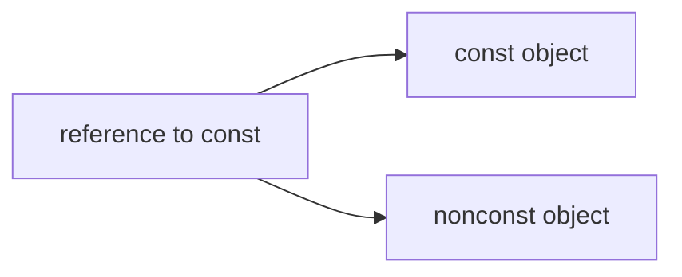

[TOC]

# Materials  
- GitHub: [Google Style Guides](https://github.com/google/styleguide)  
	- [Google C++ Style Guide](https://google.github.io/styleguide/cppguide.html)  

# Note  
- 打印函数名称，在函数内部直接使用语句 `cout << __func__ << endl;`  
- 函数中的某一变量需要初始化，则该函数不能放在 .h 文件中，否则编译出错。应将其放在 .cpp文件中。  
- **函数模板**和**类模板** **成员函数**的定义通常放在头文件中。
类模板，函数实现直接放在头文件，否则当头文件与main不在同一个文件夹下会报错；

## 与命令行交互  
- 从键盘输入文件结束符：Windows系统中，按`Ctrl+Z`，然后按`Enter`键。
- 遇到回车停止输入
```C++
char c;
c=cin.get();
if (c=='\n') 
    break;
```

## 头文件的防卫式声明  
- 知乎: [头文件的防卫式声明](https://zhuanlan.zhihu.com/p/336622992)  
- 知乎: [在 C++ 中防止头文件被重复包含时为什么同时使用 #ifndef 和 #pragma once？](https://www.zhihu.com/question/40990594)  
- 知乎: [【C++进阶之路】C++防止头文件被重复引入的3种方法！](https://zhuanlan.zhihu.com/p/352837146)  

# Grammar  

## Arrays数组  

> 3.5数组[^C++ Primer, 5th]  

### 定义和初始化内置数组  

> 3.5.1 定义和初始化内置数组[^C++ Primer, 5th]

- 数组的声明形如`a[d]`，其中`a`是数组的名字，`d`是数组的维度。数组中元素的个数也属于数组类型的一部分。维度必须是常量表达式。  
```C++
int arr[10];    // 含有10个整数的数组
int *parr[42];  // 含有42个整型指针的数组
```
默认情况下，数组的元素被默认初始化。
在函数内部定义了某种内置类型的数组，默认初始化会令数组含有未定义的值。
定义数组的时候必须指定数组的类型，不允许用auto关键字由初始值的列表推断类型。
数组的元素应为对象，不存在引用的数组。

#### 显式初始化数组元素  
- 可以对数组的元素进行列表初始化。  
```C++
int a2[] = {0, 1, 2};  // 维度是3的数组
```

#### 字符数组的特殊性  
- 可以用字符串字面值对字符数组初始化。  
- 字符串字面值的结尾还有一个空字符，这个空字符也会像字符串的其他字符一样被拷贝到字符数组中去。  

```C++
char a1[] = {'C', '+', '+'};  // 列表初始化，没有空字符
char a2[] = {'C', '+', '+', '\0'};  // 列表初始化，含有显式的空字符
char a3[] = "C++";  // 自动添加表示字符串结束的空字符

// 检查函数
template<int M>
void Test(const char (&aa)[M])
{
    int cnt = 0;
    for (auto ii=begin(aa);ii!=end(aa); ii++) {
        cnt ++;
        cout<<setw(5)<<*ii;
    }
    cout<<endl<<"number is: "<<cnt<<endl;
}

// 查看数组中元素存放元素个数
Test(a1);
Test(a2);
Test(a3);
```

#### 不允许拷贝和赋值  

#### 理解复杂的数组声明  
```C++
int *pts[10];  // pts是含有10个整形指针的数组
int &refs[0]=/*?*/;  // 错误，不存在引用的数组
int (*Parray)[10]=&arr;  // Parray指向一个含有10个整数的数组
int (&arrRef)[10]=arr;  // arrRef引用一个含有10个整数的数组
```
- 默认情况下，类型修饰符从右向左依次绑定。
- 要想理解数组声明的含义，最好的办法是从数组的名字开始按照由内向外的顺序阅读。

### 访问数组元素  
> 3.5.2 访问数组元素  

- 在使用数组下标的时候，通常将其定义为size_t类型。size_t是一种机器相关的无符号类型。  
- 在`cstddef`头文件中定义了size_t类型。  

### 指针和数组  
> 3.5.3 指针和数组  

- 通常情况下，使用**取地址符（&）**来获取指向某个对象的指针，取地址符可以用于任何对象。
- 在很多用到数组名字的地方，编译器都会自动地将其替换为一个指向数组首元素的指针。
- 使用数组作为一个auto变量的初始值时，推断得到的类型是指针而非数组。
- 使用decltype关键字与使用auto的结果不同

#### 指针也是迭代器  
- 尾后指针不指向具体的元素。不能对尾后指针执行解引用或递增的操作。  

#### 标准库函数begin和end  
- `begin`函数返回指向ia首元素的指针，`end`函数返回指向ia尾元素下一位置的指针。这两个函数定义在`iterator`头文件中。  

#### 指针运算  
- 给指针加上一个整数，得到的新指针扔需指向同一数组的其他元素，或者指向同一数组的尾元素的下一位置。  
- 两个指针相减的结果是它们之间的距离。参与运算的两个指针必须指向同一个数组当中的元素。
- 两个指针相减的结果类型是一种名为ptrdiff_t的标准库类型，定义在cdtddef头文件中的机器相关的类型。  

#### 解引用和指针运算的交互  
#### 下标和指针  
```C++
int ia[] = {0, 2, 4, 6, 8};
int *p = &ia[2];  // p指向索引为2的元素
int j = p[1];  // p[1]等价于*(p+1)
```

- 内置的下标运算符所用的索引值不是无符号类型。  

### 多维数组  
> 3.6 多维数组[^C++ Primer, 5th]  

严格来说，C++语言中没有多维数组，通常所说的多维数组其实是数组的数组。  

#### 多维数组的初始化  

#### 多维数组的下标引用  
- 如果表达式含有的下标运算符数量和数组的维度一样多，该表达式的结果将是给定类型的元素；反之，如果表达式含有的下标运算符数量比数组的维度小，则表达式的结果将是给定索引处的一个内层数组：  
```C++
int ia[3][4];
int (&row)[4]=ia;  // 指向ia的第一个4元素数组
int (&row)[4]=ia[1];  // 指向ia的第二个4元素数组
```

#### 使用范围for语句处理多维数组  
```C++
int a1[5][10];
int cnt = 0;
for (auto &row:a1) {
	for (auto &col:row) {  // 循环中有赋值操作，此处（最内层循环）必须使用引用
		col = ++cnt;
	}
}
```

- 将外层循环的控制变量声明为引用类型，避免数组被自动转成指针（auto语句）。
- 要使用范围for语句处理多维数组，除了最内层的循环外，其他所有循环的控制变量都应该是引用类型。  

#### 指针和多维数组  
- 多维数组实际上是数组的数组，由多维数组名转换得来的指针实际上是指向第一个内层数组的指针。  

```C++
// my test
int b[2][3] = {6, 5, 4, 3, 2, 1};
int (*a)[3] = b;
cout << **b << endl;
cout << **a<< endl;
cout << *(*a + 1) << endl;
cout << *(*(a + 1)) << endl;

// test for multiply array and pointers
int const M=3, N=5;
int arr[M][N], cnt=0;
for (int ii=0;ii<M;ii++) {
    for (int jj=0;jj<N;jj++) {
        arr[ii][jj] = cnt++;
    }
}

int (*ptr)[N] = arr;
for (int ii=0;ii<M;ii++) {
    for (int jj=0;jj<N;jj++) {
        cout<<setw(5)<<*(*(ptr+ii)+jj);
    }
    cout<<endl;
}
```

#### 类型别名简化多维数组的指针  
```C++
using int_array = int[4];
typedef int int_array[4];
```

## const Qualifier  
> 2.4 const限定符[^C++ Primer, 5th]  

const对象一旦创建后其值就不能再改变，所以const对象必须初始化。  
利用一个对象去初始化另外一个对象，则它们是不是const都无关紧要。  

#### 默认状态下，const对象仅在文件内有效  

定义，默认情况下，const对象被设定为仅在文件内有效。当多个文件中出现了同名的const变量时，其实等同于在不同文件中分别定义了独立的变量。  
某些时候有这样一种const变量，它的初始值不是一个常量表达式，但又确实有必要在文件间共享。  
*解决方法：对于const变量不管是声明还是定义都添加extern关键字。*  
如果想在多个文件之间共享const对象，必须在变量的定义之前添加extern关键字。  

### References to const  
reference to const, which is a reference that refers to a const type. Unlike an ordinary reference, a reference to const cannot be used to change the object to which the reference is bound.  

#### Initialization and References to const  
there are two exceptions to the rule that the type of a reference must match the type of the object to which it refers.  

- The first exception is that we can initialize a reference to const from any expression that can be converted to the type of the reference. In particular, we can bind a reference to const to a nonconst object, a literal, or a more general expression.




#### A Reference to const May Refer to an Object That Is Not const  
It is important to realize that a reference to const restricts only what we can do through that reference. Binding a reference to const to an object says nothing about whether the underlying object itself is const. Because the underlying object might be nonconst, it might be changed by other means.  

### Pointers and const  
> 2.4.2. Pointers and const  

Like a reference to const, a pointer to const may not be used to change the object to which the pointer points. 
We may store the address of a const object only in a pointer to const.
we noted that there are two exceptions to the rule that the types of a pointer and the object to which it points must match. The first exception is that we can use a pointer to const to point to a nonconst object.  

#### const Pointers  

a const pointer must be initialized, and once initialized, its value (i.e., the address that it holds) may not be changed. 
We indicate that the pointer is const by putting the const after the `*`. This placement indicates that it is the pointer, not the pointed-to type, that is const.

### Top-Level const  
> 2.4.3. Top-Level const  

We use the term top-level const to indicate that the pointer itself is a const. When a pointer can point to a const object, we refer to that const as a low-level const. 
More generally, top-level const indicates that an object itself is const.
Low-level const appears in the base type of compound types such as pointers or references. 
Note that pointer types, unlike most other types, can have both top-level and low-level const independently.

The distinction between top-level and low-level matters when we copy an object. When we copy an object, top-level consts are ignored.  
- Copying an object doesn’t change the copied object. As a result, it is immaterial whether the object copied from or copied into is const.  
- low-level const is never ignored. When we copy an object, both objects must have the same low-level const qualification or there must be a conversion between the types of the two objects. In general, we can convert a nonconst to const but not the other way round.  

### constexpr和常量表达式  
> 2.4.4. constexpr and Constant Expressions  

1. 常量表达式（const expression）是指值不会改变并且在编译过程就能得到计算结果的表达式。
2. 一个对象（或表达式）是不是常量表达式由它的数据类型和初始值共同决定。
将变量声明为constexpr类型以便由编译器来验证变量的值是否是一个常量表达式。声明为constexpr的变量一定是一个常量，而且必须用常量表达式初始化。

#### 字面值类型  
一个constexpr指针的初始值必须是nullptr或者0，或者是存储于某个固定地址中的对象。  
定义于所有函数体之外的对象其地址固定不变，能用来初始化constexpr指针。  
同样是在6.1.1节（第185页）中还将提到，允许函数定义一类有效范围超出函数本身的变量，这类变量和定义在函数体之外的变量一样也有固定地址。  

#### 指针和constexpr  
在constexpr声明中如果定义了一个指针，限定符constexpr仅对指针有效，与指针所指的对象无关。  

## Enumerations 枚举类型  
> 19.3 枚举类型  

枚举类型（enumeration）使我们可以将一组整型常量组织在一起。和类一样，每个枚举类型定义了一种新的类型。  
枚举属于字面值常量类型。  

C++包含两种枚举：限定作用域的和不限定作用域的。C++11新标准引入了限定作用域的枚举类型（scoped enumeration）。  
(1) 定义限定作用域的枚举类型的一般形式是：首先是关键字enum class（或者等价地使用enum struct），随后是枚举类型名字以及用花括号括起来的以逗号分隔的枚举成员（enumerator）列表，最后是一个分号。  
(2) 定义不限定作用域的枚举类型（unscoped enumeration）时省略掉关键字class（或struct），枚举类型的名字是可选的。  

如果enum是未命名的，则我们只能在定义该enum时定义它的对象。和类的定义类似，我们需要在enum定义的右侧花括号和最后的分号之间提供逗号分隔的声明列表。


### 枚举成员  

在限定作用域的枚举类型中，枚举成员的名字遵循常规的作用域准则，并且在枚举类型的作用域外是不可访问的。
在不限定作用域的枚举类型中，枚举成员的作用域与枚举类型本身的作用域相同。
默认情况下，枚举值从0开始，依次加1。可以为一个或几个枚举成员指定专门的值。
枚举值不一定唯一。
没有显式地提供初始值，则当前枚举成员的值等于之前枚举成员的值加1。
**枚举成员是const**，因此在初始化枚举成员时提供的初始值必须是常量表达式。

### 和类一样，枚举也定义新的类型  
1. 要想初始化enum对象或者为enum对象赋值，必须使用该类型的一个枚举成员或者该类型的另一个对象：
2. 一个不限定作用域的枚举类型的对象或枚举成员自动地转换成整型。
### 指定enum的大小  
1. 在enum的名字后加上冒号以及在该enum中使用的类型。
2. 指定enum的潜在类型，则默认情况下限定作用域的enum成员类型是int。对于不限定作用域的枚举类型来说，其枚举成员不存在默认类型，
### 枚举类型的前置声明  
1. enum的前置声明（无论隐式地还是显示地）必须指定其成员的大小：
2. 不能在同一个上下文中先声明一个不限定作用域的enum名字，然后再声明一个同名的限定作用域的enum。
### 形参匹配与枚举类型  
1. 初始化一个enum对象，必须使用该enum类型的另一个对象或者它的一个枚举成员。  


## Exception Handling  
> 5.6 TRY语句块和异常处理[^C++ Primer, 5th]  

### throw表达式  
> https://en.cppreference.com/w/cpp/language/throw  

- 程序的异常检测部分使用throw表达式引发一个异常。throw表达式包含关键字throw和紧随其后的一个表达式，其中表达式的类型就是抛出的异常类型。throw表达式后面通常紧跟一个分号，从而构成一条表达式语句。  

```C++
// throw runtime_error("This is runtime error");
try {
    throw runtime_error("This is runtime error!");
} catch (runtime_error err) {
    cout<<err.what()<<"\ncatch it\n";
}
```

### try语句块  
> https://en.cppreference.com/w/cpp/language/try_catch  

- 函数在寻找处理代码的过程中退出  
&emsp;&emsp;(1) 没能找到任何匹配的catch子句，程序转到名为terminate的标准库函数。该函数的行为与系统有关，一般情况下，执行该函数将导致程序非正常退出。
&emsp;&emsp;(2) 程序没有try语句块且发生了异常，系统会调用terminate函数并终止当前程序的执行。

### 标准异常  
- exception头文件定义了最通用的异常类exception。它只报告异常的发生，不提供任何额外信息。  
[`Standard library header <exception>`](https://en.cppreference.com/w/cpp/header/exception)  

- stdexcept头文件定义了几种常用的异常类。  
[`Standard library header <stdexcept>`](https://en.cppreference.com/w/cpp/header/stdexcept)  

|Classes||
|:-|:-|
|[**runtime_error**](https://en.cppreference.com/w/cpp/error/runtime_error)|exception class to indicate conditions only detectable at run time|

- new头文件定义了bad_alloc异常类型  
[`Standard library header <new>`](https://en.cppreference.com/w/cpp/header/new)  

- type_info头文件定义了bad_cast异常类型  
[`Standard library header <typeinfo>`](https://en.cppreference.com/w/cpp/header/typeinfo)  


## Expressions表达式  
### The Conditional Operator  
> 4.7 条件运算符  

- 条件运算符（`? :`）允许我们把简单的if-else逻辑嵌入到单个表达式当中，条件运算符按照如下形式使用:  
```C++
cond?expr1:expr2;
```
&emsp;&emsp;其中cond是判断条件的表达式，而expr1和expr2是两个类型相同或可能转换为某个公共类型的表达式。  

- 条件运算符的执行过程是：首先求cond的值，如果条件为真对expr1求值并返回该值，否则对expr2求值并返回该值。  

## Functions  
> 6 函数

### 函数基础  
> 6.1 函数基础

1. 一个典型的函数（function）定义包括以下部分：返回类型（return type）、函数名字、由0个或多个形参（parameter）组成的列表以及函数体。其中，形参以逗号隔开，形参的列表位于一对圆括号之内。函数执行的操作在语句块（参见5.1节，第155页）中说明，该语句块称为函数体（function body）。
2. 通过调用运算符（call operator）来执行函数。调用运算符的形式是一对圆括号，它作用于一个表达式，该表达式是函数或者指向函数的指针；圆括号之内是一个用逗号隔开的实参（argument）列表，我们用实参初始化函数的形参。调用表达式的类型就是函数的返回类型。
##### 形参和实参
1. 实参是形参的初始值。
2. 尽管实参与形参存在对应关系，但是并没有规定实参的求值顺序（参见4.1.3节，第123页）。编译器能以任意可行的顺序对实参求值。
3. 实参的类型必须与对应的形参类型匹配。

##### 函数的形参列表
1. 函数的形参列表可以为空，但是不能省略。要想定义一个不带形参的函数，最常用的办法是书写一个空的形参列表。不过为了与C语言兼容，也可以使用关键字void表示函数没有形参：
##### 函数返回类型
1. 返回类型是void，它表示函数不返回任何值。
函数的返回类型不能是数组类型或函数类型，但可以是指向数组或函数的指针。

### 参数传递  
> 6.2 参数传递  

#### 数组形参  
> 6.2.4 数组形参  

1. 不允许拷贝数组；
2. 使用数组时（通常）会将其转换成指针；
3. 因为不能拷贝数组，所以我们无法以值传递的方式使用数组参数。
4. 因为数组会被转换成指针，所以当我们为函数传递一个数组时，实际上传递的是指向数组首元素的指针。
5. 管理指针形参有三种常用的技术
    (1) 使用标记指定数组长度
    (2) 使用标注库规范
    (3) 显示传递一个表示数组大小的形参

##### 数组引用形参
数组的大小是构成数组类型的一部分。
```C++
// &arr 两端的括号必不可少
// arr是具有2行3列整型数组的引用
void PrintArray2D(int (&arr)[2][3])
{
    for (auto &row:arr) {
        for (auto &col:row) {
            cout<<"     "<<col;
        }
        cout<<endl;
    }
}

// test
int aa[2][3] = {{1, 2, 3}, {10, 20, 30}};
PrintArray2D(aa);
```

##### 传递多维数组
1. 当将多维数组传递给函数时，传递的是指向数组首元素的指针。
2. 处理数组的数组，首元素本身就是一个数组，指针就是一个指向数组的指针。数组第二维（以及后面所有维度）的大小都是数组类型的一部分，不能省略。
```C++
// example one =========================================
// 指向含有3个整数的数组的指针
void PrintArray2D(int (*arr)[3], int row_size)
{
    // 等价定义 void PrintArray2D(int arr[][3], int row_size)
    for (int ii=0;ii<row_size;ii++) {
        for (int jj=0;jj<3;jj++) {
            cout<<"     "<<arr[ii][jj];
        }
        cout<<endl;
    }
}

// test
int aa[2][3] = {{1, 2, 3}, {10, 20, 30}};
PrintArray2D(aa, 2);

// example two =========================================
void PrintArray2D(int *arr[2], int row_size)
{
    // 经测试，将*arr[2] 改为 *arr[3] 或 **arr 均可
    for (int ii=0;ii<row_size;ii++) {
        for (int jj=0;jj<3;jj++) {
            cout<<"     "<<arr[ii][jj];
        }
        cout<<endl;
    }
}

// test
int aa[2][3] = {{1, 2, 3}, {10, 20, 30}};
int *bb[2];  // 2个指针构成的数组
bb[0] = aa[0];
bb[1] = aa[1];
PrintArray2D(bb, 2);
```

### 返回类型和return语句  
> 6.3 返回类型和return语句

1. return语句终止当前正在执行的函数，将控制权返回到调用该函数的地方。return语句有两种形式：
```C++
return;
return expression;
```

#### 无返回值函数  
> 6.3.1 无返回值函数  

没有返回值的return语句只能用在返回类型是void的函数中。返回void的函数不要求有return语句，因为这类函数的最后一句后面会隐式地执行return。  

#### 返回数组指针  
> 6.3.3 返回数组指针  

1. 数组不能被拷贝，所以函数不能返回数组。	  
2. 函数可以返回数组的指针或引用。  
3. 其中最直接的方法是使用类型别名。  
##### 声明一个返回数组指针的函数  
1. 定义一个返回数组指针的函数，则数组的维度必须跟在函数名字之后。然而，函数的形参列表也跟在函数名字后面且形参列表应该先于数组的维度。  
2. 返回数组指针的函数形式如下所示：
```C++
Type (*function(parameter_list)) [dimension]
```
`(*function(parameter_list))`两端的括号必须存在。如果没有这对括号，函数的返回类型将是指针的数组。  

```C++
// my test
int(*(days_in_month()))[12]
{
	// 一年中每个月的天数
	static int tmp_days[12] = { 31, 28, 31, 30, 31, 30, 31, 31, 30, 31, 30, 31 };  
	int(*days)[12] = &tmp_days;
	// cout << endl << year << " " << (*days)[1] << endl << endl;
	return days;
}

// 函数调用
int(*arr)[12] = days_in_month();
for (int ii = 0; ii < 12; ii++) {
	cout << *(*arr + ii) << endl;
}
```

##### 使用尾置返回类型
1. 尾置返回类型（trailing return type）。
2. 任何函数的定义都能使用尾置返回，但是这种形式对于返回类型比较复杂的函数最有效，比如返回类型是数组的指针或者数组的引用。
尾置返回类型跟在形参列表后面并以一个 -> 符号开头。  
```C++
// func接受一个int类型的实参，返回一个指针，该指针指向含有10个整数的数组
auto func(int i) -> int(*)[10];
```

##### 使用decltype  
知道函数返回的指针指向哪个数组，就可以使用decltype关键字声明返回类型。
```C++
int odd[] = {1, 3, 5, 7, 9};
int even[] = {0, 2, 4, 6, 8};

decltype(odd) *arr_ptr(int ii)
{
    return (ii%2)?&odd:&even;
}
```
decltype并不负责把数组类型转换成对应的指针，所以decltype的结果是个数组，要想表示arrPtr返回指针还必须在函数声明时加一个＊符号。

### 函数重载  
> 6.4 函数重载


### Lambda Expressions  
> 10.3.2 lambda表达式  

- 一个lambda表达式表示一个可调用的代码单元。可以将其理解为一个未命名的内联函数。lambda具有一个返回类型、一个参数列表和一个函数体。与函数不同，lambda可以定义在函数内部。
- lambda表达式具有如下形式
`[capture list] (parameter list) -> return type {function body}`
- lambda必须使用尾置返回来指定返回类型。
- 可以忽略参数列表和返回类型，但必须永远包含捕获列表和函数体。
```C++
auto f = [] {return 42;};
```

- 在lambda中忽略括号和参数列表等价于指定一个空参数列表。
- 如果忽略返回类型，lambda根据函数体中的代码推断出返回类型。
- 如果lambda的函数体包含任何单一return语句之外的内容，且未指定返回类型，则返回void。
- 向lambda传递参数
lambda不能有默认参数。  

#### Lambda Captures and Returns  
> 10.3.3 lambda捕获和返回

## Generic Algorithms  
> 10 泛型算法  

### 概述  
1. 大多数算法都定义在头文件algorithm中。标准库还在头文件numeric中定义了一组数值泛型算法。
2. 一般情况下，这些算法并不直接操作容器，而是遍历由两个迭代器指定的一个元素范围。
3. 迭代器令算法不依赖于容器，但算法依赖于元素类型的操作。
4. 泛型算法本身不会执行容器的操作，它们只会运行于迭代器之上，执行迭代器的操作。


## Namespace命名空间  

> 3.1 命名空间的using声明  

- using声明具有如下的形式:  
```C++
using namespace::name;
```

- 每个名字都必须有自己的声明语句，而且每句话都得以分号结束。  
```C++
using std::cin;
using std::cout; using std::endl;
```
or  
```C++
using namespace std;
```

- 头文件不应包含using声明  
头文件的内容会拷贝到所有引用它的文件中去。  

## OOP  
Object-Oriented Programming[^Chapter 7. Classes]

[^Chapter 7. Classes]: [^C++ Primer, 5th]
[^15 面向对象程序设计]: [^C++ Primer, 5th]

## Pointers指针  
> 2.3.2 指针[^C++ Primer, 5th]  

- 指针与引用相比的不同点：
(1) 指针本身就是一个对象，允许对指针赋值和拷贝，而且在指针的声明周期内它可以先后指向几个不同的对象。  
(2) 指针无须在定义时赋初值。  

- 定义指针类型的方法将声明符写成`*d`的形式，其中`d`是变量名。如果在一条语句中定义了几个指针变量，每个变量前面都必须有符号`*`。

### 获取对象的地址  
- 指针存放某个对象的地址，要想获取该地址，需要使用取地址符（操作符&）  
```C++
int ival=42;
int *p=&ival;
```

- 引用不是对象，没有实际地址，不能定义指向引用的指针。  

### 指针值  

- 指针的值（即地址）应属下列4种状态之一：
	(1) 指向一个对象。
	(2) 指向紧邻对象所占空间的下一个位置。
	(3) 空指针，意味着指针没有指向任何对象。
	(4) 无效指针，也就是上述情况之外的其他值。
- 试图拷贝或以其他方式访问无效指针的值都将引发错误。  

### 利用指针访问对象  
- 如果指针指向了一个对象，则允许使用**解引用符**（操作符`*`）来访问该对象。
- 对指针解引用会得出所指的对象。
- 解引用操作仅适用于那些确实指向了某个对象的有效指针。

### 空指针  

- 空指针（null pointer）不指向任何对象，在试图使用一个指针之前，代码可以首先检查它是否为空。  
- 生成空指针的方法  
```C++
int *p1=nullptr;  // 等价于 int *p1=0;
int *p2=0;  // 直接将p2初始化为字面值常量0
// 需要首先 #include <cstdlib>
int *p3=NULL;  // 等价于 int *p3=0;
```

- 把int变量直接赋给指针是错误的操作，即使int变量的值恰好等于0也不行。  

### 赋值和指针  
### 其他指针操作  
- 只要指针拥有一个合法值，就能将它用在条件表达式中。和采用算术值作为条件遵循的规则类似，如果指针的值是0，条件取false。  
- 任何非0指针对应的条件值都是true。  

### `void*`指针  
- `void*`是一种特殊的指针类型，可用于存放任意对象的地址。
- 不能直接操作`void*`指针所指的对象。

## Regular Expressions  
https://en.cppreference.com/w/cpp/regex
> 17.3 正则表达式  

- RE库定义在头文件`regex`中  


## References引用  
> 2.3.1 引用[^C++ Primer, 5th]  

- 引用为对象起了另外一个名字。将声明符写成 &d的形式来定义引用类型，其中d是声明的变量名：  
```C++
int ival=1024;
int &refVal=ival;
```

- 引用必须初始化；  

#### 引用即别名
- 定义了一个引用之后，对其进行的所有操作都是在与之绑定的对象上进行的。
- 引用本身不是一个对象，不能定义引用的引用。
#### 引用的定义
-   引用只能绑定在对象上，不能与字面值或某个表达式的计算结果绑定在一起。


## Statements语句  
### Iterative Statements  

#### Range for Statement  
> 5.4.3 范围for语句  

- 范围for语句（range for statement）的语法形式是:  
```C++
for (declaration: expression)
	statement
```

&emsp;&emsp;(1) expression表示的必须是一个序列，比如用花括号括起来的初始值列表、数组或者vector或string等类型的对象，这些类型的共同特点是拥有能返回迭代器的`begin`和`end`成员。    
&emsp;&emsp;(2) declaration定义一个变量，序列中的每个元素都得能转换成该变量的类型。确保类型相容最简单的办法是使用`auto`类型说明符。  
&emsp;&emsp;(3) 对序列中的元素执行**写操作**，循环变量必须声明成**引用**类型。  


## STL  
standard template library  

### Iterators迭代器  

> 3.4 迭代器介绍  
所有标准容器库都可以使用迭代器。  
> 9.2.1 迭代器  
> 9.2.3 begin和end成员

标准容器类型上的所有迭代器都允许我们访问容器中的元素，而所有迭代器都是通过解引用运算符来实现这个操作的。  

- 迭代器范围  

迭代器范围的概念是标准库的基础。
迭代器范围（iterator range）由一对迭代器表示，两个迭代器分别指向同一个容器中的元素或者是尾元素之后的位置（one past the last element）。
左闭合区间（left-inclusive interval），其标准数学描述为
	`[begin, end)`
表示范围自begin开始，与end之前结束。迭代器begin和end必须指向相同的容器。end可以与begin指向相同的位置，但不能指向begin之前的位置。


#### begin和end成员
> 9.2.3 begin和end成员  

`begin`和`end`操作生成指向容器中第一个元素和尾元素之后位置的迭代器。

> 3.4.1 使用迭代器  
如果容器为空，则begin和end返回的是同一个迭代器，都是**尾后迭代器（off-the-end iterator）**。
`begin`和`end`运算符返回的具体类型由对象是否是常量决定，如果对象是常量，`begin`和`end`返回`const_iterator`；如果对象不是常量，返回`iterator`。
`cbegin`和`cend`，无论`vector`对象本身是否为常量，返回值都是`const_iterator`。

与`const`指针和引用类似，可以将一个普通的`iterator`转换为对应的`cosnt_iterator`，但反之不行。
当`auto`与`begin`或`end`结合使用时，获得的迭代器类型依赖于容器类型，与想要如何使用迭代器毫不相干。

```C++
list<string> a = {"Milton","Austen"};
list<string>::iterator it5 = a.begin();
auto it7=a.begin();

cout << *it5 << endl;
cout << *(++it7) << endl;
```

#### 使用迭代器  
> 3.4.1 使用迭代器  

有迭代器的类型同时拥有返回迭代器的成员。

如果容器为空，则begin和end返回的是同一个迭代器，都是**尾后迭代器（off-the-end iterator）**。

- 迭代器运算符  
使用==和!=来比较两个合法的迭代器是否相等，如果两个迭代器指向的元素相同或者都是同一个容器的尾后迭代器，则它们相等。
执行解引用的迭代器必须合法并确实指示着某个元素。

- 将迭代器从一个元素移动到另一个元素  
迭代器使用递增（++）运算符来从一个元素移动到下一个元素。
因为end返回的迭代器并不实际指向某个元素，所以不能对其进行递增或解引用操作。  

- 迭代器类型  
拥有迭代器的标准库类型使用iterator和const_iterator来表示迭代器的类型。  
```C++
vector<int>::iterator it;
string::iterator it2;
```

- 结合解引用和成员访问操作  
解引用迭代器可获得迭代器所指的对象。  
```C++
(*it).empty();  // 解引用it，然后调用结果对象的empty成员
```

C++定义了箭头运算符（`->`）。箭头运算符把解引用和成员访问两个操作结合在一起，`it->mem`和`(*it).mem`表达的意思相同。  
```C++
it -> empty();
```

- 某些对vector对象的操作会使迭代器失效  
使用了迭代器的循环体，都不要向迭代器所属的容器添加添加元素。


### sequential containers顺序容器  
> 9 顺序容器[^C++ Primer, 5th]  

> 9.1 顺序容器概述  


- 确定使用哪种容器
1. 除非你有很好的理由选择其他容器，否则应使用vector。
2. 如果不确定使用哪种容器，可以在程序中只使用vector和list公共的操作：使用迭代器，不使用下标操作，避免随机访问。这样，在必要时选择使用vector或list都很方便。

#### 容器库概览  
1. 一般来说，每个容器都定义在一个头文件中，文件名与类型名相同。
1. 容器均定义为**模板类**。  


###### 对容器可以保存的元素类型的限制
1. 顺序容器几乎可以保存任意类型的元素。
1. 可以定义一个容器，其元素的类型是另一个容器。  

```C++
vector<vector<string>> vec;
string s1{"line"}, s2{"work"};
vector<string> vec1{s1, s2};
vector<string> vec2{s2, s1};
vec.push_back(vec1);
vec.push_back(vec2);

for (auto ii=vec.begin(); ii!=vec.end();ii++) {
    for (auto jj = (*ii).begin(); jj!=(*ii).end(); jj++) {
        cout<<*jj<<"  ";
    }
    cout<<endl;
}
```

##### 容器类型成员  
> 9.2.2 容器类型成员  

1. 通过类型别名，可以在不了解容器中元素类型的情况下使用它。
1. 使用这些类型，必须显式使用其类名：  
```C++
list<string>::iterator iter;  // iter是通过list<string>定义的一个迭代器类型
```

##### 容器定义和初始化  
> 9.2.4 容器定义和初始化

###### 将一个容器初始化为另一个容器的拷贝
1. 两种方法：直接拷贝整个容器，或者（array除外）拷贝由一个迭代器对指定的元素范围。
2. 创建一个容器为另一个容器的拷贝，两个容器的类型及其元素类型必须匹配。当传迭代器参数来拷贝一个范围时，就不要求容器类型是相同的了。而且，新容器和原容器中的元素类型也可以不同，只要能将要拷贝的元素转换为要初始化的容器的元素类型即可。
###### 标准库array具有固定大小
与内置数组一样，标准库array的大小也是类型的一部分。当定义一个array时，除了指定元素类型，还要指定容器大小。
```C++
array<int, 42> ia1;
```

不能对内置数组类型进行拷贝或对象赋值操作，但array并无此限制：
```C++
array<int, 3> ia1={1,2,3};
array<int, 3> ia2=ia1;
for (auto vb=ia1.begin();vb!=ia1.end();vb++)
	cout<<"  "<<*vb;
```

#### 顺序容器操作  
> 9.3 顺序容器操作  

##### 向顺序容器添加元素
> 9.3.1 向顺序容器添加元素  

###### 使用push_back
###### 关键概念：容器元素是拷贝
1. 当我们用一个对象来初始化容器时，或将一个对象插入到容器中时，实际上放入到容器中的是对象值的一个拷贝，而不是对象本身。  

##### 访问元素  
>9.3.2 访问元素  


###### 访问成员函数返回的是引用  
1. 在容器中访问元素的成员函数（即front、back、下标和at）返回的都是引用。
###### 下标操作和安全的随机访问  
1. 如果我们希望确保下标是合法的，可以使用at成员函数。at成员函数类似下标运算符，但如果下标越界，at会抛出一个out_of_range异常。

##### 删除元素  
> 9.3.3 删除元素  

1. 删除元素的成员函数并不检查其参数。在删除元素之前，程序员必须确保它（们）是存在的。

#### 容器适配器  
> 9.6 容器适配器

1. 除了顺序容器外，标准库还定义了三个顺序容器适配器：stack、queue和priority_queue。
2. 适配器（adaptor）是标准库中的一个通用概念。容器、迭代器和函数都有适配器。本质上，一个适配器是一种机制，能使某种事物的行为看起来像另外一种事物一样。一个容器适配器接受一种已有的容器类型，使其行为看起来像一种不同的类型。
##### 定义一个适配器  
1. 每个适配器都定义两个构造函数：默认构造函数创建一个空对象，接受一个容器的构造函数拷贝该容器来初始化适配器。
2. 默认情况下，stack和queue是基于deque实现的，priority_queue是在vector之上实现的。我们可以在创建一个适配器时将一个命名的顺序容器作为第二个类型参数，来重载默认容器类型。
3. 对于一个给定的适配器，可以使用哪些容器是有限制的。所有适配器都要求容器具有添加和删除元素的能力。因此，适配器不能构造在array之上。类似的，我们也不能用forward_list来构造适配器，因为所有适配器都要求容器具有添加、删除以及访问尾元素的能力。stack只要求push_back、pop_back和back操作，因此可以使用除array和forward_list之外的任何容器类型来构造stack。queue适配器要求back、push_back、front和push_front，因此它可以构造于list或deque之上，但不能基于vector构造。priority_queue除了front、push_back和pop_back操作之外还要求随机访问能力，因此它可以构造于vector或deque之上，但不能基于list构造。  

##### 栈适配器
1. stack类型定义在stack头文件中。
2. 每个容器适配器都基于底层容器类型的操作定义了自己的特殊操作。我们只可以使用适配器操作，而不能使用底层容器类型的操作。
##### 队列适配器
1. queue和priority_queue适配器定义在queue头文件中。
2. 标准库queue使用一种先进先出（first-in，first-out，FIFO）的存储和访问策略。进入队列的对象被放置到队尾，而离开队列的对象则从队首删除。
3. priority_queue允许我们为队列中的元素建立优先级。新加入的元素会排在所有优先级比它低的已有元素之前。


### string  
> 3.2 标准库类型string[^C++ Primer, 5th]  

标准库类型string表示可变长的字符序列，使用string类型必须首先包含`string`头文件。  

```C++
#include <string>
using std::string;
```

#### 定义和初始化string对象  
> 3.2.1 定义和初始化string对象[^C++ Primer, 5th]  

##### 直接初始化和拷贝初始化
如果使用等号（=）初始化一个变量，实际上执行的是**拷贝初始化（copy initialization）**，编译器把等号右侧的初始值拷贝到新创建的对象中去。如果不使用等号，则执行的是**直接初始化（direct initialization）**。  

```C++
string s5 = "hiya";  // 拷贝初始化
string s6("hiya");  // 直接初始化
string s7(10, 'c');  // 直接初始化
string s8 = string(10, 'c');  // 拷贝初始化
```

#### string对象上的操作  
> 3.2.2 string对象上的操作  

##### 读写string对象
1. 在执行读取操作时，string对象会自动忽略开头的空白（即空格符、换行符、制表符等）并从第一个真正的字符读起，直到遇见下一处空白为止。
##### 读取未知数量的string对象
##### 使用getline读取一整行
1. getline函数的参数是一个输入流和一个string对象，函数从给定的输入流中读入内容，直到遇到换行符为止（注意换行符也被读进来了），然后把所读的内容存入到那个string对象中去（注意不存换行符）。
2. 触发getline函数返回的那个换行符实际上被丢弃掉了，得到的string对象中并不包含该换行符。  
```C++
string line;
int cnt = 0;
while (getline(cin, line)) {
    cout<<line<<endl;
    cnt++;
    if (cnt > 3) break;
}
```

##### string的empty和size操作  
empty函数根据string对象是否为空返回一个对应的布尔值。
size函数返回string对象的长度（即string对象中字符的个数）。  

##### string::size_type类型  
size函数返回的是一个string::size_type类型的值。
string::size_type是无符号类型的值。
表达式中混用带符号数和无符号数，负值会自动转换成一个比较大的无符号值。  

##### 字面值和string对象相加  
标准库允许把字符字面值和字符串字面值转换成string对象
当把string对象和字符字面值及字符串字面值混在一条语句中使用时，必须确保每个加法运算符（+）的两侧的运算对象至少有一个是string；
C++语言中，**字符串字面值**并不是**标准库类型string的对象**。  

#### 处理string对象中的字符  
> 3.2.3 处理string对象中的字符  

1. 改变某个字符的特性，在cctype头文件中定义了一组标准函数处理这部分工作。
2. C语言的头文件形如name.h，C++则将这些文件命名为cname。
3. 名为cname的头文件中定义的名字从属于命名空间std。

##### 处理每个字符？使用基于范围的for语句  
范围for（range for）其语法形式是：
```C++
for (declaration: expression)
	statement
```
其中，expression部分是一个对象，用于表示一个序列。declaration部分负责定义一个变量，该变量呗用于访问序列中的基础元素。每次迭代，declaration部分的变量会被初始化为expression部分的下一个元素值。
```C++
string str("some string");
for (auto c:str)
	cout<<c<<endl;
```

##### 使用范围for语句改变字符串中的字符
1. 要改变string对象中字符的值，必须把循环变量定义成引用类型。
*测试指针失败*  
```C++
// my test
string str("hello world!");
for (auto &c:str)  // for (char &c:str)
	c = toupper(c);
cout << str << endl;
```

##### 只处理一部分字符  
1. 访问string对象中的单个字符有两种方式，一种是使用下标，另外一种是使用迭代器
2. 下标运算符（`[]`）接收的输入参数是`string::size_type`类型的值，这个参数表示要访问的字符的位置，返回值是该位置上的**引用**。


### vector  
https://en.cppreference.com/w/cpp/container/vector  
> 3.3 标准库类型vector[^C++ Primer, 5th]  

- 标准库类型vector表示对象的集合，其中所有对象的类型都相同。集合中的每个对象都有一个与之对应的索引，索引用于访问对象。
- vector是一个容器（container）。
- 要想使用vector，必须包含适当的头文件  
```C++
#include <vector>
using std::vector;
```

- vector是类模板。  
- 模板本身不是类或函数。  
- 编译器根据模板创建类或函数的过程称为实例化（instantiation），当使用模板时，需要指出编译器应把类或函数实例化成何种类型。  
- 由vector生成的类型必须包含vector中元素的类型，如 `vector<int>`。  

- 向vector对象中添加元素  
```C++
vector<int> ivec;
for (int ii = 0; ii < 100; ii++) {
	ivec.push_back(ii);
}
```
范围for语句体内不应改变其所遍历序列的大小。  

- 使用范围for语句处理vector对象中的所有元素  
```C++
vector<int> ivec1, ivec2;
for (int ii=0;ii<5;ii++) {
    ivec1.push_back(ii);
    ivec2.push_back(ii+1);
}

vector<vector<int>> vec3{ivec1, ivec2};
for (auto &vv: vec3) {
    for (auto &ii: vv) {
        cout<<setw(5)<<ii;
    }
    cout<<endl;
}
```

- vector对象的类型总是包含着元素的类型。
```C++
vector<int>::size_type  // 正确
vector::size_type // 错误
```

#### vector对象是如何增长的  
- 管理容量的成员函数  
	1. reserve并不改变容器中元素的数量，它仅影响vector预先分配多大的内存空间。
	2. 只有当需要的内存空间超过当前容量时，reserve调用才会改变vector的容量。如果需求大小大于当前容量，reserve至少分配与需求一样大的内存空间（可能更大）。
	3. resize成员函数只改变容器中元素的数目，而不是容器的容量。

- 容器的size是指它已经保存的元素的数目；而capacity则是在不分配新的内存空间的前提下它最多可以保存多少元素。

## Templates  
> 16 模板与泛型编程  

### 函数模板  
> 16.1.1 函数模板  

1. 函数模板定义以关键字template开始，后跟一个模板参数列表（template parameter list），这是一个逗号分隔的一个或多个模板参数（template parameter）的列表，用小于号（<）和大于号（>）包围起来。
2. 在模板定义中，模板参数列表不能为空。
#### 实例化函数模板  
1. 当我们调用一个函数模板时，编译器（通常）用函数实参来为我们推断模板实参。
#### 模板类型参数  
1. 类型参数可以用来指定返回类型或函数的参数类型，以及在函数体内用于变量声明或类型转换。
2. 类型参数前必须使用关键字class或typename。
3. template<typename T, U> T calc(const T &, const U&);  // 错误：U之前必须加上class或typename
#### 非模板类型参数  
1. 非类型参数表示一个值而非一个类型。
2. 必须是常量表达式，从而允许编译器在编译时实例化模板。
3. 非类型模板参数的实参必须是常量表达式。
4. 指针参数可以使用nullptr或一个值为0的常量表达式来实例化。
#### inline和constexpr的函数模板  
1. inline或constexpr说明符放在模板参数列表之后，返回类型之前：
```C++
template <typename T> inline T min(const T &, const T&);
```

#### 模板编译  
1. 为了生成一个实例化版本，编译器需要掌握函数模板或类模板成员函数的定义。
2. 函数模板和类模板成员函数的定义通常放在头文件中。
***一定放在头文件中，尤其是当 头文件与main函数不在同一个文件夹中时，会报错***

### 类模板  
> 16.1.2 类模板  

1. 编译器不能为类模板推断模板参数类型。
2. 为了使用类模板，我们必须在模板名后的尖括号中提供额外信息

#### 定义类模板
1. 类模板以关键字template开始，后跟模板参数列表。
#### 实例化类模板
1. 使用一个类模板时，必须提供额外信息。即显式模板实参（explicit template argument）列表，它们被绑定到模板参数。
2. 一个类模板的每个实例都形成一个独立的类。

#### 类模板的成员函数
1. 定义在类模板内的成员函数被隐式声明为内联函数。
2. 类模板的每个实例都有其自己版本的成员函数。因此，类模板的成员函数具有和模板相同的模板参数。
3. 定义在类模板之外的成员函数就必须以关键字template开始，后接类模板参数列表。
#### Blob构造函数 
1. 与其他任何定义在类模板外的成员一样，构造函数的定义要以模板参数开始。 
#### 类模板成员函数的实例化
1. 默认情况下，一个类模板的成员函数只有当程序用到它时才进行实例化。
#### 在类代码内简化模板类名的使用
1. 在类模板自己的作用域中，我们可以直接使用模板名而不提供实参：
#### 在类模板外使用类模板名 
#### 类模板和友元 
1. 类与友元各自是否是模板是相互无关的。 

#### 令模板自己的类型参数成为友元 
	1. 可以将模板类型参数声明为友元。 
#### 模板类型别名  
```C++
template<typename T1, typename T2>
struct BinaryTreeNode {
    BinaryTreeNode *left = nullptr;
    BinaryTreeNode *right = nullptr;
    BinaryTreeNode *parent = nullptr;
    T1 key;
    T2 data;
};

typedef BinaryTreeNode<int, int> BTNodeInt;
template<typename T1, typename T2> using BTNode = BinaryTreeNode<T1, T2>;
```

1. 类模板的一个实例定义了一个类类型，与任何其他类类型一样，我们可以定义一个typedef（参见2.5.1节，第60页）来引用实例化的类。
2. 由于模板不是一个类型，我们不能定义一个typedef引用一个模板。 
3. 为类模板定义一个类型别名。 
4. 一个模板类型别名是一族类的别名。 
5. 当我们定义一个模板类型别名时，可以固定一个或多个模板参数。  
#### 类模板的static成员  
与任何其他static数据成员相同，模板类的每个static数据成员必须有且仅有一个定义。但是，类模板的每个实例都有一个独有的static对象。因此，与定义模板的成员函数类似，我们将static数据成员也定义为模板。

### 模板参数  
> 16.1.3 模板参数  

#### 模板参数与作用域 
1. 模板参数会隐藏外层作用域中声明的相同名字。但是，与大多数其他上下文不同，在模板内不能重用模板参数名。 
#### 模板声明
1. 模板声明必须包含模板参数。 
2. 与函数参数相同，声明中的模板参数的名字不必与定义中相同。 
3. 一个给定模板的每个声明和定义必须有相同数量和种类（即，类型或非类型）的参数。 
4. 一个特定文件所需要的所有模板的声明通常一起放置在文件开始位置，出现于任何使用这些模板的代码之前，原因我们将在16.3节（第617页）中解释。 
#### 使用类的类型成员
1. 默认情况下，C++语言假定通过作用域运算符访问的名字不是类型。 
2. 使用一个模板类型参数的类型成员，就必须显式告诉编译器该名字是一个类型。我们通过使用关键字typename来实现这一点。 
3. 当我们希望通知编译器一个名字表示类型时，必须使用关键字typename，而不能使用class。 
#### 默认模板实参
1. 为此模板参数提供了默认实参，并为其对应的函数参数也提供了默认实参。
2. 与函数默认实参一样，对于一个模板参数，只有当它右侧的所有参数都有默认实参时，它才可以有默认实参。
#### 模板默认实参与类模板
1. 无论何时使用一个类模板，我们都必须在模板名之后接上尖括号。尖括号指出类必须从一个模板实例化而来。特别是，如果一个类模板为其所有模板参数都提供了默认实参，且我们希望使用这些默认实参，就必须在模板名之后跟一个空尖括号对。

### 成员模板  
> 16.1.4 成员模板

1. 一个类（无论是普通类还是类模板）可以包含本身是模板的成员函数。这种成员被称为成员模板（member template）。
2. 成员模板不能是虚函数。
普通（非模板）类的成员模板
#### 类模板的成员模板
1. 对于类模板，我们也可以为其定义成员模板。在此情况下，类和成员各自有自己的、独立的模板参数。
2. 与类模板的普通函数成员不同，成员模板是函数模板。当我们在类模板外定义一个成员模板时，必须同时为类模板和成员模板提供模板参数列表。类模板的参数列表在前，后跟成员自己的模板参数列表。
#### 实例化与成员模板
为了实例化一个类模板的成员模板，我们必须同时提供类和函数模板的实参。

### 模板实参推断  
> 16.2 模板实参推断  

#### 函数模板显式实参
> 16.2.2 函数模板显式实参

##### 函数模板显式实参  
```C++
template <typename T1, typename T2, typename T3>
T1 sum(T2, T3);
```

1. 提供显式模板实参的方式与定义类模板实参的方式相同。显式模板实参在尖括号中给出，位于函数名之后，实参列表之前：
```C++
auto val3=sum<long long>(ii, ing>
```
2. 显式模板实参按由左至右的顺序与对应的模板参数匹配。


## Tuple Type  
> 17.1 tuple类型[^C++ Primer, 5th]  

### 定义和初始化tuple  
- tuple的这个构造函数是explicit的，因此我们必须使用直接初始化语法。  
`tuple<size_t, size_t, size_t> three_d{1,2,3};`

- 使用make_tuple函数来生成tuple对象  
```C++
tuple<string, int, double> item1("ISBN", 2, 20.00);
auto item = make_tuple("ISBN", 2, 20.00);
```

#### 访问tuple的成员  
- 要访问一个tuple的成员，就要使用一个名为get的标准库函数模板。为了使用get，我们必须指定一个显式模板实参，它指出我们想要访问第几个成员。我们传递给get一个tuple对象，它返回指定成员的引用。
```C++
auto book = get<0>(item);
auto cnt = get<1>(item);
```
尖括号中的值必须是一个整型常量表达式。  

- 查询tuple成员的数量和类型  
```C++
typedef decltype(item) trans;
size_t sz = tuple_size<trans>::value;
tuple_element<1, trans>::type cnt1 = get<1>(item);
```


## Variables and Basic Types  
> 2 变量和基本类型[^C++ Primer, 5th]  


### Built-in Types内置类型  
> 2.1 基本内置类型[^C++ Primer, 5th]  

#### 字面值常量  
字面值常量（literal）的形式和值决定了它的数据类型。  

- 整型和浮点型字面值  
	1. 以0开头的整数代表八进制数。  
	2. 以0x或0X开头的代表十六进制数。  
	3. 浮点型字面值表现为一个小数或以科学计数法表示的指数，其中指数部分用E或e表示: `3.14159E0`  

- 字符和字符串字面值  
	1. 由单引号括起来的一个字符称为char型字面值，双引号括起来的零个或多个字符则构成字符串型字面值。
	2. 编译器在每个字符串的结尾处添加一个空字符（'\0'），因此，字符串字面值的实际长度要比它的内容多1。

- 转义序列  
转义序列（escape sequence）以反斜线作为开始，C++语言规定的转义序列包括:
|||
|:-|:-|
|`\n`|换行符|
|`\r`|回车|
|`\t`|横向制表符|
|`\v`|纵向制表符|
|`\\`|反斜线|
|`\?`|问号|

- bool字面值和指针字面值  
	1. true 和 false 是布尔类型的字面值。  
	2. nullptr 是指针字面值。  


### Variables
> 2.2 变量[^C++ Primer, 5th]  

#### 变量定义  
- 变量定义的基本形式是：首先是类型说明符（type specifier），随后紧跟由一个或多个变量名组成的列表，其中变量名以逗号分隔，最后以分号结束。列表中每个变量名的类型都由类型说明符指定，定义时还可以为一个或多个变量赋初值。  
- 通常情况下，对象是指一块能存储数据并具有某种类型的内存空间。  

##### 初始值  
- 当对象在创建时获得了一个特定的值，我们说这个对象被初始化（initialized）。  
- 当一次定义了两个或多个变量时，对象的名字随着定义也就马上可以使用了。因此在同一条定义语句中，可以用先定义的变量值去初始化后定义的其他变量。  
- **初始化**的含义是创建变量时赋予其一个初始值，而**赋值**的含义是把对象的当前值擦除，而以一个新值来替代。  

##### 列表初始化  
- 用花括号来初始化变量。  
- 当用于内置类型的变量时，这种初始化形式有一个重要特点：如果我们使用列表初始化且初始值存在丢失信息的风险，则编译器将报错。  

##### 默认初始化  
- 如果是内置类型的变量未被显式初始化，它的值由定义的位置决定。定义于任何函数体之外的变量被初始化为0。  
- 定义在函数体内部的内置类型变量将不被初始化（uninitialized）。一个未被初始化的内置类型变量的值是未定义的，如果试图拷贝或以其他形式访问此类值将引发错误。  

#### 变量声明和定义的关系  
- 如果想声明一个变量而非定义它，就在变量名前添加关键字extern，而且不要显式地初始化变量。
- 任何包含了显式初始化的声明即成为定义。我们能给由extern关键字标记的变量赋一个初始值，但是这么做也就抵消了extern的作用。extern语句如果包含初始值就不再是声明，而变成定义了。
- 在函数体内部，如果试图初始化一个由extern关键字标记的变量，将引发错误。
- 变量能且只能被定义一次，但是可以被多次声明。
- 要在多个文件中使用同一个变量，就必须将声明和定义分离。此时，变量的定义必须出现在且只能出现在一个文件中，而其他用到该变量的文件必须对其进行声明，却绝对不能重复定义。

#### 标识符  
- C++的标识符（identifier）由字母、数字和下画线组成，其中必须以字母或下画线开头。标识符的长度没有限制，但是对大小写字母敏感。  
- 用户自定义的标识符中不能连续出现两个下画线，也不能以下画线紧连大写字母开头。此外，定义在函数体外的标识符不能以下画线开头。  

### 复合类型  
> 2.3 复合类型  

1. 一条**声明语句**由一个**基本数据类型**（base type）和紧随其后的一个**声明符**（declarator）列表组成。每个**声明符**命名了一个**变量**并指定该变量为与**基本数据类型**有关的某种类型。  

#### 理解复合类型的声明  
变量的定义包括一个基本数据类型和一组声明符。  
类型修饰符是声明符的一部分。  

```C++
int d=0;  // int为基本数据类型，d为变量名
int *p=&d; // *p为声明符，p为变量名，*为类型修饰符
int &r=d;
```

- 指向指针的指针  
允许把指针的地址再存放到另一个指针当中。
通过`*`的个数可以区分指针的级别。  
```C++
int ival=1024;
int *pi=&ival;  // pi指向一个int型的数
int **ppi=&pi;  // ppi指向一个int型的指针
```

- 指向指针的引用  
指针是对象，存在对指针的引用  

```C++
int i = 42;
int *p;
int *&r = p;  // r是一个对指针p的引用
r = &i;  
*r = 0;
```

### 类型别名  
> 2.5.1 类型别名  

类型别名（type alias）是一个名字，是某种类型的同义词。  

- 有两种方法可用于定义类型别名  
```C++
using arr = int[10];  // typedef int arr[10];
int *pia = new arr;
```

(1) 使用关键字`typedef`  
```C++
// my test 
typedef double md;
md a = 1.2;
cout << a << endl;
```

(2) 使用别名声明（alias declaration）来定义类型的别名。  
```C++
// my test 
using mdd = double;
mdd aa = 1.5;
cout << aa << endl;
```

### auto类型说明符  
> 2.5.2 auto类型说明符  

auto让编译器通过初始值来推算变量的类型。
auto定义的变量必须有初始值。
使用auto在一条语句中声明多个变量。一条语句只能有一个基本数据类型，该语句中所有变量的初始值基本数据类型都必须一样。

```C++
auto i=0, *p=&i;  // i是整数、p是整型指针
```

- 复合类型、常量和auto  
编译器推断出来的auto类型有时候和初始值的类型并不完全一样，编译器会适当地改变结果类型使其更加符合初始化规则。
编译器以引用所指对象的类型作为auto类型。  

```C++
int i=0, &r=i;
auto a=r;  // a是一个整数（r是i的别名，而i是一个整数）
```

### `decltype`类型说明符  
`decltype`选择并返回操作数的数据类型。在此过程中，编译器分析表达式并得到它的类型，却不实际计算表达式的值。  

```C++
decltype (f()) sum=x;  // sum的类型就是函数f的返回类型
```

- `decltype`和引用  
如果`decltype`使用的表达式不是一个变量，则`decltype`返回表达式结果对应的类型。  
```C++
// decltype的结果可以是引用类型
int i=42, *p=&i, &r=i;
decltype(r+0) b;  // 正确：加法的结果是int，因此b是一个（未初始化的）int
decltype(*p) c;  // 错误：c是int&，必须初始化
```

`decltype((variable))`（注意是双层括号）的结果永远是引用，而`decltype(variable)`结果只有当variable本省就是一个引用时才是引用。

# References  

[^C++ Primer, 5th]: Stanley B. Lippman, Josée Lajoie, Barbara E. Moo. C++ Primer中文版 (第五版)[M]. 电子工业出版社, 2013.
