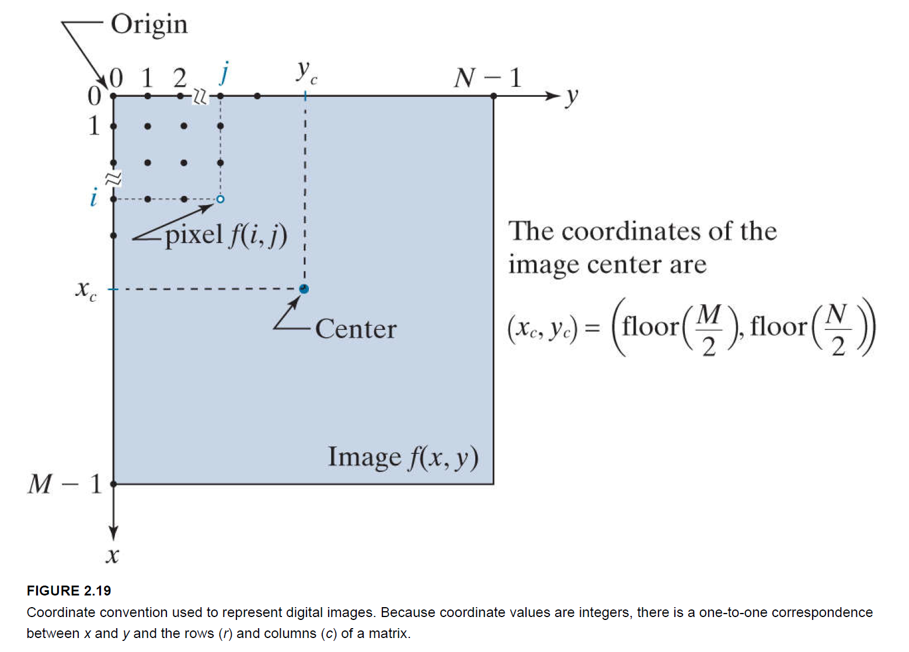
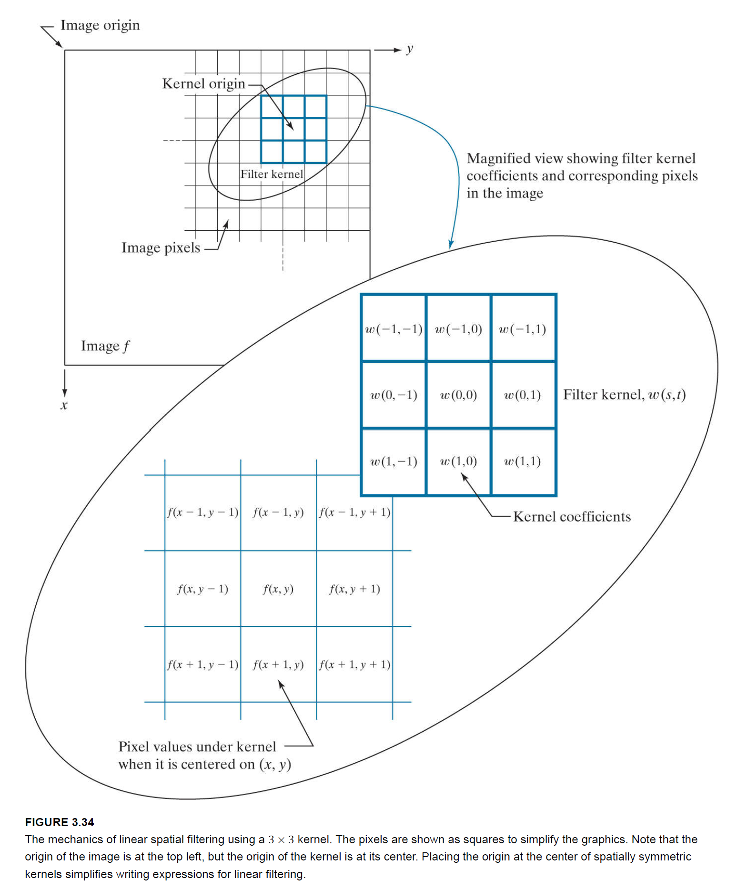

[TOC]

# Color Image  

# Geometric Transformations  
> 2.6 Introduction to the Basic Mathematical Tools Used in Digital Image Processing: Geometric Transformations[^DIP, 4th]   

- Geometric transformations of digital images consist of two basic operations:[^DIP, 4th]  
(1) Spatial transformation of coordinates.  
(2) Intensity interpolation that assigns intensity values to the spatially transformed pixels.  

## Affine Transformations  
> [OpenCV Tutorial](https://docs.opencv.org/4.x/d4/d61/tutorial_warp_affine.html)  

affine transformations, which include **scaling**, **translation**, **rotation**, and **shearing**.[^DIP, 4th]  
### Rotation  
FIGURE 2.41: note the **counterclockwise direction** for a positive angle of rotation.[^DIP, 4th]
坐标系不动，点在坐标系中的位置变动（采用极坐标推导）  
$\theta$，逆时针旋转的角度   
$$
\begin{bmatrix}
x_2 \\
y_2 
\end{bmatrix}

=  

\begin{bmatrix}
cos\theta & -sin\theta \\
sin\theta & cos\theta
\end{bmatrix}

\times

\begin{bmatrix}
x_1 \\
y_1
\end{bmatrix}
$$

# Histogram  
[OpenCV--Histogram Calculation](https://docs.opencv.org/master/d8/dbc/tutorial_histogram_calculation.html)  
[OpenCV--Histogram Comparison](https://docs.opencv.org/master/d8/dc8/tutorial_histogram_comparison.html)  
[OpenCV--Back Projection](https://docs.opencv.org/master/da/d7f/tutorial_back_projection.html)  

> 3.3 Histogram Processing[^DIP, 4th]

## Histogram Calculation  

## Histogram Equalization  
[OpenCV: Histogram Equalization](https://docs.opencv.org/master/d4/d1b/tutorial_histogram_equalization.html)  

## Histogram Matching  
[OpenCV: Template Matching](https://docs.opencv.org/master/de/da9/tutorial_template_matching.html)  

# Image Pyramids  

## OpenCV Tutorials [Image Pyramids](https://docs.opencv.org/4.x/d4/d1f/tutorial_pyramids.html)  

> The explanation below belongs to the book Learning OpenCV by Bradski and Kaehler.  

Usually we need to convert an image to a size different than its original. For this, there are two possible options:  
1. **Upsize** the image (zoom in) or  
2. **Downsize** it (zoom out).  

### Image Pyramid
An image pyramid is a collection of images - all arising from a single original image - that are successively downsampled until some desired stopping point is reached.  

There are two common kinds of image pyramids:  

- **Gaussian pyramid**: Used to downsample images  
- **Laplacian pyramid**: Used to reconstruct an upsampled image from an image lower in the pyramid (with less resolution)  

### Gaussian Pyramid  

Imagine the pyramid as a set of layers in which the higher the layer, the smaller the size.
Every layer is numbered from bottom to top, so layer $\left(i+1\right)$ (denoted as $G_{i+1}$) is smaller than layer $i\ (G_i)$.  

To produce layer $(i+1)$ in the Gaussian pyramid  

- Convolve $G_i$  with a Gaussian kernel:
- Remove every even-numbered row and column.

upsample the image  

- First, upsize the image to twice the original in each dimension, with the new even rows and columns filled with zeros (0).  
- Perform a convolution with the same kernel shown above (multiplied by 4) to approximate the values of the "missing pixels"  

# Intensity Transformation  
## Image Negatives  
> 3.2 Some Basic Intensity Transformation Functions[^DIP, 4th]  

The negative of an image with intensity levels in the range $[0, L−1]$  is obtained by using the negative transformation function, which has the form  
$$
s=L−1−r\tag{3-3}
$$

## Log Transformations  
> 3.2 Some Basic Intensity Transformation Functions[^DIP, 4th]  

The general form of the log transformation is  
$$
s=c*log⁡(1+r) \tag{3-4}
$$
where $c$ is a constant and it is assumed that $r≥0$.  

## Gamma correction  
> [UNDERSTANDING GAMMA CORRECTION](https://www.cambridgeincolour.com/tutorials/gamma-correction.htm)

### Power-Law (Gamma) Transformations  
> 3.2 Some Basic Intensity Transformation Functions[^DIP, 4th]  

Power-law transformations have the form
$$
s=c*r^\gamma \tag{3-5}
$$
where $c$ and $\gamma$ are positive constants. Sometimes $Eq. (3-5)$ is written as $s=c*(r+ε)^\gamma$  to account for offsets (that is, a measurable output when the input is zero).  

The response of many devices used for image capture, printing, and display obey a power law. By convention, the exponent in a power-law equation is referred to as gamma [hence our use of this symbol in Eq. (3-5)]. The process used to correct these power-law response phenomena is called **gamma correction** or **gamma encoding**.  

> 5.2 SCALING AND SIMPLE RGBs[^The GOES-R series, 2019]  

A common method of scaling a single image is
$$
C=255\times\left(\frac{V_{obs}-V_{min}}{V_{max}-V_{min}}\right)^\frac{1}{\gamma}
$$

### [OpenCV: Gamma correction](https://docs.opencv.org/master/d3/dc1/tutorial_basic_linear_transform.html)  

[Gamma correction](https://en.wikipedia.org/wiki/Gamma_correction) can be used to correct the brightness of an image by using a non linear transformation between the input values and the mapped output values:  
$$
O=\left(\frac{I}{255}\right)^{\gamma}\times255
$$

When $\gamma<1$, the **original dark regions will be brighter** and the histogram will be shifted to the right whereas it will be the opposite with $\gamma>1$.  

  

# Sampling and Quantization  
> 2.4 Image Sampling and Quantization[^DIP, 4th]  

## Representing Digital Images  

We define the **origin** of an image at the **top left corner**.  
The **positive x-axis** extends downward and the **positive y-axis** extends to the right (the right-handed Cartesian coordinate system).  
The center of an $M\times{N}$ digital image with origin at $(0, 0)$  and range to $(M−1, N−1)$  is obtained by dividing M and N by 2 and rounding down to the nearest integer.  

The number of **intensity levels**, $L$, is an integer power of two, that is  
$$
L=2^k
$$
&emsp;&emsp;where $k$ is an integer. We assume that the discrete levels area equally spaced and that they are integers in the range $[0, L−1]$.

The number, $b$, of bits required to store a digital image is 
$$
b=M\times{N}\times{k}
$$
as usual, one byte equals 8 bits.

When an image can have $2^k$  possible intensity level, it is common practice to refer to it as a “**k-bit image**”, (e.g., a 256-level image is called an 8-bit image).

# Spatial Filtering  

## Fundamentals of Spatial Filtering  
> 3.4 Fundamentals of Spatial Filtering  

  

### Spatial Correlation and Convolution  

### Separable Filter Kernels  

## padding an image  
> 3.5 Smoothing (Lowpass) Spatial Filters[^DIP, 4th]

**zero padding** an image introduces dark borders in the filtered result, with the thickness of the borders depending on the size and type of the filter kernel used. Earlier, when discussing correlation and convolution, we mentioned two other methods of image padding: **mirror (also called symmetric) padding**, in which values outside the boundary of the image are obtained by mirror-reflecting the image across its border; and **replicate padding**, in which values outside the boundary are set equal to the nearest image border value. The latter padding is useful when the areas near the border of the image are constant. Conversely, mirror padding is more applicable when the areas near the border contain image details. In other words, these two types of padding attempt to "extend" the characteristics of an image past its borders.  

## Smoothing (Lowpass) Spatial Filters  
> 3.5 Smoothing (Lowpass) Spatial Filters  

## Sharpening (Highpass) Spatial Filters  
> 3.6 Sharpening (Highpass) Spatial Filters[^DIP, 4th]  

# Template Matching
> OpenCV Tutorial: [Template Matching](https://docs.opencv.org/4.x/de/da9/tutorial_template_matching.html)  

**Template matching** is a technique for finding areas of an image that match (are similar) to a template image (patch).  

While the patch must be a **rectangle** it may be that not all of the rectangle is relevant.  

To identify the matching area, we have to compare the template image against the source image by sliding it:  

By sliding, we mean moving the patch one pixel at a time (left to right, up to down).  

metric in the result matrix R. Each location (x,y) in R contains the match metric:  

# References  
[^DIP, 4th]: Rafael C Gonzalez,Richard E Woods.Digital Image Processing:4th ed[M].New York:Pearson,2018.  

[^The GOES-R series, 2019]: Steven Goodman, Timothy Schmit, Jaime Daniels, Robert Redmon. The GOES-R series: a new generation of geostationary environmental satellites. Elsevier, 2019.
