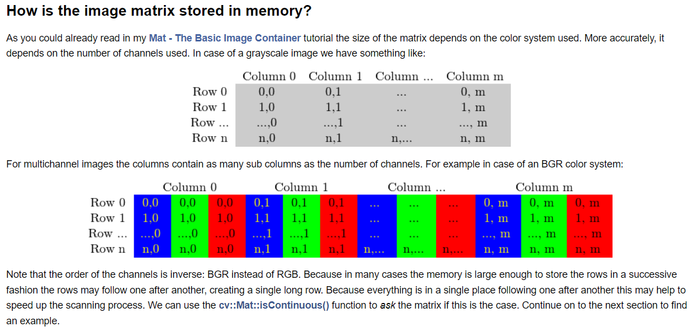

[TOC]  

# Materials  
> OpenCV [Tutorial](https://docs.opencv.org/master/d9/df8/tutorial_root.html)   
> > [Getting Started with Images](https://docs.opencv.org/master/db/deb/tutorial_display_image.html)  
> > [Modules](https://docs.opencv.org/4.x/modules.html)  
> >
> > - [Image Processing](https://docs.opencv.org/4.x/d7/dbd/group__imgproc.html)  


# [Introduction](https://docs.opencv.org/master/d1/dfb/intro.html)  
All the OpenCV classes and functions are placed into the `cv` namespace.  

```C++
using namespace cv;
```

# [Interface](https://docs.opencv.org/4.x/d1/d1b/group__core__hal__interface.html)  

## Data types  

primitive types  
|类型|说明|
|:-|:-|
|schar|signed 1 byte integer|
|uchar|unsigned 1 byte integer|
|short|signed 2 byte integer|
|ushort|unsigned 2 byte integer|
|int|signed 4 byte integer|
|uint|unsigned 4 byte integer|
|int64|signed 8 byte integer|
|uint64|unsigned 8 byte integer|


> Tutorial: [Introduction](https://docs.opencv.org/master/d1/dfb/intro.html)  

For these basic types, the following enumeration is applied:  
```C++
enum{CV_8U= 0, CV_8S= 1, CV_16U= 2, CV_16S= 3, CV_32S= 4, CV_32F= 5, CV_64F= 6};
```

Multi-channel (n-channel) types can be specified using the following options:  

- CV_8UC1 ... CV_64FC4 constants (for a number of channels from 1 to 4)  
- CV_8UC(n) ... CV_64FC(n) or CV_MAKETYPE(CV_8U, n) ... CV_MAKETYPE(CV_64F, n) macros when the number of channels is more than 4 or unknown at the compilation time.  

Note: `CV_32FC1 == CV_32F`, `CV_32FC2 == CV_32FC(2) == CV_MAKETYPE(CV_32F, 2)`, and `CV_MAKETYPE(depth, n) == ((depth&7) + ((n-1)<<3)`. This means that the constant type is formed from the depth, taking the lowest 3 bits, and the number of channels minus 1, taking the next log2(CV_CN_MAX) bits.  

> Tutorial: [Mat - The Basic Image Container](https://docs.opencv.org/master/d6/d6d/tutorial_mat_the_basic_image_container.html)  

specify the **data type** to use for storing the elements and the **number of channels** per matrix point.  

```
CV_[The number of bits per item][Signed or Unsigned][Type Prefix]C[The channel number]
```

For instance, `CV_8UC3` means we use unsigned char types that are 8 bit long and each pixel has three of these to form the three channels.  

# Color  

### [ColorMaps in OpenCV](https://docs.opencv.org/4.x/d3/d50/group__imgproc__colormap.html)


### [Color Space Conversions](https://docs.opencv.org/4.x/d8/d01/group__imgproc__color__conversions.html)  
- Tutorial: [Color conversions](https://docs.opencv.org/master/de/d25/imgproc_color_conversions.html)  

#### [cvtColor()](https://docs.opencv.org/4.x/d8/d01/group__imgproc__color__conversions.html#ga397ae87e1288a81d2363b61574eb8cab)  

```C++
void cv::cvtColor(InputArray src,
                  OutputArray dst,
                  int code,
                  int dstCn = 0
)
```
Parameters  

- **src**: input image: 8-bit unsigned, 16-bit unsigned ( CV_16UC... ), or single-precision floating-point.  
- **dst**: output image of the same size and depth as src.  
- **code**: color space conversion code (see [ColorConversionCodes](https://docs.opencv.org/4.x/d8/d01/group__imgproc__color__conversions.html#ga4e0972be5de079fed4e3a10e24ef5ef0)).  
- **dstCn**: number of channels in the destination image; if the parameter is 0, the number of the channels is derived automatically from src and code.  

Converts an image from one color space to another.  
`#include <opencv2/imgproc.hpp>`  

The conventional ranges for R, G, and B channel values are:  

- 0 to 255 for CV_8U images
- 0 to 65535 for CV_16U images
- 0 to 1 for CV_32F images

### [ColorConversionCodes](https://docs.opencv.org/4.x/d8/d01/group__imgproc__color__conversions.html#ga4e0972be5de079fed4e3a10e24ef5ef0)  

convert between RGB/BGR and grayscale  

- COLOR_BGR2GRAY  
- COLOR_RGB2GRAY  
- COLOR_GRAY2BGR  
- COLOR_GRAY2RGB  

# [Basic structures](https://docs.opencv.org/master/dc/d84/group__core__basic.html)  


## Scalar  

> [CSDN: opencv中的Scalar()函数](https://blog.csdn.net/kangjielearning/article/details/109167326)  
> [CSDN: OpenCV学习笔记（3）——Scalar数据类型理解](https://blog.csdn.net/liuweiyuxiang/article/details/76929534)  

> `cv::Scalar_< _Tp >` [Class Template Reference](https://docs.opencv.org/4.x/d1/da0/classcv_1_1Scalar__.html)  

> > Detailed Description  

Template class for a 4-element vector derived from Vec.  

Being derived from `Vec<_Tp, 4>`, `Scalar_` and Scalar can be used just as typical 4-element vectors. In addition, they can be converted to/from CvScalar . The type Scalar is widely used in OpenCV to pass pixel values.  

[cv::Scalar](https://docs.opencv.org/4.x/dc/d84/group__core__basic.html#ga599fe92e910c027be274233eccad7beb)  

```C++
typedef Scalar_<double> cv::Scalar
```

Code Example  
```C++
Scalar s1(10, 20, 255);
cout << s1 << endl;
cout << s1[0] << endl;
```


## Point  
> `cv::Point_< _Tp >` [Class Template Reference](https://docs.opencv.org/4.x/db/d4e/classcv_1_1Point__.html)  

Template class for 2D points specified by its coordinates `x` and `y`.   


For your convenience, the following type aliases are defined:  
```C++
typedef Point_<int> Point2i;
typedef Point2i Point;
typedef Point_<float> Point2f;
typedef Point_<double> Point2d;
```

Code Example  
```C++
Point2f a(0.3f, 0.f), b(0.f, 0.4f);
Point pt = (a + b)*10.f;
cout << pt.x << ", " << pt.y << endl;
```

## Rect  
> `cv::Rect_< _Tp >` [Class Template Reference](https://docs.opencv.org/4.x/d2/d44/classcv_1_1Rect__.html)  

Template class for 2D rectangles.  

> > Public Attributes  

height: height of the rectangle  
width: width of the rectangle  
x: x coordinate of the top-left corner  
y: y coordinate of the top-left corner  

> > Detailed Description  

```C++
template<typename _Tp>
class cv::Rect_< _Tp >
```


For your convenience, the `Rect_<>` alias is available: [cv::Rect](https://docs.opencv.org/4.x/dc/d84/group__core__basic.html#ga11d95de507098e90bad732b9345402e8)  

```C++
typedef Rect2i cv::Rect  
typedef Rect_<double> cv::Rect2d  
typedef Rect_<float> cv::Rect2f  
typedef Rect_<int> cv::Rect2i  
```

one of Constructor
```C++
template<typename _Tp>
cv::Rect_<_Tp>::Rect_(_Tp _x,
                      _Tp _y,
                      _Tp _width,
                      _Tp _height
)
```


## Mat  
> `cv::Mat` [Class Reference](https://docs.opencv.org/4.x/d3/d63/classcv_1_1Mat.html)  

> Tutorial: [Mat - The Basic Image Container](https://docs.opencv.org/master/d6/d6d/tutorial_mat_the_basic_image_container.html)    

> > **Mat**  

Mat is basically a class with two data parts:   

- **the matrix header** (containing information such as the size of the matrix, the method used for storing, at which address is the matrix stored, and so on) and 
- **a pointer to the matrix** containing the pixel values (taking any dimensionality depending on the method chosen for storing) . 
- The matrix header size is constant, however the size of the matrix itself may vary from image to image and usually is larger by orders of magnitude.  

OpenCV uses a **reference counting system**.  

- each Mat object has its own header, however a matrix may be shared between two Mat objects by having their matrix pointers point to the same address.  
- the **copy operators** will only copy the headers and the pointer to the large matrix, not the data itself.  
- The **assignment operator** and the **copy constructor** only copy the header.  

```C++  
Mat A, C;  // creates just the header parts
A = imread(argv[1], IMREAD_COLOR);

Mat B(A);  // Use the copy constructor
C = A;  // Assignment operator
```

All the above objects, in the end, point to the same single data matrix and making a modification using any of them will affect all the other ones as well.  

Nevertheless, their header parts are different.  

create headers which refer to only a subsection of the full data  
```C++
Mat D (A, Rect(10, 10, 100, 100) );  // using a rectangle
Mat E = A(Range::all(), Range(1,3));  // using row and column boundaries
```

**copy the matrix**, OpenCV provides `cv::Mat::clone()` and `cv::Mat::copyTo()` functions.  
```C++
Mat F = A.clone();
Mat G;
A.copyTo(G);
```
modifying F or G will not affect the matrix pointed to by the A's header.  

> > **Storing methods**  

To code the transparency of a color sometimes a fourth element, alpha (A), is added.  

OpenCV standard display system composes colors using the **BGR** color space (red and blue channels are swapped places).  
The HSV and HLS decompose colors into their **hue, saturation and value/luminance** components.  

> > **Creating a Mat object explicitly**  

for debugging purposes it's much more convenient to **see the actual values**. You can do this using the `<<` operator of Mat. Be aware that this only works for **two dimensional matrices**.  

create a Mat object in multiple ways  
- cv::Mat::Mat Constructor  
```C++
Mat M(2, 2, CV_8UC3, Scalar(0, 0, 255));
cout << "M = " << endl << " " << M << endl << endl;
```
For two dimensional and multichannel images we first define their size: **row and column** count wise.  
specify the **data type** to use for storing the elements and the **number of channels** per matrix point.  

`CV_[The number of bits per item][Signed or Unsigned][Type Prefix]C[The channel number]`  

For instance, `CV_8UC3` means we use unsigned char types that are 8 bit long and each pixel has three of these to form the three channels.  

- Use C/C++ arrays and initialize via constructor  
```C++
int sz[3] = {2,2,2};
Mat L(3,sz, CV_8UC(1), Scalar::all(0));
```
&emsp;&emsp;Specify its dimension, then pass a pointer containing the size for each dimension.  

- cv::Mat::create function  
```C++
M.create(4,4, CV_8UC(2));
cout << "M = "<< endl << " "  << M << endl << endl;
```
reallocate its matrix data memory if the new size will not fit into the old one.  

- MATLAB style initializer  
```C++
// Specify size and data type to use:
Mat E = Mat::eye(4, 4, CV_64F);
cout << "E = " << endl << " " << E << endl << endl;

Mat O = Mat::ones(2, 2, CV_32F);
cout << "O = " << endl << " " << O << endl << endl;

Mat Z = Mat::zeros(3,3, CV_8UC1);
cout << "Z = " << endl << " " << Z << endl << endl;
```

**Output formatting**  

```C++
Mat R = Mat(3, 2, CV_8UC3);
randu(R, Scalar::all(0), Scalar::all(255));
```
- Default  
`cout << "R (default) = " << endl << R << endl << endl;`  
- Python  
`cout << "R (python)  = " << endl << format(R, Formatter::FMT_PYTHON) << endl << endl;`  
- Numpy  
`cout << "R (numpy) = " << endl << format(R, Formatter::FMT_NUMPY ) << endl << endl;`

### How is the image matrix stored in memory?  
> https://docs.opencv.org/4.x/db/da5/tutorial_how_to_scan_images.html  




# Operations on arrays  


# API: [High-level GUI](https://docs.opencv.org/4.x/d7/dfc/group__highgui.html)  

- [Flags related creating and manipulating HighGUI windows and mouse events](https://docs.opencv.org/4.x/d0/d90/group__highgui__window__flags.html)  

`#include <opencv2/highgui.hpp>`

### [namedWindow()](https://docs.opencv.org/master/d7/dfc/group__highgui.html#ga5afdf8410934fd099df85c75b2e0888b)  
The function namedWindow creates a window that can be used as a placeholder for images and trackbars. Created windows are referred to by their names.  

If a window with the same name already exists, the function does nothing.  
```C++
void cv::namedWindow(const String &winname,
                     int flags = WINDOW_AUTOSIZE
)
```
Parameters  

- winname: Name of the window in the window caption that may be used as a window identifier.  
- flags: Flags of the window. The supported flags are: (cv::WindowFlags)  

> [cv::WindowFlags](https://docs.opencv.org/4.x/d0/d90/group__highgui__window__flags.html#gabf7d2c5625bc59ac130287f925557ac3)  

|C++|Python||
|:-|:-|:-|
|WINDOW_NORMAL|cv.WINDOW_NORMAL|the user can resize the window (no constraint) / also use to switch a fullscreen window to a normal size.|
|WINDOW_AUTOSIZE|cv.WINDOW_AUTOSIZE|the user cannot resize the window, the size is constrainted by the image displayed.|
|WINDOW_KEEPRATIO|cv.WINDOW_KEEPRATIO|the ratio of the image is respected.|


### [waitKey()](https://docs.opencv.org/master/d7/dfc/group__highgui.html#ga5628525ad33f52eab17feebcfba38bd7)  
The function waitKey waits for a key event infinitely (when delay$\le{0}$) or for delay milliseconds, when it is positive.  

```C++
int cv::waitKey(int delay = 0)
```
Parameters  

- delay: Delay in milliseconds. 0 is the special value that means "forever".


### [destroyWindow()](https://docs.opencv.org/master/d7/dfc/group__highgui.html#ga851ccdd6961022d1d5b4c4f255dbab34)  
The function destroyWindow destroys the window with the given name.
```C++
void cv::destroyWindow(const String &winname)
```
Parameters  
- winname: Name of the window to be destroyed.  

Example
```C++
destroyWindow("mask");
```


### [destroyAllWindows()](https://docs.opencv.org/master/d7/dfc/group__highgui.html#ga6b7fc1c1a8960438156912027b38f481)  
```C++
void cv::destroyAllWindows()
```
The function destroyAllWindows destroys all of the opened HighGUI windows.  

### [createTrackbar()](https://docs.opencv.org/4.x/d7/dfc/group__highgui.html#gaf78d2155d30b728fc413803745b67a9b)  

Creates a trackbar and attaches it to the specified window.  

The function createTrackbar creates a trackbar (a slider or range control) with the specified name and range, assigns a variable value to be a position synchronized with the trackbar and specifies the callback function onChange to be called on the trackbar position change. The created trackbar is displayed in the specified window winname.  

`#include <opencv2/highgui.hpp>`  
```C++
int cv::createTrackbar(const String &trackbarname,
                       const String &winname,
                       int *value,
                       int count,
                       TrackbarCallback onChange = 0,
                       void *userdata = 0
)
```

Parameters  

- **trackbarname**: Name of the created trackbar.  
- **winname**: Name of the window that will be used as a parent of the created trackbar.  
- **value**: Optional pointer to an integer variable whose value reflects the position of the slider. Upon creation, the slider position is defined by this variable.  
- **count**: Maximal position of the slider. The minimal position is always 0.
- **onChange**: Pointer to the function to be called every time the slider changes position. This function should be prototyped as void `Foo(int,void*)`; , where the first parameter is the trackbar position and the second parameter is the user data (see the next parameter). If the callback is the NULL pointer, no callbacks are called, but only value is updated.
- **userdata**: User data that is passed as is to the callback. It can be used to handle trackbar events without using global variables.


## Read and Write  
API: [Image file reading and writing](https://docs.opencv.org/4.x/d4/da8/group__imgcodecs.html)  

[Flags used for image file reading and writing](https://docs.opencv.org/4.x/d4/da8/group__imgcodecs.html)  

`#include <opencv2/imgcodecs.hpp>`  

### [imread()](https://docs.opencv.org/master/d4/da8/group__imgcodecs.html#ga288b8b3da0892bd651fce07b3bbd3a56)  

```C++
Mat cv::imread(const String &filename,
               int flags = IMREAD_COLOR
)
```

> [imread flags](https://docs.opencv.org/master/d8/d6a/group__imgcodecs__flags.html#ga61d9b0126a3e57d9277ac48327799c80)  

|C++|Python||
|:-|:-|:-|
|IMREAD_UNCHANGED|cv.IMREAD_UNCHANGED|If set, return the loaded image as is (with alpha channel, otherwise it gets cropped). Ignore EXIF orientation.|
|IMREAD_GRAYSCALE|cv.IMREAD_GRAYSCALE|If set, always convert image to the single channel grayscale image (codec internal conversion).|
|IMREAD_COLOR|cv.IMREAD_COLOR|If set, always convert image to the 3 channel BGR color image.|


### [imshow()](https://docs.opencv.org/master/d7/dfc/group__highgui.html#ga453d42fe4cb60e5723281a89973ee563)  
```C++
void cv::imshow(const String &winname,
                InputArray mat
)
```

### [imwrite()](https://docs.opencv.org/master/d4/da8/group__imgcodecs.html#gabbc7ef1aa2edfaa87772f1202d67e0ce)  

```C++
bool cv::imwrite(const String &filename,
                 InputArray img,
                 const std::vector<int> &params = std::vector<int>()
)
```

Parameters  

- filename: Name of the file.
- img: (Mat or vector of Mat) Image or Images to be saved.
- params: Format-specific parameters encoded as pairs (paramId_1, paramValue_1, paramId_2, paramValue_2, ... .) see [cv::ImwriteFlags](https://docs.opencv.org/4.x/d8/d6a/group__imgcodecs__flags.html#ga292d81be8d76901bff7988d18d2b42ac)

Example
```C++
imwrite("test.tiff", imgs);
```

> [Imwrite flags](https://docs.opencv.org/4.x/d8/d6a/group__imgcodecs__flags.html#ga292d81be8d76901bff7988d18d2b42ac)  

## Visualizing images  
```C++
string img_file, win_title;

Mat img = imread(img_file);
if (img.empty()) {
    throw runtime_error("Failed to read: "+img_file);
}

namedWindow(win_title, WINDOW_AUTOSIZE);
imshow(win_title, img);
waitKey(0);
destroyWindow(win_title);
// destroyAllWindows();
```

# API: [Drawing Functions](https://docs.opencv.org/4.x/d6/d6e/group__imgproc__draw.html)  

# Affine Transformations  
> [OpenCV Tutorial](https://docs.opencv.org/4.x/d4/d61/tutorial_warp_affine.html)  

## Functions  
`#include <opencv2/imgproc.hpp>`

- [cv::getAffineTransform](https://docs.opencv.org/4.x/da/d54/group__imgproc__transform.html#ga8f6d378f9f8eebb5cb55cd3ae295a999)  
- [cv::warpAffine](https://docs.opencv.org/4.x/da/d54/group__imgproc__transform.html#ga0203d9ee5fcd28d40dbc4a1ea4451983)  


## [cv::resize](https://docs.opencv.org/4.x/da/d54/group__imgproc__transform.html#ga47a974309e9102f5f08231edc7e7529d)  
### [InterpolationFlags](https://docs.opencv.org/4.x/da/d54/group__imgproc__transform.html#ga5bb5a1fea74ea38e1a5445ca803ff121)  
`#include <opencv2/imgproc.hpp>`  
|C++|Python||
|:-|:-|:-|
|INTER_NEAREST|cv.INTER_NEAREST|nearest neighbor interpolation|
|INTER_LINEAR|cv.INTER_LINEAR|bilinear interpolation|
|INTER_CUBIC|cv.INTER_CUBIC|bicubic interpolation|
|INTER_AREA|cv.INTER_AREA|resampling using pixel area relation. It may be a preferred method for image decimation, as it gives moire'-free results. But when the image is zoomed, it is similar to the INTER_NEAREST method.|

# Histograms  
> OpenCV: Image Processing : [Histograms](https://docs.opencv.org/4.x/d6/dc7/group__imgproc__hist.html)  


## Histogram Calculation  

> [OpenCV Tutorials: Histogram Calculation](https://docs.opencv.org/4.x/d8/dbc/tutorial_histogram_calculation.html)  

> [`calcHist()`](https://docs.opencv.org/4.x/d6/dc7/group__imgproc__hist.html#ga4b2b5fd75503ff9e6844cc4dcdaed35d)  

```C++
// Calculates a histogram of a set of arrays.
void cv::calcHist(const Mat *images,
                  int nimages,
                  const int *channels,
                  InputArray mask,
                  OutputArray hist,
                  int dims,
                  const int *histSize,
                  const float **ranges,
                  bool uniform = true,
                  bool accumulate = false
)
```

```Python
cv.calcHist(images, channels, mask, histSize, ranges[, hist[, accumulate]]) -> hist
```

> Parameters  
- *images*: Source arrays. They all should have the same depth, CV_8U, CV_16U or CV_32F , and the same size. Each of them can have an arbitrary number of channels.  
- *nimages*: Number of source images.  
- *channels*: 	List of the dims channels used to compute the histogram.  
- *mask*: Optional mask. If the matrix is not empty, it must be an 8-bit array of the same size as images[i] . The non-zero mask elements mark the array elements counted in the histogram.  
- *hist*: Output histogram, which is a dense or sparse dims -dimensional array.  
- *dims*: Histogram dimensionality that must be positive and not greater than CV_MAX_DIMS (equal to 32 in the current OpenCV version).  
- *histSize*: Array of histogram sizes in each dimension.  
- *ranges*: Array of the dims arrays of the histogram bin boundaries in each dimension.  
- *uniform*: Flag indicating whether the histogram is uniform or not.  
- *accumulate*: Accumulation flag. If it is set, the histogram is not cleared in the beginning when it is allocated. This feature enables you to compute a single histogram from several sets of arrays, or to update the histogram in time.  


## Histogram Equalization  
> [OpenCV Tutorials: Histogram Equalization](https://docs.opencv.org/4.x/d4/d1b/tutorial_histogram_equalization.html)  

```C++
string img_file = "";
Mat src = imread(img_file, IMREAD_GRAYSCALE);

Mat dst;
equalizeHist(src, dst);

imshow("Source image", src);
imshow("Equalized Image", dst);
waitKey();
```


# Image Pyramids  

> OpenCV Tutorials [Image Pyramids](https://docs.opencv.org/4.x/d4/d1f/tutorial_pyramids.html)  

```C++
Mat src = imread(file_path);
Mat dst;

string down_name = "Down";
pyrDown(src, dst, Size(src.cols/2, src.rows/2));
// string up_name = "Up";
// pyrUp(src, dst, Size(src.cols*2, src.rows*2));
namedWindow(down_name, WINDOW_AUTOSIZE);
imshow(down_name, dst);

waitKey(0);
// destroyWindow(down_name);
destroyAllWindows();
```

# Smoothing Images  
> OpenCV Tutorials: [Smoothing Images](https://docs.opencv.org/4.x/dc/dd3/tutorial_gausian_median_blur_bilateral_filter.html)

The explanation below belongs to the book [Computer Vision: Algorithms and Applications](http://szeliski.org/Book/) by Richard Szeliski and to LearningOpenCV

```C++
Mat src;
Mat dst = Mat::zeros( src.size(), src.type() )

blur(src, dst, Size(5, 5), Point(-1,-1));
GaussianBlur( src, dst, Size(5, 5), 0, 0 );
medianBlur(src, dst, 5);
```

# Watershed Algorithm  
> OpenCV Tutorials: [Image Segmentation with Distance Transform and Watershed Algorithm](https://docs.opencv.org/4.x/d2/dbd/tutorial_distance_transform.html)  

# Template Matching  

> [`matchTemplate()`](https://docs.opencv.org/4.x/df/dfb/group__imgproc__object.html#ga586ebfb0a7fb604b35a23d85391329be)  

Compares a template against overlapped image regions.

```C++
void cv::matchTemplate(InputArray image,
                       InputArray templ,
                       OutputArray result,
                       int method,
                       InputArray mask = noArray()
)
```

Parameters  

- **image**: Image where the search is running. It must be **8-bit or 32-bit floating-point**.  
- **templ**: Searched template. It must be not greater than the source image and have the same data type.  
- **result**: Map of comparison results. It must be single-channel 32-bit floating-point. If image is $W\times{H}$ and templ is $w\times{h}$, then result is $\left(W−w+1\right)\times\left(H−h+1\right)$.    
- **method**: Parameter specifying the comparison method, see **TemplateMatchModes**.  
- **mask**: Optional mask. It must have the **same size as templ**. It must either have the same number of channels as template or only one channel, which is then used for all template and image channels. If the data type is CV_8U, the mask is interpreted as a binary mask, meaning only elements where mask is nonzero are used and are kept unchanged independent of the actual mask value (weight equals 1). For data tpye CV_32F, the mask values are used as weights. The exact formulas are documented in TemplateMatchModes.  

```C++
enum cv::TemplateMatchModes
{
    cv::TM_SQDIFF = 0,
    cv::TM_SQDIFF_NORMED = 1,
    cv::TM_CCORR = 2,
    cv::TM_CCORR_NORMED = 3,
    cv::TM_CCOEFF = 4,
    cv::TM_CCOEFF_NORMED = 5
}
```


> OpenCV Tutorials: [Template Matching](https://docs.opencv.org/4.x/de/da9/tutorial_template_matching.html)  


# References  
