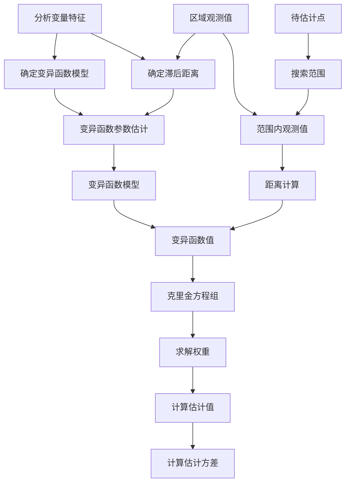
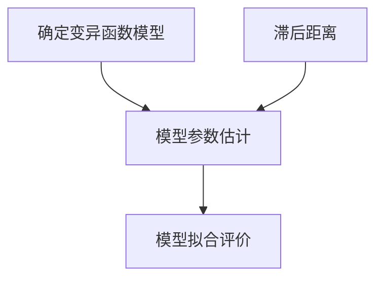

[TOC]  

# Delaunay Triangulation  

## Materials  
- [wikipedia--Barycentric coordinate system](https://en.wikipedia.org/wiki/Barycentric_coordinate_system)  
- [Matlab--Interpolation Using a Specific Delaunay Triangulation](https://www.mathworks.com/help/matlab/math/interpolation-using-a-specific-delaunay-triangulation.html)  
- [matplotlib.tri](https://matplotlib.org/stable/api/tri_api.html)  
- Python: scipy

# Kriging 克里金插值  

## Materials  
- 刘爱利,王培法,丁园圆.地统计学概论[M].科学出版社,2012.  
- ArcGIS:[克里金法的工作原理](https://desktop.arcgis.com/zh-cn/arcmap/latest/tools/3d-analyst-toolbox/how-kriging-works.htm)  
- ArcGIS:[Geostatistical Analyst 中的克里金法](https://desktop.arcgis.com/zh-cn/arcmap/latest/extensions/geostatistical-analyst/kriging-in-geostatistical-analyst.htm)  

## 概述  

## 地统计学理论假设  

### 平稳假设  
> 3.3.1 平稳假设[^刘爱利, 2012M]  

$$
{\gamma}(h)=C(0)-C(h)
$$

### 内蕴假设  
> 3.3.2 内蕴假设[^刘爱利, 2012M]  

## 变异函数（半变异函数semivariogram）  

> 2.1.4变异函数[^胡泓达, 2017]  

- 作为地统计学中描述区域化变量空间结构的重要工具，变异函数的建立一般需要进行**样本变异函数的计算**及**变异函数理论模型的选取和拟合**。
- 在实际应用中需要根据空间采样点的一系列观测数据$Z(x_1 ), Z(x_2 ), ⋯, Z(x_n )$来计算不同**滞后距离**$h$对应的样本变异函数值，具体计算公式如下
$$
\boxed{\color{Blue}\gamma^{*}(h)=\frac{1}{2N(h)}\sum\limits_{i=1}^{N(h)}[Z(x_i)-Z(x_i+h)]^2}
$$
式中，$N(h)$是间隔距离为$h$的样本点对个数。  

- 在计算样本变异函数值前需要确定变异函数的滞后距离及划分不同间隔距离的样本点对。由于空间采样点的位置分布不均匀，通过选择合适的距离增量以及可允许的距离波动区间来将样本点对划分成多块，每块含有的样本对之间的间隔距离相同或接近，滞后距离则为每块样本对之间的间隔距离的平均值。  
- 计算得到多个滞后距离对应的样本变异函数值后，需要根据**散点图**选择合适的理论模型拟合得到一条连续的变异函数曲线。

> 3.2.2 变异函数[^刘爱利, 2012M]  

- 实验变异函数计算公式  
$$
\boxed{\color{Blue}\gamma^{*}(h)=\frac{1}{2N(h)}\sum\limits_{i=1}^{N(h)}[Z(x_i)-Z(x_i+h)]^2}
$$

### 影响变异函数的主要因素  
1. 样点距离和支撑大小  
2. 样本数量  
3. 异常值影响  
4. 比例效应影响  
5. 漂移的影响  

### 确定滞后距离  

> 2.1.4变异函数[^胡泓达, 2017]  
由于空间采样点的位置分布不均匀，通过选择合适的距离增量以及可允许的距离波动区间来将样本点对划分成多块，每块含有的样本对之间的间隔距离相同或接近，**滞后距离则为每块样本对之间的间隔距离的平均值**。

### 变异函数理论模型  
#### 球状模型  
> 4.1.1 有基台值模型--2 球状模型[^刘爱利, 2012M]  

##### 模型参数的估计  
> 4.2.1 模型参数的最优估计[^刘爱利, 2012M]

## 克里金模型  
### 概述  
|模型|假设|条件|
|:-|:-|:-|
|简单克里金|二阶平稳假设|数学期望存在，且已知 协方差函数$C(h)$和变异函数${\gamma}(h)$存在且平稳。|
|普通克里金|二阶平稳假设|数学期望存在，且未知 协方差函数$C(h)$和变异函数${\gamma}(h)$存在且平稳。|

### 简单克里金  
> 5.2.1 简单克里金法[^刘爱利, 2012M]  

### 普通克里金  
> 5.2.2 普通克里金法[^刘爱利, 2012M]  

## 应用  

### 有效波高  
> 3.2 克里金插值法[^陈小燕, 2009]  

1. 通过对多个变差函数模型的研究，本文选用**球状模型**，该模型最适合有效波高数据融合。  
2. 在求取变差函数时，确定**基本滞后**很重要，它关系到变差函数的变异性和稳定性。如果**卫星高度计**的轨道在网格内有交叉点或者轨道非常接近，这样直接计算得到的基本滞后就很小甚至为零，最终无法得到正确的理论变差函数。根据卫星高度计的轨道分布特征以及沿轨数据的分布，同一轨道上相邻点之间的距离为6km左右，因此在本研究中确定**基本滞后为7km**，不随网格内点的数目以及分布而改变。  

# OI  
optimum interpolation (OI)，最优插值  

## 概述  
> 1 引言[^潘旸, 2012]  
最优插值（Optimum Interpolation，OI）最早由Eliassem（1954）和Gandin（1965）应用于气象领域的研究，Reynolds等（1994）曾采用该方法融合了卫星反演和海洋浮标、船舶观测的全球海表温度。  

## 计算公式  
> 5.2.1 计算公式[^柳婧, 2018D]  

在最优插值算法中，每一个空间网格点上的**分析值**是由网格点的**背景场**值加上**订正值**所确定的，其订正值由一定范围内$N$个格点上已知的**观测值**与背景场值的**偏差**加权得到，一般分析公式为   
$$
X_g^a=X_g^b+\sum\limits_{i=1}^Nw_i(X_i^o-X_i^b)
$$
式中，  

- $g$为格网分析点，$i$为有效观测点；
- $X_g^a$为分析格点上的分析值，$X_g^b$为格点上的背景场值；
- $w_i$为权重函数；
- $X_i^o$和$X_i^b$分别为观测点上的观测值和背景场值；
- $N$为观测范围内参与插值的有效观测点个数。

为了保证能搜索到一定数量的有效观测点，且尽可能减少计算量，参考Reynolds等人，将分析范围半径设为400km，**最大分析个数**为22个。

根据分析格点上误差方差最小进行公式推导，利用最小二乘法构建线性方程：
$$
\sum\limits_{j=1}^n(\mu_{ij}^b+\mu_{ij}^o\lambda_i\lambda_j)w_j=\mu_{ig}^b  \\
i=1,2,\cdots,n
$$
***原文献中，公式有误，参考[^潘旸, 2012]，已修改公式***

式中，  

- $\mu_{ij}^b$为背景场误差协相关；
- $\mu_{ij}^o$为观测误差协相关；
- $\lambda_i, \lambda_j$分别为观测点$i, j$上的观测误差标准差和背景误差标准差之比。

说明：  

- 上式中，$i,j$表示观测值的下标
- 以$i$为基准，即每个观测值列出一个等式，最后$n$个等式组成方程组。
- 为保证观测点与背景场对应，需要提前构建超级观测场（与背景场同分辨率）或者将背景场插值（一般用双线性即可）到观测点的位置上。
- 需要分析确定的参数: $\mu_{ij}^b, \mu_{ij}^o, \lambda$    
	- 观测误差标准差  
	- 观测误差协相关  
	- 初估场误差标准差  
	- 初估场误差协相关  
	- 搜索半径与最大使用点数
- 待求解权重向量  
$$
W=\begin{bmatrix}w_1 \\ w_2  \\ \vdots  \\w_n\end{bmatrix}
$$

## 应用  

### SST海面温度  
> 3 OI SST analysis[^Reynolds R W, 1994]  
> 3 Analysis--a. The OI analysis[^Reynolds R W, 2007]  
> 4.3.2 计算公式[^奚萌, 2011]  

#### 观测误差标准差  
#### 观测误差协相关  
#### 初估场误差标准差  
#### 初估场误差协相关  
#### 搜索半径与最大使用点数  

### SWH有效波高  
> 2 CONSTRUCTION OF AN ANALYZED WAVE HEIGHT FIELD[^Lionello P, 1992]  

> 2 有效波高最优插值和海浪谱重构[^王毅, 2009]  

#### 观测误差标准差  
#### 观测误差协相关  
#### 初估场误差标准差  
#### 初估场误差协相关  

#### 搜索半径与最大使用点数  
> 2 有效波高最优插值和海浪谱重构[^王毅, 2009]
$R_m$称为$m$点的影响半径。本文中参照国内外同类研究的经验, 取为$R_m=400km$。

### 洋面风
> 5.2.2 确定参数[^柳婧, 2018D]  
对于误差标准差之比λ，前人在研究中多设置为常数 1。

#### 观测误差标准差  
#### 观测误差协相关  
> 5.2.2 确定参数[^柳婧, 2018D]  

对于观测误差协相关$μ_{ij}^o$，一般认为不同位置上的观测误差不相关，即  
$$
μ_{ij}^o=\begin{cases}0, & i\ne{j} \\ 1, & i=j\end{cases}
$$
#### 初估场误差标准差  
#### 初估场误差协相关  
> 5.2.2 确定参数[^柳婧, 2018D]

背景误差协相关$μ_{ij}^b$通常不能精确定义，根据观测事实及分析研究表明，背景误差协相关常随着测站间的水平距离增大而呈指数衰减，因此常用高斯函数、二阶自相关函数等表示成测站间水平距离的函数。  

参考Kako等将ERA再分析风场的误差协方差假设为**高斯函数**，假设背景误差协相关  
$$
\mu_{ij}^b=exp(-\frac{r_m^2}{L_m^2}-\frac{r_z^2}{L_z^2})
$$
式中，$r_m, r_z$分别为任意两个观测站点间的经向、纬向距离；而$L_m, L_z$为经向、纬向上的特征尺度。

$L_m, L_z$的选择应考虑融合结果的精度，当卫星数据不能被有效插值时，融合数据精度会减小。因此，合理地扩大误差相关尺度，可以避免融合结果所包含的卫星数据过少，从而在一定程度上提高融合产品的精度。参考Kako等的研究，为了进一步改进融合产品精度，并且保留ERA-Interim风场数据中基本不存在的小尺度特征，$L_m$和$L_z$分别选为150km和300km。

### 降水  
#### 观测误差标准差  
#### 观测误差协相关  
#### 初估场误差标准差  
#### 初估场误差协相关  
#### 搜索半径与最大使用点数  

> 3.2 最优插值误差估计[^潘旸, 2012]  

# SCM  
successive correction method (SCM)，逐步订正法  
## 概述  
> 1 Introduction[^Zhang X, 2020]  

As a branch of objective analysis, **successive correction method (SCM)** represented by **Cressman (1959)** and **Barnes (1964, 1973)** have received more attention than others and remain popular today.  

> 1.4 逐步订正法[^李宏, 2012]  

逐步订正的思想最初由Cressman（Cressman，1959）提出，首先要求给出网格点的初始值(通常由背景场提供)，然后从每一个观测中减去对该观测点的估计值(一般通过对观测点周围的背景场格点值进行双线性插值获得) 得到观测增量，通过将分析格点周围影响区域内的观测增量进行加权组合得到分析增量，再将分析增量加到背景场上得到最终的分析场，并进行逐步迭代，直到分析值达到某种预期的精度。其迭代公式为:  

## 计算公式  
> 2.1 逐步订正法（SCM）[^柳婧, 2018]  

## 经验权重函数  
> 2.1 逐步订正法（SCM）[^柳婧, 2018]  

## 应用  
### 有效波高  

> 3.3 逐步订正法[^陈小燕, 2009]  

该方法的关键就是确定初次猜测场和选择影响半径，其中初次猜测场是根据曲面拟合方法得到的，这样就没必要获取由气象部门提供的数值预报格点资料，而且得到的初始场会跟实际更符合。初始影响半径要根据研究海域以及有效波高的空间尺度而定，本研究海域为我国海域及其临近海域，有效波高的空间尺度大概为30～100km，初始影响半径至少为该尺度的3～4倍，因此本研究中取初始影响半径为400km。随着迭代次数的增加初始影响半径会逐渐减小，减小的步长为100km，迭代次数为3～4次。

# References  
[^陈小燕, 2009]: 陈小燕,杨劲松,黄韦艮,王隽,王贺,张荣.多源卫星高度计有效波高数据融合方法研究[J].海洋学报(中文版),2009,31(04):51-57.  

[^胡泓达, 2017]: 胡泓达. 利用气溶胶光学厚度遥感数据估算$PM_{2.5}$浓度的时空回归克里金方法[D].武汉大学,2017.  

[^李宏, 2012]: 李宏,许建平,刘增宏,孙朝辉.利用逐步订正法构建Argo网格资料集的研究[J].海洋通报,2012,31(05):502-514.  

[^Lionello P, 1992]: Lionello P, Günther H, Janssen P A E M. Assimilation of altimeter data in a global third‐generation wave model[J]. Journal of Geophysical Research: Oceans, 1992, 97(C9): 14453-14474.  

[^刘爱利, 2012M]: 刘爱利,王培法,丁园圆.地统计学概论[M].科学出版社,2012.  

[^柳婧, 2018]: 柳婧,宋晓姜,王彰贵.海面风场融合技术综述[J].海洋预报,2018,35(03):81-87.  
[^柳婧, 2018D]: 柳婧. 基于最优插值方法的中国近海海面风场资料融合研究[D].国家海洋环境预报中心,2018.

[^潘旸, 2012]: 潘旸,沈艳,宇婧婧,赵平.基于最优插值方法分析的中国区域地面观测与卫星反演逐时降水融合试验[J].气象学报,2012,70(06):1381-1389.  

[^Reynolds R W, 1994]: Reynolds R W, Smith T M. Improved global sea surface temperature analyses using optimum interpolation[J]. Journal of climate, 1994, 7(6): 929-948.  
[^Reynolds R W, 2007]: Reynolds R W, Smith T M, Liu C, et al. Daily high-resolution-blended analyses for sea surface temperature[J]. Journal of climate, 2007, 20(22): 5473-5496.

[^王毅, 2009]: 王毅,余宙文.卫星高度计波高数据同化对西北太平洋海浪数值预报的影响评估[J].海洋学报(中文版),2009,31(06):1-8.

[^奚萌, 2011]: 奚萌. 基于最优插值算法的红外和微波遥感海表温度数据融合[D].国家海洋环境预报研究中心,2011.

[^Zhang X, 2020]: Zhang X, Yang L, Fu H, et al. A variational successive corrections approach for the sea ice concentration analysis[J]. Acta Oceanologica Sinica, 2020, 39(9): 140-154.  
